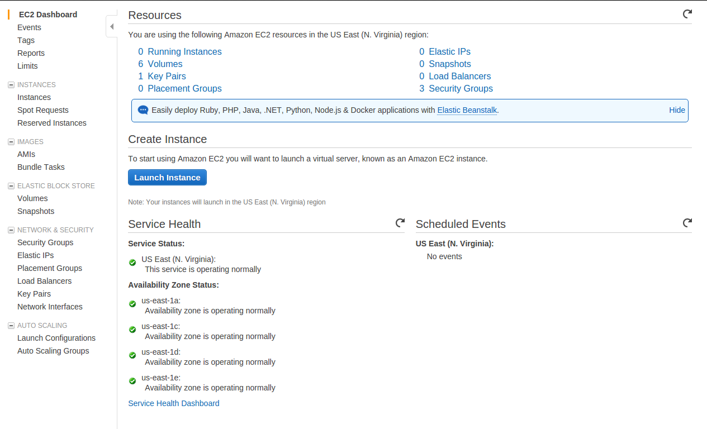
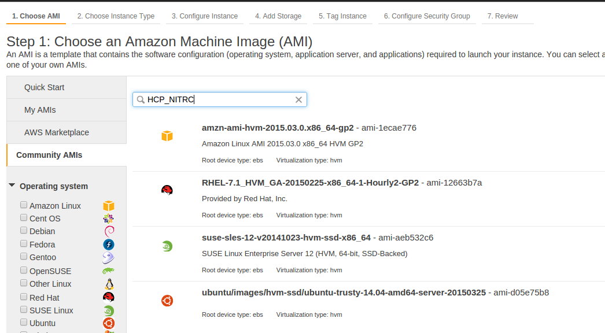
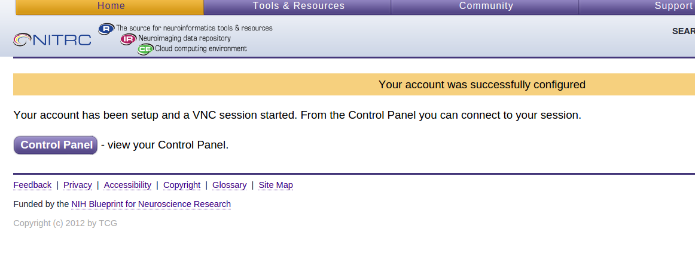
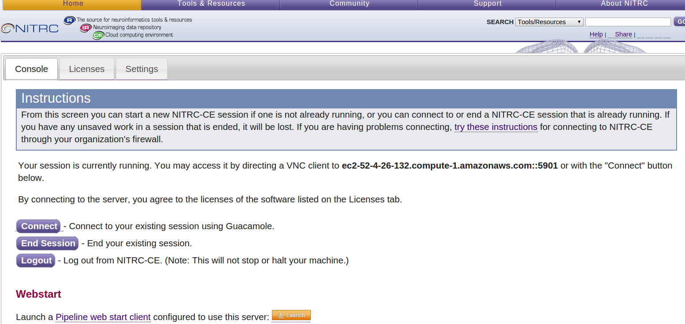
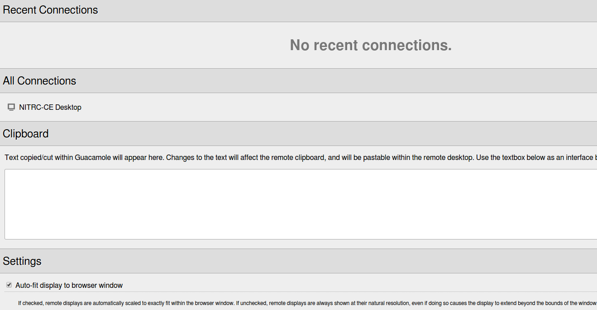
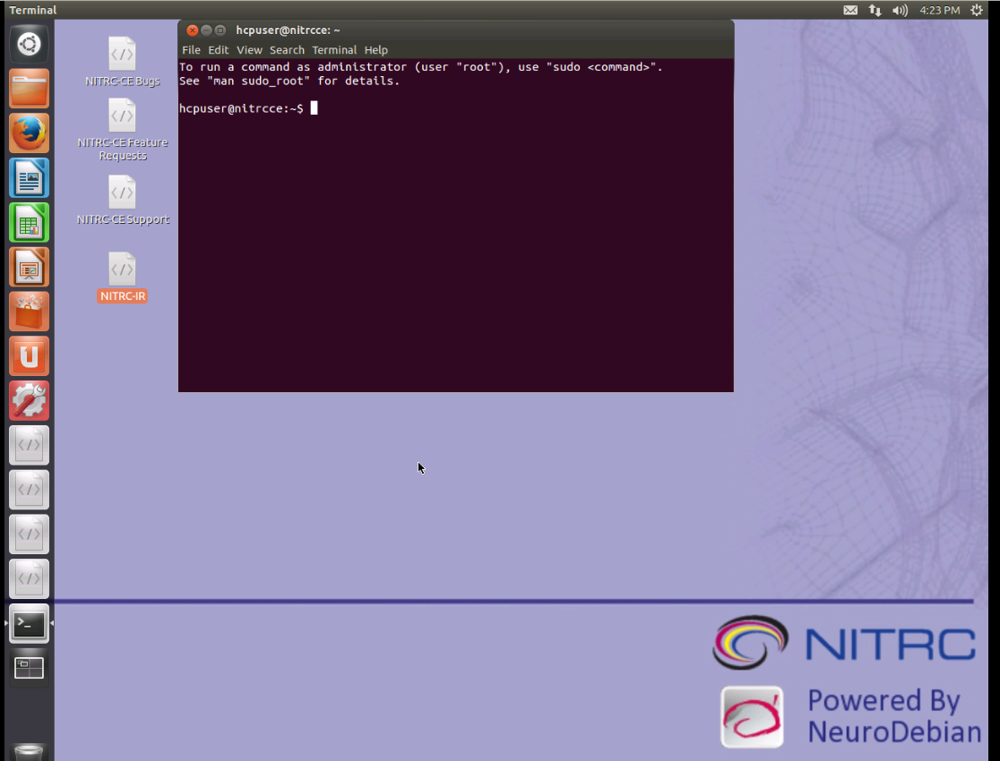
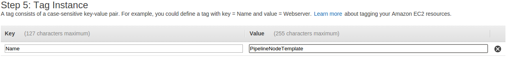
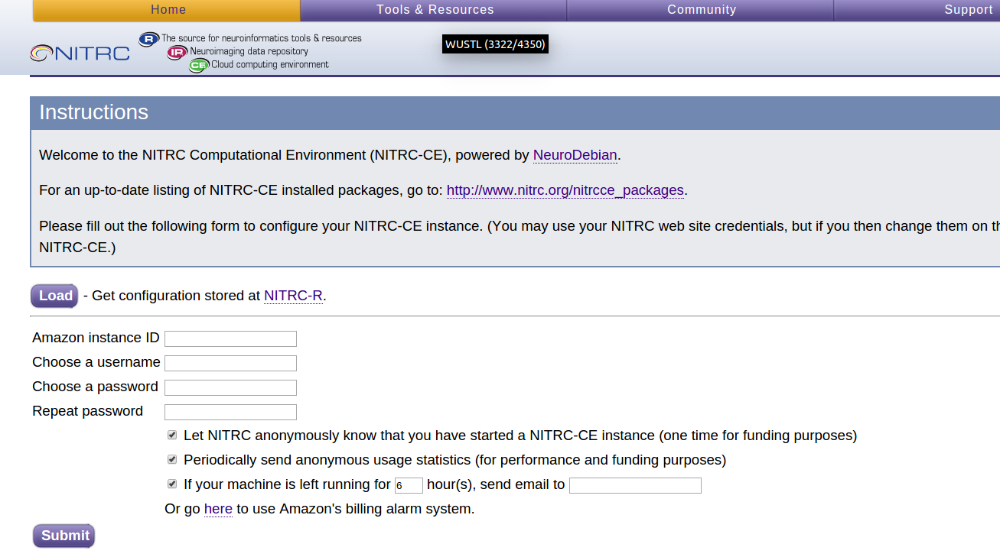
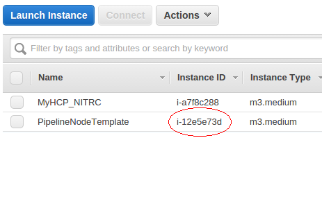

<a name="TOC"></a>
# Table of Contents
Terms and Acronyms
    
    AWS - Amazon Web Services
    EC2 – Elastic Compute Cloud
    S3 – Simple Storage Service
    S3 Bucket
    AMI – Amazon Machine Image – The Software
    Amazon EC2 Instance Types – The available hardware
    Amazon EBS – Elastic Block Storage    
    NITRC

Step 1: Getting Credentials to access HCP S3 Data

Step 2: Getting Started with AWS

    Step 2a: Login to AWS
    Step 2b: Create an Instance
    Step 2c: Configure Your Machine Instance
    Step 2d: Connect to Your Running Machine Instance
    Step 2e: Make a Terminal Connection using SSH 

Step 3: Take Note of the Pre-installed Software

    Step 3a: Note FSL Installation
    Step 3b: Note FreeSurfer Installation
    Step 3c: Note Connectome Workbench Installation
    Step 3d: Note the HCP Pipelines Installation
    Step 3e: Note All Available Pre-installed Software

Step 4: Take Note of Available HCP data

Step 5: Create directory structure on which HCP Pipelines can be run

Step 6: Editing files to run a pipeline stage

Step 7: Starting up a set of PreFreeSurfer Pipeline jobs

Step 8: Shutdown and Restart of an instance

    Step 8a: Shutdown of a running machine instance
    Step 8b: Restart of a machine instance
    Important Notes about Stopping and Restarting machine instances:

Step 9: Installing StarCluster

Step 10: Create an AWS Access Key Pair

Step 11: Setup a cluster for running HCP Pipelines

    Step 11a: Supply StarCluster with your AWS credentials
    Step 11b: Creating an Amazon EC2 key pair
    Step 11c: Start an example cluster
    Step 11d: Navigate your example cluster
        Example StarCluster Commands
    Step 11e: Terminate your small cluster
    Step 11f: Create an instance to use as a model for your pipeline cluster nodes
    Step 11g: Further prepare your new instance for StarCluster use
        Turn off the software firewall on your PipelineNodeTemplate instance
        Delete gridengine software from your PipelineNodeTemplate instance
        Delete the sgeadmin account and group.
        Remove the SGE_ROOT setting in the /etc/profile file
    Step 11h: Install SGE files
        Create a compressed tar file containing what StarCluster needs
        Copy the compressed tar file you just made to your local machine
        Copy the compressed tar file from your local machine to your PipelineNodeTemplate instance
        Unpack the compressed tar file and copy its contents to where StarCluster expects it
        Terminate the instance you just created based on the StarCluster AMI
    Step 11i: Create an EBS volume to hold data to be shared across your cluster
    Step 11j: Create an AMI for cluster nodes
    Step 11k: Configure and Start a Pipeline Cluster 

Step 12: Getting the HCP OpenAccess data available to your cluster

    Step 12a: Setting up s3cmd on your master node
    Step 12b: Retrieving data to process from the HCP OpenAccess S3 Bucket


Step 13: Editing files to run a pipeline stage

Step 14: Starting up a set of PreFreeSurfer Pipeline jobs

Step 15: Using the StarCluster load balancer

Step 16: Using spot instances as worker nodes

Links and references

# Terms and Acronyms

The goal of this tutorial is for the reader to gain experience with running the HCP pipelines in the "Amazon Cloud". In order for this to make sense, it is important that you start out with a basic understanding of the following terms.

## AWS - Amazon Web Services

A collection of remote computing services that make up a *cloud computing platform.* The two of the central services are *Amazon EC2* (the service that provides compute power, “machines” that are remotely available) and *Amazon S3* (the service that provides storage space for your data).

## EC2 – Elastic Compute Cloud

Amazon service that allows users to rent virtual machines (VMs) on which to run their applications. Users can create, launch, and terminate VMs as needed, paying an hourly fee only for VMs that are currently active (this the “elastic” nature).

## S3 – Simple Storage Service

Amazon online data storage service. Not a traditional file system. Stores large “objects” instead of files. These objects are accessible virtually anywhere on the web. Multiple running EC2 instances can access an S3 object simultaneously. Intended for large, shared pools of data. Conceptually similar to a shared, web-accessible drive. 

## S3 Bucket

Data in S3 is stored in *buckets.* Forour purposes, a bucket is simply a named container for the files that we store and share via Amazon S3. HCP's data is made available publicly in a bucket named *hcp-openaccess*.

## AMI – Amazon Machine Image – *The Software*

A read-only image of a file system that includes an Operating System (OS) and additional software installed. Conceptually, this is comparable to a CD/DVD that contains an OS and other software that is installed on a “machine” for you. The creator of the AMI chooses which OS to include and then installs and configures other software. For example, an AMI creator might choose to start with CentOS Linux or Ubuntu Linux and then pre-install a set of tools that are useful for a particular purpose.

An AMI might be created for Photo Editing which would contain a pre-installed suite of software that the AMI creator deems is useful for Photo Editing.

An AMI might be created for Neuroimaging with a chosen OS (e.g. Ubuntu 12.04.1 LTS) and a pre-installed suite of software for Neuroimaging (e.g. FSL, AFNI, FreeSurfer, the HCP Pipelines, Workbench, etc.)

The AMI is the *software distribution* that will be installed and run on your virtual machine *instance* (see below.)

## Amazon EC2 Instance Types – *The* *available hardware*

An *EC2 Instance Type* is a particular combination of CPU, memory (RAM), storage, and networking capacity optimized for a particular purpose. There are instance types defined for use as:

* *General Purpose* systems
* *Compute Optimized* (e.g. high performance) systems
* *Memory Optimized* systems
* *GPU* application systems
* *Storage Optimized* (high I/O) systems

An *Instance Type* is a *virtual hardware configuration*.

## Amazon EBS – Elastic Block Storage

Online data storage service that provides a more traditional file system. An EBS volume is attached to a running EC2 instance. From the EC2 instance's point of view, an EBS volume is a “local drive”.

EBS volumes can be configured such that the data continues to exist after the EC2 instance is shut down. By default, however, they are configured such that the volume is deleted upon instance shut down.

## NITRC

Neuroimaging Informatics Tools and Resources Clearinghouse

 


---

Return to [Table of Contents](#TOC)


---

# Step 1: Getting Credentials to access HCP S3 Data

* In order to have access to the HCP data via Amazon S3, you will need to have a ConnectomeDB account and have accepted the Open Access Data Use Terms.
* In a web browser (e.g Firefox), login to your ConnectomeDB account by visiting [https://db.humanconnectome.org](https://db.humanconnectome.org/) and entering your ConnectomeDB user name and password.
* There should be an orange icon and text stating *Data Available on Amazon S3*

 

  

  


* To create your AWS Credentials, click on the *Amazon Web Services* icon at the upper right of the page. The credentials will include your ConnectomeDB username and a pair of keys created for your account that will be used for secure access to the HCP S3 Bucket
* These keys are your AWS *Access Key ID* and your AWS *Secret Access Key.* While not exactly the same, it may be helpful to think of your *Access Key ID* as your username and your *Secret Access Key* as your password for accessing the HCP S3 Bucket.
* Upon clicking the Amazon Web Services icon, you should see a Set Up Credentials dialog

 

  

  


* Select the *Create my AWS Credentials* button on the dialog

    


  


* When your credentials have been created, you should see the *AWS Connection Manager: Success* dialog

 

  

* Notice that the Success dialog has a temporary link to use to download your credentials. Click on that link and record the 3 pieces of information that make up your AWS credentials:


	+ Your username – the same as your ConnectomeDB username
	+ Your Access Key ID – this is stored by ConnectomeDB
	+ Your Secret Access Key – this is yours to store and maintain access to
* Keep this information in a secure place as it is your access information to the HCP S3 data. It should not be shared with others.

 


---

Return to [Table of Contents](#TOC)


---

# Step 2: Getting Started with AWS

* Before coming to the *Exploring the Human Connectome* course, you should have received an email with instructions for how to setup an Amazon Web Services (AWS) account and setup the account to use the $100 of credit that has been provided by Amazon to students in the course.
* You will need your AWS account information (login email address and password) to complete the steps of the practical.

## Step 2a: Login to AWS

* Open a web browser and visit [http](http://console.aws.amazon.com/)[s](http://console.aws.amazon.com/)[://console.aws.amazon.com](http://console.aws.amazon.com/) and login
* You should see the *A**WS Management Console* page similar to the figure below.

    


* In the upper right of the web page, just to the right of the name associated with your account, there is a region indication (e.g. N. Virginia, Oregon, Ireland, Sydney, etc.) At the time these instructions were written, the AMI that we want to use is available only in the *US East (N. Virginia)* region. If the region indicator does not already read *N. Virginia*, select the down arrow to the right of the region and select *US East (N. Virginia)*.

 


---

Return to [Table of Contents](#TOC)


---

## Step 2b: Create an Instance

* Once you've successfully logged in to the AWS Management Console, select the EC2- Virtual Servers in the Cloud link in the upper left.

  


  

 

* Select the *Launch Instance* button

  


    


* Select the *Community AMIs* tab on the left hand side of the page.
* In the search box near the top of the page enter **HCP\_NITRC**

  


    


* The result of this search should be at least one AMI. Select the latest version of the HCP\_NITRC AMI by pressing the *Select* button to the right of the AMI listing.
* You'll then be asked to choose an instance type.

    


* For this exercise, choose the *m3.medium* instance type by making sure that the “check box” to the left of that instance type is selected.
* Since we won't have time to fully run any pipelines in this exercise, this is a good, relatively inexpensive choice. When you do this “for real” you will want to consider whether you are going to run the pipelines on this machine (in which case you will probably want a high memory, high CPU power instance type) or use this machine as a "control center" for bringing up, shutting down, and running a cluster (a.k.a. grid) of other machines that actually run the pipelines (in which case you will probably want a relatively low memory and low CPU power instance type in order to save money.)
* We will illustrate using a cluster to run pipelines later in this tutorial.
* Select the *Next: Configure Instance Details, Next: Add Storage, Next: Tag Instance, and Next Configure Security Group* buttons in order to arrive at *Step 6: Configure Security Group*.
* You will need to Add security rules using the *Add Rule* button until you get a set of rules that looks like the following figure.
* You should already have the SSH type rule configured, but the remaining 4 Customer TCP Rules for various ports and HTTP and HTTPS rules will have to be configured by you. Be sure to enter the appropriate Port Ranges as shown in the figure below for each rule.

  


    


* After configuring your security rules, select the *Review and Launch* button
* You may see a pop-up asking you whether you want to boot from a General Purpose (SSD). If so, accept the default settings and select *Next.*
* Select the *Launch* button
* If you have previously used your AWS console and created a key pair for accessing an instance, you will see a dialog asking you whether you want to use an existing key pair. If you have the private key file for an existing key pair, you can choose to use that existing key pair. Otherwise, you should choose to create a new key pair.
* Give the key pair a name that does **not** have any spaces in it, e.g. MyHcpKeyPair (not My Hcp Key Pair) and download the key pair using the *Download Key Pair* button.
* You must save the private key file (e.g. **MyHcpKeyPair.pem**) on your local computer system. Depending upon how your browser is configured, you may have to look in your   
 **${HOME}/Downloads** directory for the downloaded **.pem** file. You will need this file later.
* If necessary, select the check box indicating that you acknowledge that you will have access to the private key file.
* Select the *Launch Instances* button on the key pair dialog
* After a short time, you should see the Launch Status page

 

    


* Take note of the listed instance ID


	+ The instance ID is shown in green after the text reading, “The following instance launches have been initiated:”
	+ In the above illustration, the instance ID is i-a2b3888d. Your instance ID will be different.
* Select the instance ID (e.g. i-a2b3888d) link provided.
* This should get you to an instance table.

  


    


* In the instance table, note the following information about your instance. You will need all of this information later.


	+ Instance ID
	
	
		- In the example, the Instance ID is: **i-a2b3888d.**
		- Yours will be different
	+ Public DNS
	
	
		- In the example, the Public DNS is: **ec2-52-7-106-116.compute-1.amazonaws.com**
		- Yours will be different
	+ Key Name
	
	
		- In the example, the KeyName is: **MyHcpKeyPair**
		- Yours may be different
* Hover your cursor over the *Name* field for the instance you have just created, and you should see an icon that looks something like a pencil show up. Click on that pencil icon and enter a *Name* for the instance you have just created. Name the instance **MyHCP\_NITRC**.
* Open another tab on your browser and visit your machine at **http://<your-public-dns>***(It may take a few minutes for your instance to finish initializing and be ready to respond. If you get an error message similar to "Server not found", verify that you are using the correct public DNS and try again. You can check whether your instance has completed initializing by refreshing your instance table.)*
* This should bring you to a *Security Redirect* page that looks like the following:

 

  

  


* Select the “For better security, please click *here”* link.
* Click through the “Your connection is not private” warnings by selecting the *Advanced* and then the *Proceed to … (unsafe)* links as necessary.

 

Important: 

1. Different browsers may have different responses and messages associated with not make a valid secure connection.
2. Choose whichever option allows you to continue to connect to your instance (e.g. Advanced, Proceed, Continue, Connect, Accept, etc.)

 

* This should get you to the main page served up by your running HCP\_NITRC instance. Note the address in the address bar of your browser window:

 

    


* The part of the address starting with **ec2** and going through **amazonaws.com** (in the above example: **ec2-52-4-26-132.compute-1.amazonaws.com**) is your virtual machine's public DNS address. As has been already mentioned, you will want to have this information recorded for future reference.
* This web-based interface to your running instance is part of the service provided by a NITRC's AMI and allows you to configure your NITRC-CE instance.
* Enter your saved Amazon instance ID (e.g. **i‑e09d961c**) and a username and password for an account that will be created for you on your running instance (e.g. hcpuser and hcppassword). You are entering a username and password for an account that will be created for you on the instance, not an account that already exists.
* Fill in an email address for notification if the machine instance is left running. You will be charged for the time the machine instance is left running whether you are “doing anything” on it or not. So it is worth keeping track of a machine instance and being notified if it is left running. If you'd prefer not to receive such notifications, uncheck the box next to the *If your machine is left running...* text.
* Select the *Submit* button.
* This sets up an account for you on the running instance and starts a logged in Virtual Network Computing (VNC) server session on the instance.
* If you get a page that has a red banner across the top reading, “There was an unexpected error creating your account. Please try again”, then simply press the *Submit* button again.
* Your confirmation that the account has been setup and the VNC server session has been started will be seeing a page that looks similar to the following:

  


    


* The VNC server session will allow you to connect to the machine instance with a full GUI Desktop interface. You can connect to this GUI Desktop interface either from inside your browser or by using VNC client software installed on your local machine. For this demonstration, we will connect to the GUI Desktop from the browser. Later we will also see how to establish a simple terminal connection to your instance using SSH.

 


---

Return to [Table of Contents](#TOC)


---

## Step 2c: Configure Your Machine Instance

* Select the *Control Panel* button to get to a page that allows you to:


	+ Configure your software licenses
	+ Setup access to the HCP OpenAccess S3 bucket (hcp-openaccess)
	+ Start, Connect To, and End a VNC server session.

  


    


* You will be able to return to this *Control Panel* page in the future by using your public DNS (e.g. **ec2-52-4-26-132.compute-1.amazonaws.com**), clicking through the Security Redirect page, and entering the username and password for the account that was just created for you (e.g. **hcpuser** and **hcppassword).**
* Notice the bold text on the page providing you with the address to use to connect to the VNC server session with VNC client software. In the above example it states, “You may access it by directing a VNC client to **ec2-52-4-26-132.compute-1.amazonaws.com::5901** or with the “Connect” button below.”
* This is your instance's public DNS (**ec2-52-4-26-132.compute-1.amazonaws.com**) with a port number (**::5901**) associated with the VNC server session added to the end of it.
* Select the *Licenses* tab on the Control Panel

  


    


  


* Notice that the FreeSurfer Status is “License not installed”
* Select the *click here* link after the “To update your FreeSurfer License...” text
* In the text box presented, place the following license information.

Important:

1. The following is the FreeSurfer license that we are using for this course. It is only intended for your use during this course. If you want to continue using FreeSurfer after the course, please get your own FreeSurfer license and install it on any machine instances you use.
2. In the FreeSurfer license information below, please carefully note that there are singel space characters before lines 3 and 4.

 

```
tsc5yc@mst.edu
7361
 *CMS6c5mP.wmk
 FSQVaStVzhzXA
```

* Once you have entered the FreeSurfer license information, press the *Submit* button below the text area. You should then be returned to the *Console* tab.
* Select the *Settings* tab

  


    


* Enter your AWS Access Key ID and AWS Secret Access Key that you obtained back in Step 1 in the provided text fields.
* Be very careful if you are copying and pasting your Access Key ID and Secret Access Key from somewhere into the text fields that you do not accidentally add a space character at either end of the copied and pasted text. Extra characters (even extra spaces) will prevent you from properly mounting the HCP bucket.
* Notice that the Public S3 Bucket for the HCP is already configured to mount, but needs to have your AWS keys entered, under the Mount header it says *Enter AWS keys*.
* After you have entered your AWS Access Key ID and AWS Secret Access Key, select the *Apply* button at the bottom left of the page, and a check box should appear under the **Mount** heading for the HCP S3 Bucket.

  


  

  


* Select the check box asking that the HCP S3 Bucket be mounted

  


    


* Select the *Apply* button again.
* This time you should see the following notification across the top of the page above the *Console, Licenses,* and *Settings* tabs*.* Notice the “Mounted hcp at /s3/hcp” notification.

  


    


---

Return to [Table of Contents](#TOC)


---

## Step 2d: Connect to Your Running Machine Instance

* Select the *Console* tab on the Control Panel Page
* To connect to the VNC server session within your browser, press the *Connect* button. You will then need to supply your account username and password (e.g. hcpuser and hcppassword).
* This presents a web page (from your machine instance) that allows you to use the Guacamole clientless remote desktop gateway ([http://guac-dev.org](http://guac-dev.org/)) to connect to the running VNC server session.

  


    


  


* Select the    link
* A new tab will open up in your browser showing you a complete Ubuntu Desktop in which you are logged in to your created account.

  


    


* Feel free to issue some simple commands in the presented terminal window (**ls**, **pwd**, **fslview, …)**
* In a moment, we'll do a little more “looking around” to take note of what software is already installed and available for you to use on this system. But first, let's look at one other way to connect to the system.

  


---

Return to [Table of Contents](#TOC)


---

## Step 2e: Make a Terminal Connection using SSH

* Rather than have a full Desktop GUI, you can simply connect to your running machine instance using a terminal emulator and SSH.
* Start a terminal emulator on your local machine.
* Locate the private key file that was created as part of creating your machine instance (e.g. **${HOME}/Downloads/MyHcpKeyPair.pem**) and use the **chmod** command to make sure your private key file isn't publicly viewable.

Important:

1. If your private key file was downloaded to somewhere different than your **~/Downloads** directory, you will need to substitute the location of your private key file for **~/Downloads** in the below commands.
2. If your private key file was named something other than **MyHcpKeyPair.pem**, you will need to substitute the name of your private key file for **MyHcpKeyPair.pem** in the below commands.

```
$ cd ~/Downloads
$ chmod 400 MyHcpKeyPair.pem
```

 

* Issue the following command to connect to use SSH to connect to your running instance:

Important:

1. You will need to substitute your machine instance's public DNS for **ec2-52-4-26-132.compute-1.amazonaws.com** in the below commands.

 

```
$ ssh -X hcpuser@ec2-52-4-26-132.compute-1.amazonaws.com
```

* You will likely be informed that the authenticity of the host to which you are connecting cannot be established and asked if you want to continue connecting. Answer yes and then enter the password for the account that was created (e.g. hcppassword.) Once you've answered yes to this question one time, you shouldn't receive this notification in the future.
* When prompted, enter the password for the account you created on your running instance (e.g. **hcppassword).**
* You should then receive a welcome to NITRC Computational Environment message that looks similar to:

  


    


* You have now successfully used 2 of the 3 possible ways to access your machine instance.
* The third way would be to use VNC Client software on your local system to connect to the running VNC Server session. We will not use this mechanism in this tutorial, but you should be aware of the option.

  


---

Return to [Table of Contents](#TOC)


---

# Step 3: Take Note of the Pre-installed Software

## Step 3a: Note FSL Installation

* From either the terminal (SSH) connection or from the terminal window on the Desktop GUI inside your browser, enter the following commands to see that FSL has been pre-installed for you on your machine instance.

 

```
$ which fslview
/usr/share/fsl/5.0/bin/fslview
$ fslmerge

Usage: fslmerge <-x/y/z/t/a/tr> <output> <file1 file2 .......> 
 -t : concatenate images in time
 -x : concatenate images in the x direction
 -y : concatenate images in the y direction
 ...
 
$ flirt -version
FLIRT version 6.0

$ fsl
```

 

* See the fsl main window (similar to below) and then exit.

    


  


---

Return to [Table of Contents](#TOC)


---

## Step 3b: Note FreeSurfer Installation

* Enter the following commands:

```
$ which freesurfer
/usr/local/freesurfer/bin/freesurfer
$ freesurfer

FreeSurfer is a set of tools for analysis and visualization
of structural and functional brain imaging data. FreeSurfer
also refers to the structural imaging stream within the 
FreeSurfer suite.

Users should consult ...
```

 

* Be sure to note that you are running the v5.3.0-HCP version of FreeSurfer

  


---

Return to [Table of Contents](#TOC)


---

## Step 3c: Note Connectome Workbench Installation

* Enter the following commands:

```
$ wb_command -version
Connectome Workbench
Version: 1.0
Qt Compiled Version: 4.8.1
Qt Runtime Version: 4.8.1
commit: unknown (NeuroDebian build from source)
commit date: unknown
Compiler: c++ (/usr/bin)
Compiler Version:
Compiled Debug: NO
Operating System: Linux

$ wb_view
```

* See the wb\_view "splash screen" window

  

* Click on the *Skip* button, then exit from wb\_view using *File → Exit → Exit*.

  


---

Return to [Table of Contents](#TOC)


---

## Step 3d: Note the HCP Pipelines Installation

* From either the terminal (SSH) connection or from the terminal window on the Desktop GUI inside your browser, enter the following commands:

 

```
$ cd ~/tools/Pipelines
$ ls
DiffusionPreprocessing  fMRISurface  FreeSurfer  LICENSE.md ..
...
$ more version.txt
V3.6.0-RCd
```

  


---

Return to [Table of Contents](#TOC)


---

## Step 3e: Note All Available Pre-installed Software

* For a full list of what's installed visit:<http://www.nitrc.org/plugins/mwiki/index.php/nitrc:User_Guide_-_NITRC-CE_Installed_Packages>

  


---

Return to [Table of Contents](#TOC)


---

# Step 4: Take Note of Available HCP data

* From either the terminal (SSH) connection or from the terminal window on the Desktop GUI inside your browser, enter the following commands:

```
$ cd /s3/hcp
$ ls
```

* The first time you run this command, it can take quite a while (a few minutes) before you get a full listing. Subsequent commands should give results much more quickly. This has to do with caching of the data in the S3 bucket. If you allow a “significant” period of time to go by between accesses, the first access after that delay will again take a few minutes with subsequent accesses going quickly.
* Notice that the latest release of HCP data is mounted and available for your use. However, it is read-only data in read-only directories.
* If you want to run pipelines on this data, you will need to copy some of this data to your “local” EBS disk (or link to it) in order to run pipelines or do other processing with it.
* On our example configuration, you will have roughly 60GB of available free space on your “local” EBS disk.

  


---

Return to [Table of Contents](#TOC)


---

# Step 5: Create directory structure on which HCP Pipelines can be run

* There is a utility that we have made available that should help in creating a directory on your local EBS disk that contains links to data in the read-only **/s3/hcp** directory. Use the following commands to get and install the utility.

 

```
$ cd ~/tools
$ wget https://github.com/Washington-University/access_hcp_data/archive/v3.0.0.tar.gz
...(output from wget)...
$ tar xvf v3.0.0.tar.gz
...(output from tar)...
$ ln -s access_hcp_data-3.0.0 access_hcp_data
$ cd
```

* Next, use the utility to setup a local directory that is ready for us to run HCP pipelines for subjects 100307 and 111413 using the following commands.

Important:

1. The last command in the code block below should all be entered on one line (or wrapped only by the width of the terminal.) Do not press *Enter* until you've typed the entire command.

```
$ cd 
$ ./tools/access_hcp_data/link_hcp_data --source=/s3/hcp --dest=${HOME}/data --subjlist=${HOME}/tools/access_hcp_data/example_subject_list.txt --stage=unproc
```

* We are, by default, using the **link\_hcp\_data** utility in “verbose” mode. So you should see a lot of informational messages scroll by. *It will take* *a* *minute* *or two* *to complete this step.*
* Feel free to also issue the command **./tools/access\_hcp\_data/link\_hcp\_data** **--help** to see the usage information for the tool.
* Once the utility finishes, take a quick look at the data in your **${HOME}/data** directory. It should look familiar to you as the directory structure for a study with only unprocessed data for 2 subjects in it.

  


---

Return to [Table of Contents](#TOC)


---

# Step 6: Editing files to run a pipeline stage

This step should be familiar to you as it is very similar to the modifications you made to the **PreFreeSurferPipelineBatch.sh** script and the **SetUpHCPPipeline.sh** script in a previous practical. The point is to make similar modifications to adapt these scripts to the configuration of your running EC2 instance.

* Make copies of these two script files in the **${HOME}/tools/Pipelines/Examples/Scripts** directory on your running EC2 instance.

Important:

1. Be sure to take note of and include the **.mine** part in the file names for the files that are being created by the **cp** commands below.

```
$ cd ~/tools/Pipelines/Examples/Scripts
$ cp PreFreeSurferPipelineBatch.sh PreFreeSurferPipelineBatch.mine.sh
$ cp SetUpHCPPipeline.sh SetUpHCPPipeline.mine.sh
```

 

* Edit your version of the “batch” file (**PreFreeSurferPipelineBatch.mine.sh**) to change the **StudyFolder****,** **Subjlist**, and **EnvironmentScript** variable settings to look like the following:
* You should be able to use the **gedit** command to fire up a text editor.

Important:

1. Be sure to make sure that the setting of the **EnvironmentScript** variable includes **.mine** in the name of the set up file.

```
StudyFolder="${HOME}/data"
Subjlist="100307 111413"
EnvironmentScript="${HOME}/tools/Pipelines/Examples/Scripts/SetUpHCPPipeline.mine.sh"
```

 

* Edit your version of the setup script file (**SetUpHCPPipeline.mine.sh**) to change the values for the **FSLDIR****,** **FREESURFER\_HOME**, **HCPPIPEDIR**, **CARET7DIR** environment variables to look like the following:

Important:

1. Commented out commands (starting with a #) which are very similar to the following are already in the setup script file. If you want to modify those commands instead of entering all new commands yourself, you will need to make sure you add the keyword **export** in the appropriate places, remove the comment marker (#) from the beginning of the appropriate lines, and carefully check that the values set for the **FSLDIR**, **FREESURFER\_HOME**, **HCPPIPEDIR**, and **CARET7** variables are as shown below.
2. Be careful to note and check your placement of double quote characters (") so they match what is shown below.
3. Note that **FREESURFER\_HOME** should not have **bin** in its set value. Before you edit this line, it may have **bin** in the variable setting. Be sure to remove this.
4. Note that **HCPPIPEDIR** should not have **projects** in its set value. Before you edit this line, it may have **projects** in the variable setting. Be sure to replace this with **tools**.
5. The setting for CARET7DIR is completely different from what it is before you edit it.

```
# Set up FSL (if not already done so in the running environment)
export FSLDIR="/usr/share/fsl/5.0"
. ${FSLDIR}/etc/fslconf/fsl.sh

# Set up FreeSurfer (if not already done so in the running environment)
export FREESURFER_HOME="/usr/local/freesurfer"
. ${FREESURFER_HOME}/SetUpFreeSurfer.sh > /dev/null 2>&1

# Set up specific environment variables for the HCP Pipeline
export HCPPIPEDIR="${HOME}/tools/Pipelines"
export CARET7DIR="/usr/bin"
```

  


---

Return to [Table of Contents](#TOC)


---

# Step 7: Starting up a set of PreFreeSurfer Pipeline jobs

Again, this step should be familiar as it is essentially the same as the test run you did of the **PreFreeSurferPiplineBatch.mine.sh** script in a previous practical.

* Issue the following commands:

Important:

1. There are 2 (two) hyphens in from of **runlocal**.

```
$ cd ~/tools/Pipelines/Examples/Scripts
$ ./PreFreeSurferPipelineBatch.mine.sh --runlocal
```

* You should see a number of logging messages indicating that **PreFreeSurferPipeline.sh** is running.
* The first of these logging messages should look similar to:

```
This script must be SOURCED to correctly setup the environment prior to running any of the other HCP scripts contained here
--runlocal
100307
```

* After a few more informational logging messages, you should see something like:

```
START: ACPCAlignment
Final FOV is:
0.000000 ...
```

* We will not wait for this to finish. So once you see the above, you can press **Ctrl-C** to cancel this run.
* You can briefly examine the **~/data/100307** directory to see that the pipeline script has already started creating new directories and data files in your study location.
* **~/data/100307** should now contain **MNINonLinear**, **T1w****,** and **T2w** directories in addition to the **release-notes** and **unprocessed** directories that were already there.
* If, for example, you look in the **~/data/100307/T1w** directory, you should see files named **T1w1\_gdc.nii.gz** and **T1w.nii.gz**. Note that unlike the files in the **~/data/100307/unprocessed/3T/T1w\_MPR1** directory, these files are not symbolic links to files over in the **/s3/hcp** directory tree.
* The following shows commands to examine the ~/data/100307 directory

 

```
$ cd ~/data/100307
$ ls
MNINonLinear  release-notes  T1w  T2w  unprocessed
$ cd T1w
$ ls -l
total 62808
drwxrwxr-x 2 hcpuser hcpuser 4096     May 8 17:08 ACPCAlignment
-r-xr-xr-x 1 hcpuser hcpuser 32150559 May 8 17:08 T1w1_gdc.nii.gz
-r-xr-xr-x 1 hcpuser hcpuser 32150559 May 8 17:08 T1w.nii.gz
drwxrwxr-x 2 hcpuser hcpuser 4096     May 8 17:08 xfms
 
$ cd ~/data/100307/unprocessed/3T/T1w_MPR1
$ ls -l
total 20
lrwxrwxrwx 1 hcpuser hcpuser 59 May 8 16:51 100307_3T_AFI.nii.gz -> /s3/hcp/100307/unprocessed/3T/T1w_MPR1/100307_3T_AFI.nii.gz
lrwxrwxrwx 1 hcpuser hcpuser 65 May 8 16:51 100307_3T_BIAS_32CH.nii.gz -> /s3/hcp/100307/unprocessed/3T/T1w_MPR1/100307_3T_BIAS_32CH.nii.gz
lrwxrwxrwx 1 hcpuser hcpuser 63 May 8 16:51 100307_3T_BIAS_BC.nii.gz -> /s3/hcp/100307/unprocessed/3T/T1w_MPR1/100307_3T_BIAS_BC.nii.gz
lrwxrwxrwx 1 hcpuser hcpuser 74 May 8 16:51 100307_3T_FieldMap_Magnitude.nii.gz -> /s3/hcp/100307/unprocessed/3T/T1w_MPR1/100307_3T_FieldMap_Magnitude.nii.gz
lrwxrwxrwx 1 hcpuser hcpuser 70 May 8 16:51 100307_3T_FieldMap_Phase.nii.gz -> /s3/hcp/100307/unprocessed/3T/T1w_MPR1/100307_3T_FieldMap_Phase.nii.gz
lrwxrwxrwx 1 hcpuser hcpuser 64 May 8 16:51 100307_3T_T1w_MPR1.nii.gz -> /s3/hcp/100307/unprocessed/3T/T1w_MPR1/100307_3T_T1w_MPR1.nii.gz
```

  


---

Return to [Table of Contents](#TOC)


---

# Step 8: Shutdown and Restart of an instance

## Step 8a: Shutdown of a running machine instance

* Log out of any running terminal connections and close any web browser tabs showing VNC connections to your running instance. If using SSH through a terminal, you may have to press **Ctrl-C** after using the **exit** command to return the terminal to your local machine.
* Then visit your control panel at **http://*****<your public dns>*** and press the *Logout* button (you may still have such a tab active in your browser.)
* Visit your Amazon EC2 Dashboard at <https://console.aws.amazon.com/ec2>
* Click on *Instances* (not *INSTANCES*) on the left side of the page
* See your Instance table
* Select the instance you want to stop by clicking in the selection box to the left of that instance


	+ Note: Multiple instances can be selected.
* Select the    drop down button and select *Instance State → Stop*

Important:

1. The *Terminate* option is equivalent to deleting the machine instance for good. Only use this option if you really want the machine instance to be deleted, not just stopped.
2. The data on the "local" EBS drive connected to an instance generated from the HCP\_NITRC AMI is not "ephemeral storage". It will persist while the machine instance is stopped. It will **not** persist if the machine is terminated.

 

* Select the *Yes, Stop* button in the pop-up dialog.

  


---

Return to [Table of Contents](#TOC)


---

## Step 8b: Restart of a machine instance

* Visit your Amazon EC2 Dashboard at <https://console.aws.amazon.com/ec2>
* Click on *Instances* (not *INSTANCES*) on the left side of the page
* See your Instance table
* Select the instance you want to start by clicking in the selection box to the left of that instance
* Select the    drop down button and select *Instance State → Start*
* Select the *Yes, Start* button in the pop-up dialog.
* If your instance is in the process of stopping, you may not be allowed to ask it to Start. Allow the instance to finish stopping before trying to start it again.

  


---

Return to [Table of Contents](#TOC)


---

## Important Notes about Stopping and Restarting machine instances:

It is important to stop your machine instance when it is not in use. Amazon charges you for the instance while it is active/running (whether you are actually using it or not). You are not charged for the instance during the time that it is stopped. You are still charged a monthly rental fee for provisioned EBS storage.

When you do restart an instance that has been stopped, you'll find that it has a new Public IP address and a new Public DNS entry. You will have to modify the commands you use to connect to the running instance to take into account this new DNS entry.

Similarly, each time you shut down your running instance, the VNC Server session will be shut down. After you start up the instance again, if you want to run another VNC Server session, you will need to visit your HCP\_NITRC control panel at **http://*<your-public-DNS>***, login, and then press the *Start* *Session* button to get a VNC Server session restarted.

After restarting your instance, you *may* find that you no longer have access to HCP S3 bucket at the **/s3/hcp** mount point. If you try to use a command like:

```
$ cd /s3/hcp
```

and receive an error message similar to:

```
-bash: cd: /s3/hcp: Transport endpoint is not connected
```

then you will need to remount the S3 bucket. This can be done using the following steps:

* Visit the *Settings* tab on the control panel for your instance (visit **http:<your-public-DNS>**, login, and go to the *Settings* tab)
* Make sure the check box to the left of the hcp Public S3 Bucket is checked
* Press the *Apply* button.
* Notice the banner across the top of the page:

  

* After remounting, your first access to the data will again take a few minutes. Subsequent accesses will be much faster.
* **There is no need to always remount the S3 bucket. Only do this if you have tried to access the bucket at the /s3/hcp mount point and received an error message.**

 


---

Return to [Table of Contents](#TOC)


---

  


For the *Exploring the Human Connectome Course* (Summer 2015), the following steps are optional.

#  Step 9: Installing StarCluster

At this point you have created an example Amazon EC2 instance that you can use to run HCP Pipelines. It does not have adequate disk space to store the output from many pipeline runs, so this is just an example. You would need to create an instance with significantly more disk space, EBS volume space, to actually run HCP Pipelines.

If we were to allow the PreFreeSurfer pipeline processing that we started a couple steps back to continue, it would run the PreFreeSurfer processing to completion for subject 100307 before moving on to running the PreFreeSurfer processing for the next subject in our list, 111413. To do this for very many subjects would be very time consuming as the processing would be happening serially (one subject, then the next, then the next, etc.) on this single machine instance.

To make this processing less time consuming and more cost efficient, we can, instead of just running the pipelines on this one Amazon EC2 instance, distribute the jobs across a cluster of EC2 instances.

StarCluster (<http://star.mit.edu/cluster>) is available from the STAR (Software Tools for Academics and Researchers) program at MIT. StarCluster is a cluster-computing toolkit specifically designed for Amazon's EC2. Installation documentation for StarCluster can be found at <http://star.mit.edu/cluster/docs/latest/installation.html>.

StarCluster is written in the Python programming language, and your HCP\_NITRC instance already has a Python module installed on it (called **easy\_install**) that allows for easy installation of Python packages. Therefore, installing StarCluster is as simple as entering the following command in a terminal connected to your running HCP\_NITRC instance (followed by the password for your hcpuser account when prompted).

Important:

1. If you have stopped and restarted your MyHCP\_NITRC instance, you will need to reconnect to that instance either via a Guacamole-based GUI in a web browser interface or via SSH in a terminal.
2. Keep in mind that upon restarting your MyHCP\_NITRC instance will have a different Public DNS.
3. The following commands are to be entered within a terminal connected to your MyHCP\_NITRC instance (in the Guacamole-based GUI or connected via SSH).

```
$ sudo easy_install StarCluster
(enter your password e.g. hcppassword when prompted)
```

The installation process will display a number of messages about installing prerequisite software and should end by returning you to the $ prompt. Note, the whenever the $ prompt is used for the remainder of this document, your actual prompt will likely not be just a $. For example, it may include a user name (e.g. **hcpuser**), a node name (e.g. **nitrcce**), and your current working directory before the $. So your actual $ prompt might look like: **hcpuser@nitrcce:~$**

You can verify that the installation was successful by asking for the StarCluster version number with a command like:

```
$ starcluster --version
StarCluster – (http://star.mit.edu/cluster) (v. 0.95.6)
Software Tools for Academics and Researchers (STAR)
 
0.95.6
$
```

 


---

Return to [Table of Contents](#TOC)


---

# Step 10: Create an AWS Access Key Pair

In order to configure and use StarCluster, you will need an AWS Access Key ID and AWS Secret Access Key for your AWS account. These are a ***different*** AWS Access Key Pair than you created for accessing the HCP S3 data. That previous access key pair are associated with your HCP ConnectomeDB account. The pair that you create as part of this step are for access to your Amazon AWS account. The StarCluster software will need to access your AWS account.

To create the necessary AWS key pair, do the following:

* Visit the AWS console at [https://console.aws.amazon.com](https://console.aws.amazon.com/) and login if necessary
* Near the upper right hand corner, click on the down arrow next to your name and select *Security Credentials.* When/if you see a pop-up dialog that starts with “You are accessing the security credentials page for your AWS account”, select the *Continue to Security Credentials* button.
* Click on the plus sign to the left of the entry *Access Keys (Access Key ID and Secret Access Key)*
* Select the *Create New Access Key* button
* Choose to Download the Key File and perhaps also select the to Show the Access Key information. Either way, the point is to get and record the Access Key ID and the Secret Key information.
* Record your Access Key ID and the Secret Key information for use in the next step.

 


---

Return to [Table of Contents](#TOC)


---

 

# Step 11: Setup a cluster for running HCP Pipelines

## Step 11a: Supply StarCluster with your AWS credentials

Next, you will need to begin the process of creating and editing a StarCluster configuration file.

* Start by simply asking StarCluster for help

```
$ starcluster help
StarCluster - (http://star.mit.edu/cluster) (v. 0.95.6)
Software Tools for Academics and Researchers (STAR)
Please submit bug reports to starcluster@mit.edu
 
!!! ERROR - config file /home/hcpuser/.starcluster/config does not exist

Options:
--------
[1] Show the StarCluster config template
[2] Write config template to /home/hcpuser/.starcluster/config
[q] Quit
 
Please enter your selection:
```

* Select option 2 to create a configuration file based on a template

```
Please enter your selection: 2
 
>>> Config template written to /home/hcpuser/.starcluster/config
>>> Please customize the config template
```

 

* Edit the **config** file to supply your account information:

```
$ cd ~/.starcluster
$ gedit config
```

 

* The configuration file will need to have your Amazon Web Services (AWS) account information added to it, including the AWS Access Key ID and AWS Secret Access Key you created in Step 10.
* In addition to your Access Key ID and your Secret Access Key, you will need to add your AWS Account ID number to the configuration file. To obtain your Account ID, visit the AWS console ([http://console.aws.amazon.com](http://console.aws.amazon.com/)) and login if necessary.
* Click on the down arrow next to your name in the upper right hand corner of the page, and select *My Account.* At the very top of the Account page under the heading *Account Settings*, you should see a field labelled *Account Id.* This will show your 12 digit Account ID number.
* Add these 3 pieces of information to the [aws info] section of the StarCluster config file. In your editor with the StarCluster config file open, search for a section that looks like:

```
[aws info]
# This is the AWS credentials section (required).
# These settings apply to all clusters
# replace these with your AWS keys
AWS_ACCESS_KEY_ID = #your_aws_access_key_id
AWS_SECRET_ACCESS_KEY = #your_secret_access_key
# replace this with your account number
AWS_USR_ID= #your userid
```

* + Replace #your\_aws\_access\_key\_id with your AWS Access Key ID
	+ Replace #your\_secret\_access\_key with your AWS Secret Access Key
	+ Replace #your userid with your 12 digit Account ID number
* Save the StarCluster **config** file you are editing and exit from the editor.

 


---

Return to [Table of Contents](#TOC)


---

## Step 11b: Creating an Amazon EC2 key pair

StarCluster will be creating and configuring a number of machine instances for you. To do this, in addition to needing access to your account, StarCluster will also need an EC2 key pair to use to connect to and configure EC2 instances on your behalf. Therefore, you must create at least one EC2 key pair to supply to StarCluster via its configuration file.

You can have multiple EC2 key pairs. Each cluster that you create will be associated with one of your key pairs. For now, we will just create a single key pair.

StarCluster itself has a convenient mechanism built in (once it has your AWS account credentials) for creating an EC2 key pair.

* Issue a StarCluster **createkey** command like the following.

```
$ cd
$ mkdir .ssh
$ starcluster createkey mykey -o ~/.ssh/mykey.rsa
StarCluster - (http://star.mit.edu/cluster) (v. 0.95.6)
Software Tools for Academics and Researchers (STAR)
Please submit bug reports to starcluster@mit.edu
 
>>> Successfully created keypair: mykey
>>> fingerprint: e9:9a:a8:f6:7f:63:cb:87:40:2e:14:6d:1a:3e:14:e4:9f:9b:f4:43
>>> keypair written to /home/hcpuser/.ssh/mykey.rsa
$
```

* This will create a key named **mykey** and create a file named **~/.ssh/mykey.rsa**
* Include information about this key pair in your StarCluster configuration file by editing the **~/.starcluster/config** file again and filling in the following sections (or making sure the following sections are already filled in) as follows

```
[key mykey]
key_location = ~/.ssh/mykey.rsa
...
[cluster smallcluster]
keyname = mykey
```

* Note: The **[key mykey]** section and the **[cluster smallcluster]** section may already be filled in as shown. So you may not need to make any changes.
* Save the file you are editing and close the editor.

 


---

Return to [Table of Contents](#TOC)


---

## Step 11c: Start an example cluster

* Next, we'll start an example cluster just to verify that everything is setup correctly. The cluster we start now will not be one on which we can actually run pipelines, we've got further configuration work to do before we get to that point.
* Start an example cluster by issuing commands like the following. Note that in using the following commands, you are starting a cluster and giving it the cluster name: **mysmallcluster**. You are allowing StarCluster to use the default cluster template (which defines the machines that you would like to be in your cluster). Your default cluster template is also set in your StarCluster config file, and should already be set to **smallcluster**.

Important:

1. The output supplied while creating the cluster is somewhat long and is not all included below. To confirm the success of this operation, look for text that reads “The cluster is now ready to use” in the output.

```
$ starcluster start mysmallcluster
StarCluster - (http://star.mit.edu/cluster) (v. 0.95.6)
Software Tools for Academics and Researchers (STAR)
Please submit bug reports to starcluster@mit.edu

>>> Using default cluster template: smallcluster
>>> Validating cluster template settings...
>>> Cluster template settings are valid
>>> Starting cluster...
>>> Launching a 2-node cluster...
>>> Creating security group @sc-mysmallcluster...
>>> Waiting for security group @sc-mysmallcluster...
Reservation:r-77fcd49b
>>> Waiting for instances to propagate...
2/2 |||||||||||||||||||||||||||||||||||||||||||||||||||||||||||||||||||| 100%
>>> Waiting for cluster to come up... (updating every 30s)
>>> Waiting for all nodes to be in a 'running' state...
2/2 |||||||||||||||||||||||||||||||||||||||||||||||||||||||||||||||||||| 100%
>>> Waiting for SSH to come up on all nodes...
.
.
.
>>> Configuring cluster took 1.801 mins
>>> Starting cluster took 3.970 mins

The cluster is now ready to use. To login to the master node
as root, run:
.
.
You can activate a 'stopped' cluster by passing the -x
option to the 'start' command:

    $ starcluster start -x mysmallcluster

This will start all 'stopped' nodes and reconfigure the
cluster.
$
```

 


---

Return to [Table of Contents](#TOC)


---

## Step 11d: Navigate your example cluster

* After starting your cluster, visit your EC2 console at <https://console.aws.amazon.com/ec2> and view your instance table by selecting the *Instances* link on the left hand side. You may have to refresh your instance table by clicking on the    icon in the upper right.
* You should see the instance that you created previously, installed StarCluster software on, and used to create a cluster. If you failed to give that instance the name MyHCP\_NITRC before, now is a good time to give it a name to help distinguish it from other instances. Point your cursor at the Name field for the instance and then click on the pencil icon that appears in the field. You can then fill in the field with a name for your instance (e.g. **MyHCP\_NITRC**) and select the check mark to confirm the change.
* In addition to your HCP\_NITRC instance, you should see 2 new instances which have been created for you, one named **master** and one named **node001**. This is your *small* cluster of computers consisting of one “master” node which you would typically log in to in order to start and control jobs and one “worker” node that the cluster engine software controls and jobs would be run on. (Note: In this type of cluster, the master node actually also functions as a worker node. As such, processing jobs can and will also run on the master node.)

Important:

1. Instances which are StarCluster cluster nodes, such as the instances named **master** and **node001**, should be left under the control of StarCluster. You should not start, stop, terminate, or reboot such nodes using the Actions button at the top of your instance table. Doing so can potentially make your cluster unusable.
2. For example, if you want to stop the nodes **master** and **node001** in the cluster you've just created (named **mysmallcluster**), you should do so by logging on to your **MyHCP\_NITRC** instance and issuing the appropriate StarCluster command as shown in the example StarCluster Commands below (e.g. **$ starcluster stop mysmallcluster**).

### Example StarCluster Commands

Now is a good time to become familiar with some basic StarCluster commands. You will issue such StarCluster commands on a terminal connected your HCP\_NITRC instance. In the below examples, text enclosed in angle brackets, < >, should be replaced by names that you provide.

Important:

1. There is no need to enter the example commands below now. These examples are provided here just to familiarize you with some of the available StarCluster commands and concepts. After the example commands, we will return to steps that you should carry out.  
  

	* To see what clusters you have currently in existence:

```
starcluster listclusters
```

 

* + To start a new cluster based on a cluster template defined in your StarCluster config file:

```
starcluster start -c <template-name> <new-cluster-name>
```

 

* + To reboot all the nodes in a running cluster:

```
starcluster restart <running-cluster-name>
```

* + To stop a running cluster:

```
starcluster stop <running-cluster-name>
```

 

* + To terminate a cluster (whether running or not):

```
starcluster terminate <cluster-name>
```

NOTE: Stopping a cluster is analogous to turning off the machines. Terminating a cluster is analogous to throwing away the machines. When you terminate, the instances go away and cannot be restarted; they are gone.

 

* + To restart a stopped (not terminated) cluster:

```
starcluster start -x <cluster-name>
```

 

* + To login to the master node of a cluster:

```
starcluster sshmaster <cluster-name>
```

 

* + To login to one of the worker nodes of a cluster:

```
starcluster sshnode <cluster-name> <node-name>
```

 

Important:

1. The following steps are those you should start carrying out again.
* From your MyHCP\_NITRC instance, use the **starcluster sshmaster** command to login to the master node of your cluster named **mysmallcluster** and place a file in the **/home** directory

```
$ starcluster sshmaster mysmallcluster
# cd /home
# ls
sgeadmin  ubuntu
# echo "hello there" > hello.txt
# ls
hello.txt  sgeadmin  ubuntu
# more hello.txt
hello there
# exit
```

  


* Use the **starcluster sshnode** command to login to the worker node named **node001** of your cluster named **mysmallcluster** and note that the file you placed in the **/home** directory while logged in to the master node is available from the worker node.

```
$ starcluster sshnode mysmallcluster node001
# cd /home
# ls
hello.txt  sgeadmin  ubuntu
# cat hello.txt
hello there
# exit
```

 


---

Return to [Table of Contents](#TOC)


---

## Step 11e: Terminate your small cluster

* The machine instances that are part of the cluster you have started are not based upon the HCP\_NITRC AMI or upon the machine instance that you have configured to access the S3 HCP open access data. So neither the master nor the worker nodes can run HCP pipelines.
* Terminate the cluster so that you can move on to configuring a cluster with nodes that can run the HCP Pipelines.

```
$ starcluster terminate mysmallcluster
StarCluster - (http://star.mit.edu/cluster) (v. 0.95.6)
Software Tools for Academics and Researchers (STAR)
Please submit bug reports to starcluster@mit.edu
 
Terminate EBS cluster mysmallcluster (y/n)? y
>>> Running plugin starcluster.plugins.sge.SGEPlugin
>>> Running plugin starcluster.clustersetup.DefaultClusterSetup
>>> Terminating node: master (i-5bd7a38d)
>>> Terminating node: node001 (i-5ad7a38c)
>>> Waiting for cluster to terminate... 
>>> Removing security group: @sc-mycluster 
$
```

 


---

Return to [Table of Contents](#TOC)


---

## Step 11f: Create an instance to use as a model for your pipeline cluster nodes

We now need to create an Amazon EC2 instance that will be used as a “template” for creating the nodes in a cluster that can run HCP pipelines. We'll start by creating another instance that is based on the HCP\_NITRC AMI.

Note that the process of creating an instance that can be used as a model for pipeline cluster nodes is currently somewhat complicated. This is due to expectations that StarCluster has for AMIs that it can use as StarCluster nodes. There are ongoing efforts between HCP and NITRC to simplify this process.

* Visit the instance table in your Amazon EC2 console (<http://console.aws.amazon.com/ec2> → select *Instances*)
* Select the *Launch Instance* button; Select the *Community AMIs* tab, search for the HCP\_NITRC AMI, and press the *Select* button.
* Choose an instance type. Again, just choose *m3.medium* and select the *Next: Configure Instance Details* button
* Select *Next: Add Storage* followed by *Next: Tag Instance.*
* On the *Tag Instance* page, give your instance a name by filling in a *Value* for the *Key* Name which is already supplied. A name like **PipelineNodeTemplate** is appropriate.

    


* Next, select the *Next, Configure Security Group* button.
* On the Configure Security Group page, you will need to add rules to configure the security group just as you did when creating your original HCP\_NITRC instance.
* The figure showing the security rules to configure is repeated here for your reference.

    


* Once you have the security rules configured, select the *Review and Launch* button followed by the *Launch* button.
* Selecting the *Launch* button should cause the *Select an existing key pai**r* *or create a new key pair* pop-up dialog to appear.
* As we saw earlier, you should use a key pair to control access instances you create. StarCluster will need to access the instance you are currently creating. To simplify things, we'll create a key pair that is intended just for accessing this instance. To do so, change the pull down that says “Choose and existing key pair” to “Create a new key pair”. Supply the new key pair with a name (e.g. **PipelineNodeTemplate**), and then select the *Download Key Pair* button.
* Locate the downloaded file (e.g **PipelineNodeTemplate.pem**). It will most likely be in the **${HOME}/Downloads** folder on your local system as before. You will need to copy this file to your HCP\_NITRC instance so that StarCluster running on that instance can access the instance you are creating now. The transfer can be done by using the following commands in a terminal window on your local system (***not a terminal connected to your HCP\_NITRC instance.***) Carefully note that you should be transferring this file to your HCP\_NITRC instance not to your PipelineNodeTemplate instance. So the Public DNS to use in the **sftp** command below is the Public DNS for your original HCP\_NITRC instance not the instance you are currently creating.

```
$ cd <directory-containing-your-PipelineNodeTemplate.pem-file>
$ mkdir -p ~/.ssh
$ cp PipelineNodeTemplate.pem ~/.ssh
$ chmod 400 ~/.ssh/PipelineNodeTemplate.pem
$ sftp hcpuser@<your-HCP_NITRC-instance-public-dns>.compute-1.amazon.aws.com
Enter your password (e.g. hcppassword) when prompted
sftp> cd .ssh
sftp> pwd
Remote working directory: /home/hcpuser/.ssh
sftp> put PipelineNodeTemplate.pem
Uploading PipelineNodeTemplate.pem to /home/user/.ssh/PipelineNodeTemplate.pem
PipelineNodeTemplate.pem                                                        100% 1692 1.7KB/s 00.00
sftp> exit
$
```

* After you've transferred the key file to your HCP\_NITRC instance, go ahead and press the *Launch Instances* button on the pop-up.
* While the new instance is launching, return to a terminal attached to your HCP\_NITRC instance and add the following lines to the **~/.starcluster/config** file a few lines after the comment that reads, “You can of course have multiple key sections”

```
# You can of course have multiple key sections
# [key myotherkey]
# KEY_LOCATION=~/.ssh/myotherkey.rsa

[key PipelineNodeTemplate]
KEY_LOCATION=~/.ssh/PipelineNodeTemplate.pem
```

* Save the **config** file and exit from the editor.


---

Return to [Table of Contents](#TOC)


---

## Step 11g: Further prepare your new instance for StarCluster use

* In a new tab in your browser,


	+ Visit your newly created instance (your **PipelineNodeTemplate** instance) by going to http://<your public DNS>. You will have to visit your Amazon AWS instance table to get the public DNS for the **PipelineNodeTemplate** instance you just created.
	+ Continue through the *Security Redirect* page by pressing the *here* link and clicking through the security warnings to proceed to your running instance
* At the page that looks like:

    


  


* Enter the Amazon Instance ID, a username (e.g. **hcpuser**), a password (e.g. **hcppassword**), and an email address, then press the *Submit* button.
* Wait for the page to return from pressing *Submit* and show you the “Your account was successfully configured” message.
* If you instead receive a message like, “There was an unexpected error creating your account. Please try again”, then press the *Submit* button again.
* Once you successfully see the “Your account was successfully configured” page, select the *Control Panel* button. Visit the *Licenses* tab and enter your FreeSurfer License information as you did back in Step 2c.
* The FreeSurfer license in use for the course is repeated here for your convenience. As before, please note that this license is for use in the course and not intended to be your regular FreeSurfer license. Visit <https://surfer.nmr.mgh.harvard.edu/registration.html> to get your own license.

```
tsc5yc@mst.edu
7361
 *CMS6c5mP.wmk
 FSQVaStVzhzXA
```

* After you *Submit* the license change, press the *C**onnect* button to connect to your newly running **PipelineNodeTemplate** instance using Guacamole. Enter your username (e.g. **hcpuser**) and password (e.g. **hcppassword**) when prompted, and then click on the *NITRC\_CE Desktop* link.
* In the terminal window now in your browser, enter the following sets of commands.

### Turn off the software firewall on your PipelineNodeTemplate instance

* Use the following commands in the terminal window inside the Guacamole-based GUI connected to your PipelineNodeTemplate instance. *(The Amazon Security Groups that you configure for each instance are the virtual firewall for your EC2 instances. Having the additional software firewall included with Ubuntu enabled just adds a layer of confusion when trying to configure your instance and sometimes prevents StarCluster from sharing data across nodes.)*

```
$ sudo ufw disable
Enter your password (e.g. hcppassword) when prompted
Firewall stopped and disabled on system startup
$
```

### Delete gridengine software from your PipelineNodeTemplate instance

* *StarCluster expects the gridengine software to be installed in a particular location and fails to create a cluster node if the software is installed differently. We'll fix this up in the next sub-step.*

```
$ sudo apt-get remove gridengine-client gridengine-common gridengine-master
Enter your password (e.g. hcppassword) if/when prompted
Enter Y when asked if you want to continue
```

### Delete the sgeadmin account and group.

Important:

1. Double check your use of the **sudo rm -rf** command below to make sure it matches exactly what is written below before you press enter.

```
$ sudo userdel sgeadmin
Enter your password (e.g. hcppassword) when/if prompted
$ sudo rm -rf /var/lib/gridengine
$ sudo delgroup sgeadmin
```

* Do not worry if the system's response to the **delgroup** command is, “The group `sgeadmin' does not exist.”

### Remove the SGE\_ROOT setting in the /etc/profile file

* Use the following command:

```
$ sudo sed -i 's/export SGE_ROOT/#export SGE_ROOT/g' /etc/profile
```

  


---

Return to [Table of Contents](#TOC)


---

## Step 11h: Install SGE files

We need to create another running instance. This instance needs to be based on an officially released StarCluster AMI. We'll need to copy some files from that running instance to our PipelineNodeTemplate instance.

* Return to your instance table in a browser tab and again select *Launch Instance*.
* Select the *Community AMI*s tab and enter *starcluster-base-ubuntu-12.04-x86\_64* in the search box.
* Select the *starcluster-base-ubuntu-12.04-x86\_64* AMI (no "hvm" or "lustre" or "public" in the AMI name) (It will likely have AMI ID ami-765b3e1f.)
* Select the *t1.micro* Instance Type and press the *Review and Launch* button
* Select the *Launch* button
* Select *Choose an existing key pair* in the first (upper) pull down menu, and then select your PipelineNodeTemplate key pair in the second (lower) pull down menu. Check the box to acknowledge that you have access to the private key file, and select the *Launch Instances* button.
* Visit your instances table again in the browser and get the Public DNS for the instance that you are starting up.
* When that instance is up and running, login to it via a terminal ***on your local machine*** with commands like the following.

Important:

1. In the following commands: <new-instance-DNS> = the Public DNS for the instance you just created (the t1.micro instance)
2. In the following commands: <PipelineNodeTemplate-DNS> = the Public DNS for your PipelineNodeTemplate instance

### Create a compressed tar file containing what StarCluster needs

```
$ ssh -i ~/.ssh/PipelineNodeTemplate.pem root@<new-instance-DNS>
# cd /
# tar cavf opt_starcluster.tar.gz ./opt
...(see a log of files placed in the opt_starcluster.tar.gz file)...
# exit
```

### Copy the compressed tar file you just made to your local machine

```
$ scp -i ~/.ssh/PipelineNodeTemplate.pem root@<new-instance-DNS>:/opt_starcluster.tar.gz ./
...(see scp output showing percent copied and ETA until done, etc.)...
```

### Copy the compressed tar file from your local machine to your PipelineNodeTemplate instance

Important:

1. Note that the root@<PipelineNodeTemplate-DNS> near the end of the following command is specifying the DNS for your PipelineNodeTemplate be used. This is not the DNS for the new instance (the t1.micro) that you used in the just previous command.
2. Don't forget the :. at the end of the command.

```
$ scp -i ~/.ssh/PipelineNodeTemplate.pem opt_starcluster.tar.gz root@<PipelineNodeTemplate-DNS>:.
...(see scp output showing percent copied and ETA until done, etc.)...
```

### Unpack the compressed tar file and copy its contents to where StarCluster expects it

```
$ ssh -i ~/.ssh/PipelineNodeTemplate.pem root@<PipelineNodeTemplate-DNS>
# tar xvf opt_starcluster.tar.gz
...(see tar output showing files being unpacked from opt_starcluster.tar.gz)...
# mv opt/sge6-fresh /opt
# exit
```

### Terminate the instance you just created based on the StarCluster AMI

Important:

1. When you terminate the instance you just created, it is important that you verify that only the instance you just created is selected. Make sure no other instances are selected!
* Visit your Instance table, make sure only the instance that you just created (it will be of type t1.micro) is selected.
* Select *Actions → Instance State → Terminate* followed by *Yes, Terminate*.

  


---

Return to [Table of Contents](#TOC)


---

## Step 11i: Create an EBS volume to hold data to be shared across your cluster

You now need an EBS volume (think of it as a simple Hard Disk Drive) that will contain your data for processing. It would be best if this volume is independent of any particular EC2 instance (machine) whether that instance is part of a cluster or not. That way, if you terminate the instances, your data will persist. We'll create such a volume, and then setup StarCluster so that the created volume gets mounted to all the nodes in the cluster that we create for running pipelines.

* Return to a terminal logged in to your original HCP\_NITRC (MyHCP\_NITRC) instance and use StarCluster to create a volume which will be shared between your cluster's master node and all of the cluster's worker nodes.

```
$ starcluster createvolume --name=mydata 200 us-east-1a --shutdown-volume-host
```

* Note the 200 value in the above is the size of the volume to be created in Gigabytes (GB). You should consider changing that value to something larger when you create such a volume later (back home) for your actual use. The **us-east-1a** is an “availability zone” for your volume. The first part that specification (us-east) should match the region your account is operating within.
* Creating and formatting the volume can take a while and is somewhat dependent upon the volume size. The size also determines how much you will pay for the volume. So, while you might want to create a bigger volume later, for this exercise you should probably stick with just 200GB.
* If you visit your AWS console at <https://console.aws.amazon.com/ec2> and select the *Volumes* link on the left, you should be able to (eventually) notice the creation of your 200GB volume named **mydata**.
* The creation process will report the volume id for the newly created volume. It will look something like:

```
.
.
>>> Checking for required remote commands...
>>> Creating 200GB volume in zone us-east-1a
>>> New volume id: vol-4b5b480c
>>> Waiting for vol-4b5b480c to become 'available'...
.
>>> Your new 200GB volume vol-4b5b480c has been created successfully
.
.
```

* You'll need this volume id, so take note of it.
* After the volume is created, edit the **~/.starcluster/config** file. In the section after comments that look like:

```
#############################
## Configuring EBS Volumes ##
#############################
# StarCluster can attach one or more EBS volumes to the master and then
# NFS_share these volumes to all of the worker nodes. ...
```

* Add a volume section that looks like:

```
[volume mydata]
VOLUME_ID = vol-4b5b480c
MOUNT_PATH = /mydata
```

* The volume id value that you use should not be **vol-4b5b480c**. Instead it should be the id of the volume you just created.
* Save the file and exit from the editor.

  


---

Return to [Table of Contents](#TOC)


---

## Step 11j: Create an AMI for cluster nodes

* Visit your Amazon instance table and get the instance id of the **PipelineNodeTemplate** instance you've created.

  

* Continuing to work in a terminal attached to your HCP\_NITRC instance (MyHCP\_NITRC), issue the following command to create an Amazon Machine Image based upon your running **PipelineNodeTemplate** instance.

```
$ starcluster ebsimage i-12e5e73d pipelineclusterami
```

* Substitute your instance id for the i-12e5e73d in the above. *(The process of creating an ebsimage from a running instance makes it such that you will no longer be able to access that instance using SSH from a terminal. You will still be able to access it via Guacamole in a browser.)*
* At the end of this AMI creation process, you will be informed of the AMI ID for the AMI that is created for you.

```
.
.
>>> New EBS AMI created: ami-feb7aa96
>>> Waiting for snapshot to complete: snap-d6a61fa0
Snap-d6a61fa0: | 100% ETA: --:--:-- 
 >>> Waiting for ami-feb7aa96 to become available...
>>> create_image took 7.253 mins
>>> Your new AMI id is: ami-feb7aa96
```

* As, you might expect, you'll need this AMI ID in the next sub-step.
* Note: The creation of an AMI can be a somewhat long process.
* Once you have successfully created a custom AMI from the **PipelineNodeTemplate**, you should visit your instance table and stop the **PipelineNodeTemplate** instance to avoid any further charges associated with it running.

 


---

Return to [Table of Contents](#TOC)


---

## Step 11k: Configure and Start a Pipeline Cluster

Next we'll modify the StarCluster configuration file to create a template for a cluster that is appropriate for running HCP Pipelines. It will use the AMI that we just created as the starting point image (e.g. **ami-feb7aa96** above, but yours will be different) for both the master and the worker nodes.

* On your HCP\_NITRC instance (e.g. **MyHCP\_NITRC**), edit the **~****/.starcluster/config** file and add the following lines just before the section labelled **[cluster smallcluster]**

Important:  


1. Your enty for NODE\_IMAGE\_ID will be your AMI ID from the previous substep, not **ami-feb7aa96**.
2. The NODE\_INSTANCE\_TYPE value is where you specify the instance type for nodes in your cluster. When running pipelines "for real", this is where you might find it necessary to choose a different instance type to provide your cluster nodes with more processing power, more RAM, or GPU access depending upon what stage of the HCP Pipelines you are running. You can always change this value and start a new cluster using a different instance type for running different stages of the pipelines.

```
[cluster pipelinecluster]
KEYNAME = mykey
CLUSTER_SIZE = 5
NODE_IMAGE_ID = ami-feb7aa96
NODE_INSTANCE_TYPE = m3.medium
VOLUMES = mydata
```

* Save the **config** file and exit from the editor.
* Start a cluster based on your **pipelinecluster** template

```
$ starcluster start -c pipelinecluster mypipelinecluster
```

* The above command is telling StarCluster to start a cluster based on the description in the **config** file of a cluster of type **pipelinecluster** (**-c pipelinecluster**) and give the newly created cluster the name **mypipelinecluster**.
* Once the cluster is fully running (this could take several minutes), you will receive a “The cluster is now ready to use.” message followed by a summary of **starcluster** commands.
* If you visit your *Instances* table, you should see a node named **master** and worker nodes named **node001**, **node002**, **node003**, and **node004**.

Important:

1. This is a reiteration of a previous point. The master and nodeXXX instances should be left under the control of StarCluster. Do not try to start, stop, terminate, or reboot them using the Actions button at the top of the Instance table.
2. Control these instances by logging in to your MyHCP\_NITRC instance, and issuing StarCluster commands like **starcluster stop mypipelinecluster**.
* Once your cluster is configured and running and you receive the "The cluster is now ready to use." message, use the **starcluster sshmaster** and **starcluster sshnode** commands to login to your cluster nodes and verify that the **/mydata** and the **/home** directories are shared between the cluster nodes.

```
$ starcluster sshmaster mypipelinecluster
# cd /home
# ls
hcpuser  sgeadmin  ubuntu
# touch afileinhome.txt
# ls
afileinhome.txt  hcpuser  sgeadmin  ubuntu
# cd /mydata
# ls
lost+found
# touch afileinmydata.txt
# ls
afileinmydata.txt  lost+found
# exit
$ starcluster sshnode mypipelinecluster node001
# cd /home
# ls
afileinhome.txt  hcpuser  sgeadmin  ubuntu
# cd /mydata
# ls
afileinmydata.txt  lost+found
```

 


---

Return to [Table of Contents](#TOC)


---

# Step 12: Getting the HCP OpenAccess data available to your cluster

You now have a running cluster that has the necessary software installed for running the HCP Pipelines. However, none of the nodes in the cluster (master or workers) have direct access to the HCP OpenAccess S3 data. For this exercise, we will see how to easily copy the data you would like to use for pipeline processing from the HCP OpenAccess S3 bucket to the /mydata directory that is shared between your cluster nodes.

## Step 12a: Setting up s3cmd on your master node

S3cmd (<http://s3tools.org/s3cmd>) is a free command line tool for uploading, retrieving and managing data in an Amazon S3 bucket. S3cmd is pre-installed in the HCP\_NITRC AMI. Therefore, it is available to use on your cluster nodes. In particular for our use now, it is available for use on the master node of your cluster.

To configure **s3cmd** so that it can access the HCP OpenAccess bucket, you will need your AWS Access Key ID and your AWS Secret Access Key that you obtained for accessing S3 bucket, those that you obtained back in Step 1 and are associated with your Connectome DB account. These are ***not*** the AWS Key ID and the AWS Secret Access Key that you obtained in Step 10. They are the access key pair created in Step 1.

* If you are not already logged in to your HCP\_NITRC instance, login to your HCP\_NITRC instance (either via Guacamole or via SSH as below)

Important:

1. Substitute the Public DNS for your HCP\_NITRC instance for **<your-HCP\_NITRC-Public-DNS>** in the command below.
2. Enter the password for the **hcpuser** account (e.g. **hcppassword**) when prompted.

```
$ ssh -X hcpuser@<your-HCP_NITRC-Public-DNS>
```

 

* Use StarCluster to login to your cluster's master node

```
$ starcluster sshmaster mypipelinecluster
#
```

* Configure s3cmd (Note the access key and secret key to use are the ones you obtained back in Step 1.) Items in angle brackets < > are where you substitute something.

Important:

1. The Access Key and Secret Key you enter here are those that you got way back in step 1. They are the keys necessary for you to access the HCP OpenAccess S3 bucket.

```
root@master:~# s3cmd --configure

Enter new values or accept defaults in brackets with Enter.
Refer to user manual for detailed description of all options.
 
Access key and Secret key are your identifiers for Amazon S3
Access Key: <your-access-key>
Secret Key: <your-secret-key>
 
Encryption password is used to protect your files from reading
by unauthorized persons while in transfer to S3
Encryption password: <just-press-enter>
Path to GPG program [/usr/bin/gpg]: <just-press-enter>
 
When using secure HTTPS protocol all communication with Amazon S3
servers is protected from 3rd party eavesdropping. This method is
slower than plain HTTP and can't be used if you're behind a proxy
Use HTTPS protocol [No]: <just-press-enter>
 
On some networks all internet access must go through a HTTP proxy.
Try setting it here if you can't conect to S3 directly
HTTP Proxy server name: <just-press-enter>
 
New settings:
  Access Key: <your-access-key>
  Secret Key: <your-secret-key>
  Encryption password: 
  Path to GPG program: /usr/bin/gpg
  Use HTTPS protocol: False
  HTTP Proxy server name: 
  HTTP Proxy server port: 0

Test access with supplied credentials? [Y/n] y
Please wait...
 
Success. Your access key and secret key worked fine :-)
 
Now verifying that encryption works…
Not configured. Never mind.
 
Save settings? [y/N] y
Configuration saved to '/root/.s3cfg'
root@master:~#
```

* Now, you should be able to list the S3 buckets that you have access to by virtue of the credentials you entered.

```
root@master:~# s3cmd ls
2014-05-15 18:56  s3://hcp-openaccess
2014-05-15 18:57  s3://hcp-openaccess-logs
```

* And list the contents of the hcp-openaccess bucket

```
root@master:~# s3cmd ls s3://hcp-openaccess
                       DIR s3://hcp-openaccess/HCP/
root@master:~# s3cmd ls s3://hcp-openaccess/HCP
ERROR: Access to bucket 'hcp-openaccess' was denied
root@master:~# s3cmd ls s3://hcp-openaccess/HCP/
                       DIR s3://hcp-openaccess/HCP/100307/
                       DIR s3://hcp-openaccess/HCP/100408/
                       DIR s3://hcp-openaccess/HCP/101006/
                       DIR s3://hcp-openaccess/HCP/101107/
                       DIR s3://hcp-openaccess/HCP/101309/
. . .
2015-01-24 21:34         0 s3://hcp-openaccess/HCP/
2015-05-08 08:26      3577 s3://hcp-openaccess/HCP/S500.txt
2015-01-28 08:22       700 s3://hcp-openaccess/HCP/UR100.txt
root@master:~#
```

Notice that the **ls** subcommand of **s3cmd** (**s3cmd ls**) is a bit picky with regard to whether you include the final **/** in the name of a directory. Without the **/**, you get an access denied error. With the **/**, you can see the subdirectories containing subject data.

 


---

Return to [Table of Contents](#TOC)


---

## Step 12b: Retrieving data to process from the HCP OpenAccess S3 Bucket

* Just as there was a utility available to help create a link structure (see Step 5), there is a utility available to help retrieve copies of data from the HCP OpenAccess S3 bucket using **s3cmd**.
* While logged in to the master node of your cluster, enter the following commands to get data for a couple subjects

```
# cd /mydata
# wget https://github.com/Washington-University/access_hcp_data/archive/v3.0.0.tar.gz
# tar xvf v3.0.0.tar.gz
# /mydata/access_hcp_data-3.0.0/sync_hcp_data --subjlist=/mydata/access_hcp_data-3.0.0/example_subject_list.txt --dest=/mydata --stage=unproc
```

* Once this command completes (which could take a few minutes), you will have subject data for two subjects 100307 and 111413 in your **/mydata** directory. Recall that this **/mydata** directory is shared across all nodes in your cluster.
* While you are waiting for the command to complete, visit the following page in a browser  
 <https://sagebionetworks.jira.com/wiki/display/SCICOMP/Configuration+of+Cluster+for+Scientific+Computing>.   
That page contains a simple diagram that illustrates our AWS and StarCluster configuration. With a few minor adjustments, the illustration in the Overview section of that page shows our configuration.


	+ The node that is labeled *admin* in the illustration is equivalent to the HCP\_NITRC instance we created in the early parts of this practical (a.k.a. MyHCP\_NITRC).
	+ The disk icon in the illustration shows that the NFS Mounted EBS Volume is available at a mount point called **/shared**. Our NFS Mounted EBS Volume is available at a mount point called **/mydata** instead.
	+ Not shown, is that the **/home** directory is also shared between the master and the worker nodes.
	+ Our current cluster only has 4 worker nodes (node001 … node004) instead of the 999 nodes shown in the diagram.

 


---

Return to [Table of Contents](#TOC)


---

# Step 13: Editing files to run a pipeline stage

Once again, this step should be familiar as you are editing the **PreFreeSurferPipelineBatch.sh** script and the **SetUpHCPPipeline.sh** script to match your cluster configuration.

* To do the file editing that you need to do on the master node, you either need to use an “in-terminal” editor like **vi** or **nano** or modify your use of the **starcluster sshmaster** command to connect to the master node of your cluster. If you are comfortable using **vi** or **nano**, go ahead and make the edits that way. Otherwise, exit from your current connection to the master node and issue a new connection command as follows:

```
$ starcluster sshmaster -X mypipelinecluster
```

* Note the addition of the **-X** after **sshmaster**. This addition will allow you to use the **gedit** text editor if you prefer.

***nano** is a relatively user-friendly editor that, like **vi**, doesn't need to open a separate window on your screen in which to edit files. Instead it uses your terminal window. To invoke **nano** just use a command like **nano PreFreeSurferBatch.mine.sh**. Navigation and editing of text is straightforward. Use the arrow keys to move around in the file; use the **Delete** or **Backspace** keys for deleting text; and add new text by simply typing. Once you have made the necessary chagnes, press **Ctrl-X** to exit the editor, answer **Y** when prompted to save the buffer, and press **Enter** when asked for the name of the file to write before exiting.* 

* On your master node, make copies of these two script files to versions you will edit.

```
# cd /home/hcpuser/tools/Pipelines/Examples/Scripts
# cp PreFreeSurferPipelineBatch.sh PreFreeSurferPipelineBatch.mine.sh
# cp SetUpHCPPipeline.sh SetUpHCPPipeline.mine.sh
```

* Edit your version of the “batch” file (**PreFreeSurferPipelineBatch.mine.sh**) to change the **StudyFolder**, **Subjlist**, and **EnvironmentScript** variable settings to look like the following:

```
StudyFolder=/mydata
Subjlist="100307 111413"
EnvironmentScript="/home/hcpuser/tools/Pipelines/Examples/Scripts/SetUpHCPPipeline.mine.sh"
```

* Further down in the batch script there are lines that look like:

```
#if [ X$SGE_ROOT != X ] ; then
#    QUEUE="-q long.q"
    QUEUE="-q hcp_priority.q"
#fi
```

* Change the queue specification in that section to the queue named **all.q**. So that code should look like:

```
#if [ X$SGE_ROOT != X ] ; then
#    QUEUE="-q long.q"
    QUEUE="-q all.q"
#fi
```

* Even further down in the batch script (close the end of the file) there are lines that look like:

```
if [ -n "${command_line_specified_run_local}" ] ; then
      echo "About to run ${HCPPIPEDIR}/PreFreeSurfer/PreFreeSurferPipeline.sh"
      queuing_command=""
  else
      echo "About to use fsl_sub to queue or run ${HCPPIPEDIR}/PreFreeSurfer/PreFreeSurferPipeline.sh"
      queuing_command="${FSLDIR}/bin/fsl_sub ${QUEUE}"
  fi
```

* Change the else clause by substituting qsub for ${FSLDIR}/bin/fsl\_sub so that the code looks like the following:

```
if [ -n "${command_line_specified_run_local}" ] ; then
      echo "About to run ${HCPPIPEDIR}/PreFreeSurfer/PreFreeSurferPipeline.sh"
      queuing_command=""
  else
      echo "About to use qsub to queue ${HCPPIPEDIR}/PreFreeSurfer/PreFreeSurferPipeline.sh"
      queuing_command="qsub ${QUEUE}"
      queuing_command+=" -o ${HCPPIPEDIR}/Examples/Scripts/${Subject}.PreFreeSurfer.stdout.log"
      queuing_command+=" -e ${HCPPIPEDIR}/Examples/Scripts/${Subject}.PreFreeSurfer.stderr.log"
  fi
```

* Edit your version of the setup script file to change the values for **FSLDIR, FREESURFER\_HOME**, **HCPPIPEDIR, CARET7DIR** environment variables to look like the following:

```
# Set up FSL (if not already done so in the running environment)
export FSLDIR="/usr/share/fsl/5.0"
. ${FSLDIR}/etc/fslconf/fsl.sh
 
# Set up FreeSurfer (if not already done so in the running environment)
export FREESURFER_HOME="/usr/local/freesurfer"
. ${FREESURFER_HOME}/SetUpFreeSurfer.sh > /dev/null 2>&1
 
# Set up specific environment variables for the HCP Pipeline
export HCPPIPEDIR="/home/hcpuser/tools/Pipelines"
export CARET7DIR="/usr/bin"
```

* Finally, you will need to edit the actual **PreFreeSurferPipeline.sh** script (located at **/home/hcpuser/tools/Pipelines/PreFreeSurfer/PreFreeSurferPipeline.sh**).
* After the header comments in this script file (lines starting with #), the first actual non-comment line is:

```
set -e
```

* Immediately after that line, add the following two lines of code

```
EnvironmentScript="/home/hcpuser/tools/Pipelines/Examples/Scripts/SetUpHCPPipeline.mine.sh"
. ${EnvironmentScript}
```

Note that we are making these edits in order to run the PreFreeSurfer portion of Structural Preprocessing. Similar edits to example batch files (e.g. **FreeSurferPipelineBatch.sh**, **GenericfMRISurfaceProcessingPipelineBatch.sh**, **DiffusionPreprocessingBatch.sh**, etc.) would be necessary in order to run those pipelines on your cluster. Edits similar to the one to **PreFreeSurferPipeline.sh** would also be necessary to files like **FreeSurferPipeline.sh**, **DiffPreprocPipeline.sh**, etc.) to run those pipelines on your cluster.

*(If you don't want to lose your edits to the Pipeline script files when your cluster is terminated, you should consider moving the entire **/home/hcpuser/tools** directory over to somewhere in the **/mydata** directory. This will put the scripts and your changes to them on the shared volume that persists beyond the life of any given instance. You will need to modify the paths specified in your script files accordingly.)*

 


---

Return to [Table of Contents](#TOC)


---

# Step 14: Starting up a set of PreFreeSurfer Pipeline jobs

* From the master node of your cluster, issue the following commands

```
# cd /home/hcpuser/tools/Pipelines/Examples/Scripts
# ./PreFreeSurferPipelineBatch.mine.sh
```

* **Note that there is no --runlocal option being used.**
* The output to your terminal window should show you jobs being submitting and include text showing you all the command line parameters supplied to the **PreFreeSurferPipeline.sh** script.
* Look in the on screen output for confirmation lines that look something like:

```
...
Your job n ("PreFreeSurferPipeline.sh") has been submitted
...
Your job n+1 ("PreFreeSurferPipeline.sh") has been submitted
...
```

* Do an ls command to see the log files being produced by your jobs

```
# ls *.log
100307.PreFreeSurfer.stderr.log  100307.PreFreeSurfer.stdout.log
111413.PreFreeSurfer.stderr.log  111413.PreFreeSurfer.stdout.log
#
```

* These are the standard output (stdout) and standard error (stderr) files being produced by your pipeline jobs submitted to the cluster queue. You can use the **more** command to see the contents of the files. (e.g. **more 100307.PreFreeSurfer.stdout.log**)
* To see the status of your jobs use the **qstat** command

```
# qstat
job-ID  prior   name       user         state submit/start at     queue                         slots
-------------------------------------------------------------------------------------------------------
     20 0.55500 PreFreeSur root         r     05/20/2015 16:00:44 all.q@master                      1
     21 0.55500 PreFreeSur root         r     05/20/2015 16:00:44 all.q@node004                     1
```

* The left hand column of the **qstat** output provides the job IDs for the jobs you currently have queued or running. In the example above, the job IDs are 20 and 21. Your job IDs will probably be 1 and 2.
* The state value for a job tells you whether it is running (**r**) or queued and waiting (**qw**) or any number of other states.
* You can use the job ID to get further information about a job by supplying the **-j** option and the job ID number to the **qstat** command. For example:

```
# qstat -j 20
```

* You can also use the job ID to delete a running job if necessary using the **qdel** command. For example:

```
# qdel 20
```

 


---

Return to [Table of Contents](#TOC)


---

# Step 15: Using the StarCluster load balancer

As you might imagine there can be disadvantages to keeping worker nodes of your cluster running even when they are not being used. In our example so far, we have created a cluster that contains one master node and 4 worker nodes, but we only have 2 jobs running. So at most we really need only 2 nodes right now. 

To lower costs, we can take advantage of the StarCluster load balancer. The StarCluster load balancer can observe the job queue for a cluster and start new worker nodes or remove worker nodes from the cluster based on demand.

The load balancer is an experimental feature of StarCluster. To allow the use of an experimental feature, you must edit the **.starcluster/config** file (on your HCP\_NITRC instance, the one on which you have StarCluster installed and from which you started the cluster, not the master node of the cluster on which you were editing scripts in the previous step.)

In the **[global]** section of your **.starcluster/config** file include the following line

```
ENABLE_EXPERIMENTAL=True
```

You should be able to do this by simply removing the comment marker (**#**) from a line in the config file that already looks like:

```
#ENABLE_EXPERIMENTAL=True
```

Once you have enabled experimental features and have a cluster up and running (e.g. **mypipelinecluster**), you can start the load balancer for the cluster by issuing the following command:

```
$ nohup starcluster loadbalance -m 20 -n 3 mypipelinecluster &
```

 

The **-m** option specifies the maximum number of nodes in your cluster and the **-n** option specifies the minimum number of nodes in your cluster. You will need to press enter twice to return to the system prompt.

To find out the process ID of your load balancer issue a command like the following

```
$ ps -ef | grep loadbalance
hcpuser  24161 20520  1 18:16 pts/1    00:00:03 /usr/bin/python /usr/local/bin/starcluster loadbalance mypipelinecluster
hcpuser  24243 20520  0 18:21 pts/1    00:00:00 grep --color=auto loadbalance
```

The first numeric entry in the output line that ends with **mypipelinecluster** and after the **hcpuser** text (in the example above the number **24161**) is the process ID of your load balancer process. To stop the load balancer issue a command like:

```
$ kill -9 24161
```

Of course, you will need to substitute your loadbalancer process ID for 24161 in the above.

If you allow the load balancer to continue to run and only have the PreFreeSurfer jobs running for two subjects as we have started in the previous steps, then when you visit your Instance Table in a browser you will likely see the worker nodes that are not being used by your running jobs have been terminated. It can take in the neighborhood of 30 minutes before nodes will be terminated. If you have more jobs queued to run than there are nodes available to run them on (and this situation lasts for a while), the load balancer will (eventually) add new nodes to your cluster.

If your cluster is using spot instances for worker nodes (see the next step), the load balancer will also use spot instances for worker nodes that it adds to your cluster.


---

Return to [Table of Contents](#TOC)


---

# Step 16: Using spot instances as worker nodes

To lower costs even further, we can take advantage of the spot instance mechanism of Amazon AWS. The spot instance mechanism is a way for you to bid on Amazon EC2 instances such that instances are run only when your bid exceeds the current *Spot Price* for the instance type that you want to use. 

Amazon's documentation at <http://aws.amazon.com/ec2/purchasing-options/spot-instances/> describes spot instances as follows:

Spot Instances are spare Amazon EC2 instances for which you can name your own price. The Spot Price is set by Amazon EC2, which fluctuates in real-time according to Spot Instances supply and demand. When your bid exceed the Spot Price, your Spot instance is launched and your instance will run until the Spot Price exceeds your bid (a Spot interruption) or you choose to terminate them. …

To use Spot Instances, you place a Spot Instance request that specifies the instance type, the Availability Zone desired, the number of Spot Instances desired, and the maximum price you are willing to pay per instance hour (your bid).

To determine how that maximum price compares to past Spot Prices, the Spot Price history for the past 90 days is available via the Amazon EC2 API and the AWS Management Console. ...

Starting a StarCluster cluster using spot instances as your worker nodes is as simple as using the **-b** option when starting your cluster from your HCP\_NITRC instance. For example:  


```
$ starcluster start -c pipelinecluster -b 0.50 myspotpipelinecluster
```

The above command would start a cluster named **myspotpipelinecluster** with a bid of $0.50 per hour for each worker node. *(By default, StarCluster will not use spot instances for the master node of a cluster. It is unlikely that you would want your master node to be stopped if the current price exceeds your bid.)* But how do you decide what to bid for your worker nodes? As is noted in the quote above, Amazon makes available spot bid history for instance types. StarCluster provides an easy command for viewing that history.

For example:

```
$ starcluster spothistory m3.medium
. . .
>>> Fetching spot history for m3.medium (VPC)
>>> Current price: $0.1131
>>> Max price: $0.7000
>>> Average price: $0.1570
```

Adding the **-p** option (e.g. **starcluster spothistory -p m3.medium**) will launch a web browser tab and supply you with a graph of the spot price over the last 30 days. (It may take a while to generate the graph and open the browser, so you may not want to do this during class.)

It is very useful to take note of the warning message that you get when starting a cluster using spot instances.

```
$ starcluster start -c pipelinecluster -b 0.50 myspotpipelinecluster
 .
 .
 .
 *** WARNING - ************************************************************
 *** WARNING - SPOT INSTANCES ARE NOT GUARANTEED TO COME UP
 *** WARNING - 
 *** WARNING - Spot instances can take a long time to come up and may not
 *** WARNING - come up at all depending on the current AWS load and your
 *** WARNING - max spot bid price.
 *** WARNING - 
 *** WARNING - StarCluster will wait indefinitely until all instances (5)
 *** WARNING - come up. If this takes too long, you can cancel the start
 *** WARNING - command using CTRL-C. You can then resume the start command
 *** WARNING - later on using the --no-create (-x) option:
 *** WARNING - 
 *** WARNING - $ starcluster start -x myspotpipelinecluster
 *** WARNING - 
 *** WARNING - This will use the existing spot instances launched
 *** WARNING - previously and continue starting the cluster. If you don't
 *** WARNING - wish to wait on the cluster any longer after pressing CTRL-C
 *** WARNING - simply terminate the cluster using the 'terminate' command.
 *** WARNING - ************************************************************
```

 


---

Return to [Table of Contents](#TOC)


---

# Links and references

Browse Amazon S3 buckets with Ubuntu Linux: <http://makandracards.com/makandra/31999-browse-amzon-s3-buckets-with-ubuntu-linux>

Expanding the Storage Space of an EBS Volume on Linux: <http://docs.aws.amazon.com/AWSEC2/latest/UserGuide/ebs-expand-volume.html>

What Is Amazon EC2?: <http://docs.aws.amazon.com/AWSEC2/latest/UserGuide/concepts.html>

StarCluster Quick Start: <http://star.mit.edu/cluster/docs/latest/quickstart.html>

StarCluster Configuration File information: <http://star.mit.edu/cluster/docs/latest/manual/configuration.html>

Defining StarCluster Templates[: http://star.mit.edu/cluster/docs/latest/manual/configuration.html#defining-cluster-templates](http://star.mit.edu/cluster/docs/latest/manual/configuration.html#defining-cluster-templates)

Configuration of a Cluster for Scientific Computing[: https://sagebionetworks.jira.com/wiki/display/SCICOMP/Configuration+of+Cluster+for+Scientific+Computing](https://sagebionetworks.jira.com/wiki/display/SCICOMP/Configuration+of+Cluster+for+Scientific+Computing)

StarCluster Elastic Load Balancer[: http://star.mit.edu/cluster/docs/0.93.3/manual/load\_balancer.html](http://star.mit.edu/cluster/docs/0.93.3/manual/load_balancer.html)

 


---

Return to [Table of Contents](#TOC)


---

ec2-52-4-211-53.compute-1.amazonaws.com


# Attachments

- 
- 
- 
- 
- 
- 
- 
- 
- 
- 
- 
- 
- 
- 
- 
- 
- 
- 
- 
- 
- 
- 
- 
- 
- 
- 
- 
- 
- 
- 
- 
- 
- 
- 
- 
- 
- 
