The HCP Course VM is quite large (>300GB).   On the best Internet connections, the VM will take close to a day to download.

## Requirements

* VMware Workstation, Player or Fusion or and ESXi1 host
* 8GB of available RAM for the VM
* 700GB free disk space

Note: Virtual Box will NOT work for this download. You must use one of the VMware products listed above.

## Installation

1. Download the course VM stub from **[here](http://download.nrg.wustl.edu/pub/hcpcourse/HCPcourse-stub-2018.ova)**. This takes a few to several minutes, depending on your connection speed.
2. Open the .ova file with VMware to import and create the HCP Course VM.
3. Power on the virtual machine. This will take a few minutes.  

	1. Do not install VMware tools, this will be done automatically  
	  
	    
	Click "Remind Me Later"
	2. If you get a prompt for updating the VM, you can choose the Cancel option.
4. Take a snapshot of the VM. In the VM or Virtual Machine menu choose the Snapshot>Take Snapshot option. Depending on your disk speed, this may take several minutes.  
 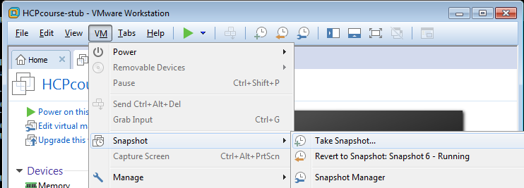
5. Login to the VM as 'root' with password 'course'  
 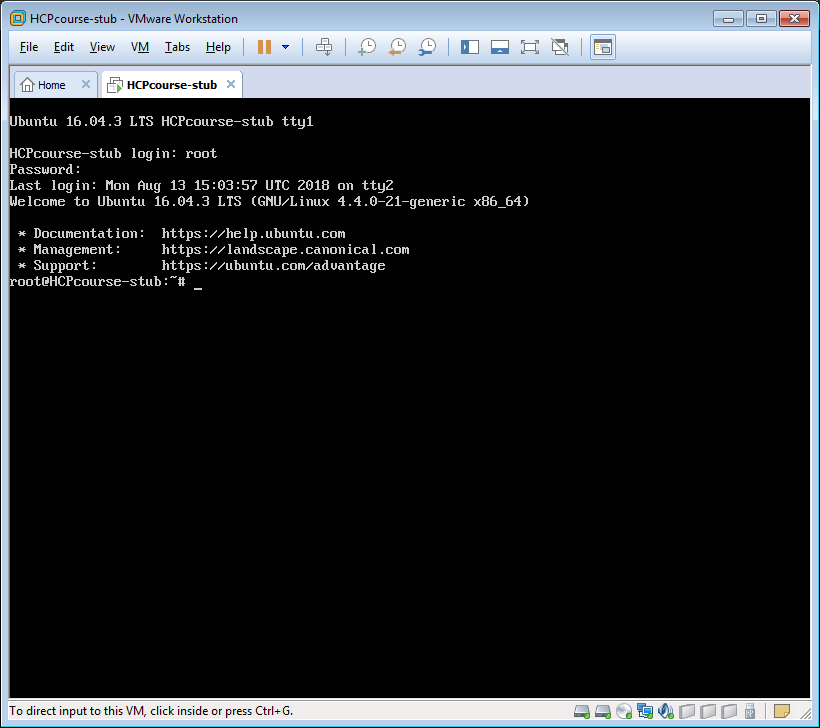
6. Execute './setupCourse.sh'  
 
7. Leave the hardware configuration as is for the course VM.  Press Ctrl-X:  
 
8. Press enter to start the syncing with the master copy of the VM:  
 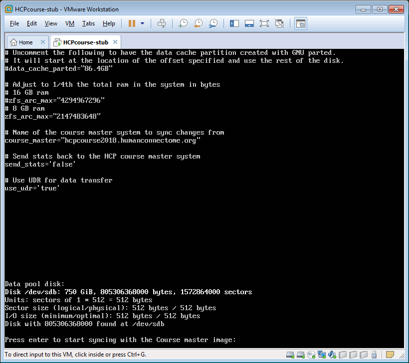
9. The screen will start logging the files as they are synced from the master.   The rest of the process is completely automated.  Do not interrupt the process until it completes.   Some of the larger files may take a while to copy.  This stage downloads about 28GB of data.  
  
 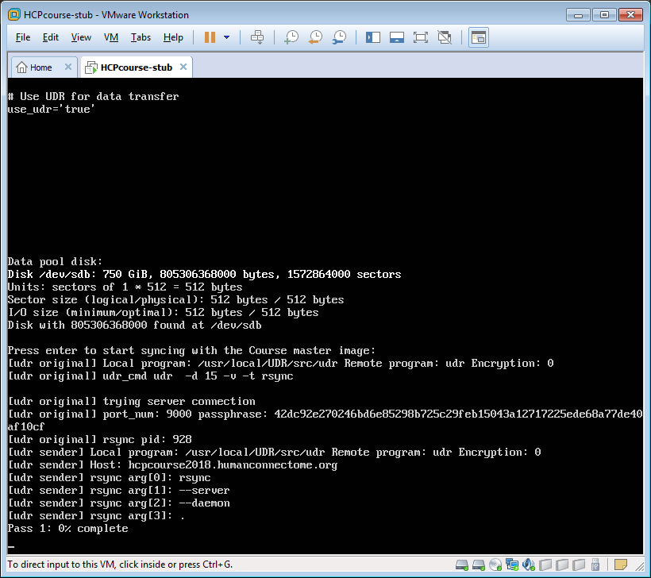  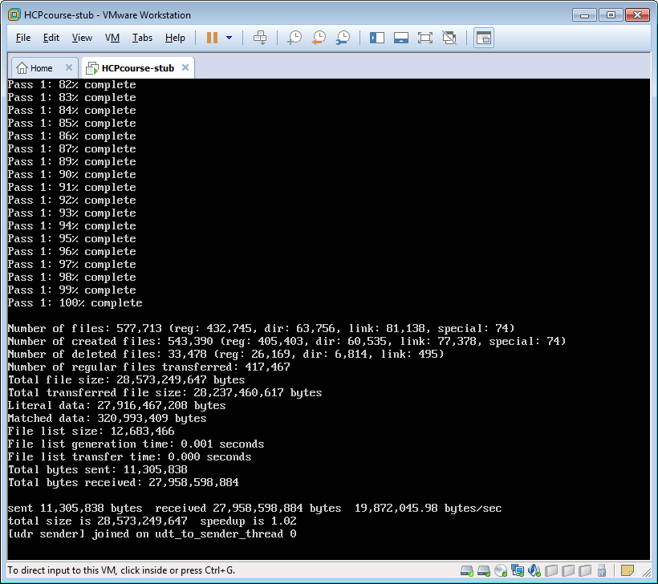   
After syncing the operating system portion of the VM it will reconfigure itself and reboot several times.  
      
    
Finally it will synchronize all the course data:  
  
 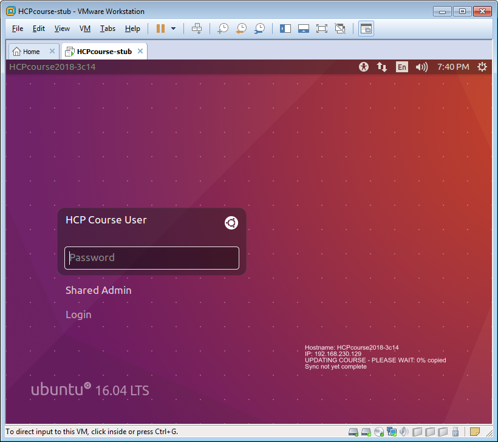   
The screen will update each percent that the copy completes.   If your Internet connection is slow (<100mb/s) this process could take several to many days/over a week.  Even on the 1Gb/s LAN, this process takes several hours.  
If the VM is interrupted at this point it will simply resume the copy of the course data until it has everything.  Do not shut down or put to sleep your computer's native OS during the download (download will suspend). If you do not see the "UPDATING Course - PLEASE WAIT: X% copied" message, shut down and restart the VM to start the syncing again.
10. When the download is complete your screen should look like this:  
    
The "Synced to: 08/13/2018 02:10:48 PM" (or later) message indicates the download is complete.
11. Login to the Course machine as HCP Course User with the password:  
HCPoxford2018
12. Click the "Start/Reset/Archive Course" terminal icon. Type 1 to choose "1) Start the course":  
 
13. The message will now say "Starting Course" then when done, "Course is Running", and you should be able to click on the desktop icons to see the directories/data for each day's practicals.
14. Open the 2018\_Course\_PDFs folder on the desktop and navigate to PDFs/Word Docs for the Lectures and Practicals. The Practicals are named in numeric order, the PDF versions have correct formatting and therefore have figures that show up correctly, but you may want to open the Word Doc versions in Libre Office so that you can cut and paste commands as you work through the practicals. (Cutting and pasting from the PDFs often introduces invisible characters that will often mess up commands that you run at the terminal.)\*  
\*Note: the 2018 HCP Course Lectures and Practicals PDFs and Word Docs, including an entire Course book of all the materials, are also available for download from: <https://wustl.box.com/v/HCP-Course-Materials-2018>

  
**Troubleshooting:**

If you think your download is done but you do not see the above message:

1. If the first pass repeats the message "UDR ERROR: Cannot connect to server at hcpcourse2018.humanconnectome.org:9000", your network firewall is blocking the connection to download the course VM.   You will need to request your IT department allow outbound connections for TCP and UDP ports 9000-9100.
2. If the first pass of the stub VM fails, roll back to the snapshot taken in step 4 and proceed with step 5 again.
3. Login to the Course machine as in 10., above
4. Click the "Start/Reset/Archive Course" terminal icon. Type 2 to choose "2) Reset the course"
5. The screen should say "COURSE HAS NOT STARTED Sync not yet complete"
6. The VM should automatically restart syncing and the screen should update to say: "UPDATING Course - PLEASE WAIT: X% copied"
7. When the download is complete follow the above directions from 9. onward.

#### Notes:

1. ESXi will require special configuration not covered here.

  

# Attachments

- 
- 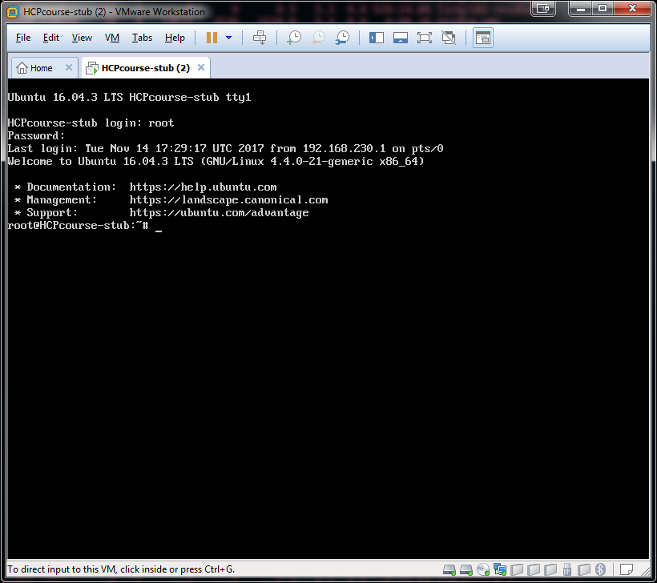
- 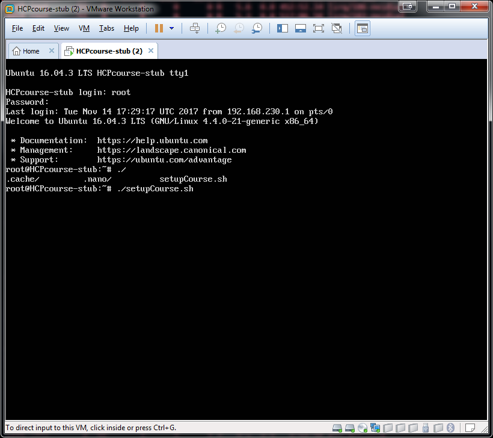
- 
- 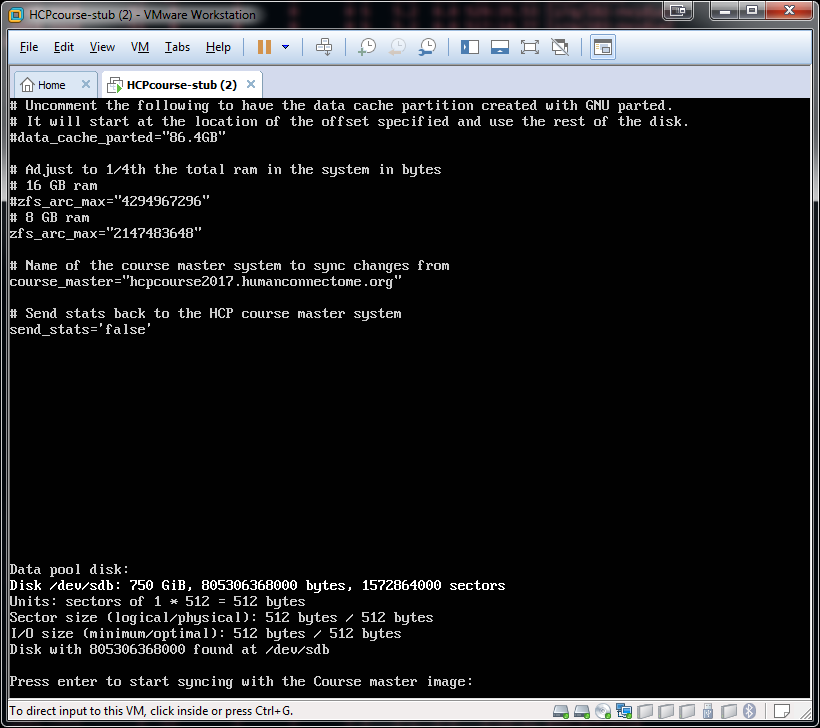
- 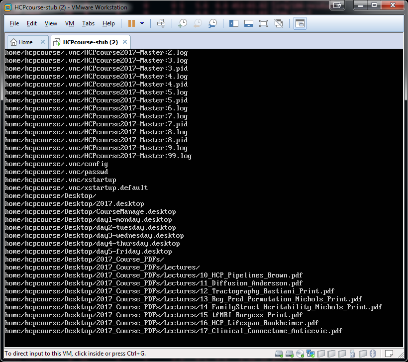
- 
- 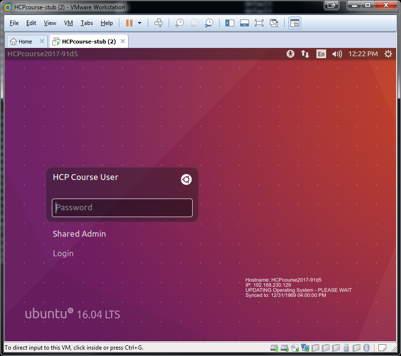
- 
- 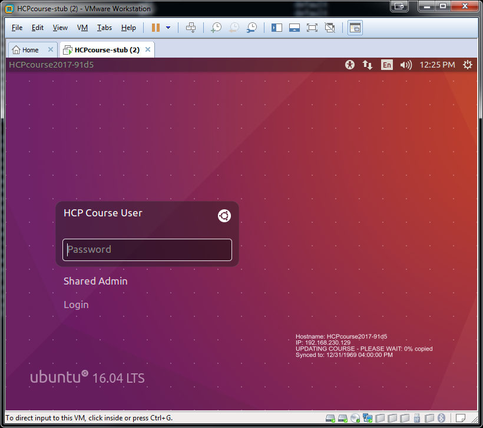
- 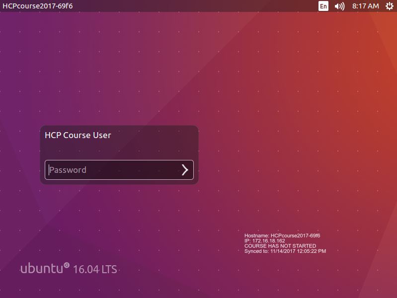
- 
- 
- 
- 
- 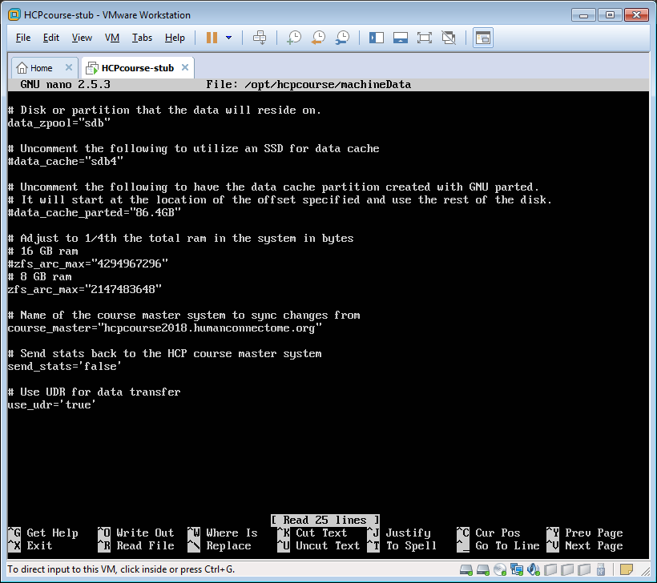
- 
- 
- 
- 
- 
- 
- 
- 
- 
- 
- 
- 