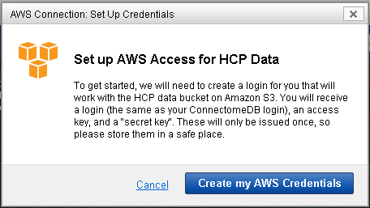
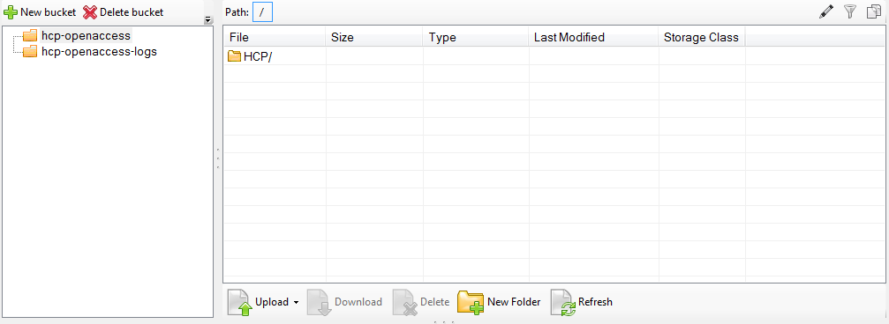
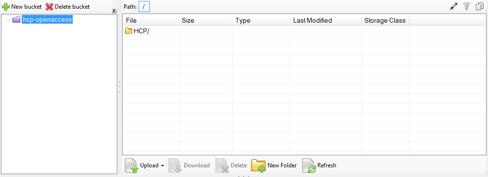
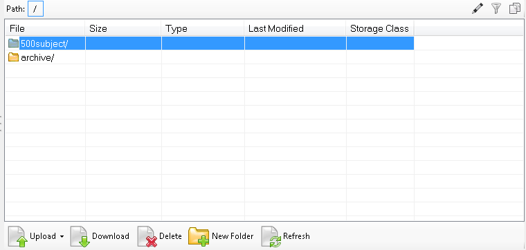
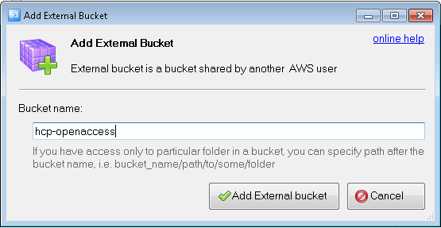

## Introduction

The Human Connectome Project is now making image data available to use directly with Amazon Web Services, without you having to download from ConnectomeDB or order Connectome in a Box drives. This tutorial will show you how to get a set of AWS credentials and connect to HCP data via Amazon S3. Amazon S3 can be used for cloud-based HCP data processing (Amazon charges users for compute cycles) or as an alternative to Aspera for download of HCP data at no cost to the user (Note: in most cases, downloading HCP data through Amazon S3 WILL NOT be faster than Aspera-driven data download through ConnectomeDB). Information on setting up an AWS EC2 instance and processing is available here: **[EC2 Beginner Startup Advice](../Docs/EC2 Beginner Startup Advice.md)**.

## HCP Datasets on AWS

After logging in to ConnectomeDB (<https://db.humanconnectome.org)>, you will see a list of datasets that we are hosting. Each dataset that is available on AWS will have an icon in its dataset listing, as shown: 

  

You will only need one set of credentials to access all datasets on AWS, but that access will be controlled by your acceptance of each dataset's data use terms.  When new datasets are added to AWS, the only action you will need to take (if you already have AWS credentials) is to review and accept the data use terms for each new dataset.

## Creating AWS Credentials

  

Each set of AWS credentials consists of three parts: a login, a public access key, and a secret access key. Simply click on the "Data Available on Amazon S3" button to open a modal window to generate them. There will be a brief delay while ConnectomeDB communicates with our AWS bucket to establish permissions. 

  

AWS returns a set of credentials. Your AWS login will be the same as your ConnectomeDB username. Your access keys will be randomly generated. Once your set of credentials is created, we strongly encourage you to save them locally. For security reasons, we do not store a copy of your AWS access keys in ConnectomeDB. 

  

## Connecting to AWS Data Using These Credentials

There are a number of ways and applications that can be used to connect to the HCP data container on AWS. Here is one example, using [Amazon S3 Browser](http://s3browser.com/), a free software package for Windows that lets you browse data on AWS from your desktop.  [CyberDuck](https://cyberduck.io/) is another such free software client, available for both Mac and Windows. 

Once you launch S3 Browser, you will be prompted to create an account. Enter your AWS credentials where specified: 

  

Once you have connected, you should be automatically connected to the HCP Open Access data bucket, and see the "HCP/" folder.

If not...

  

> [!expand] 
> you will need to manually add the bucket that contains HCP datasets. The name of this bucket is "hcp-openaccess". Select "Add an External Bucket" from the menu and enter this id.
  

 Just like that, you have access to all HCP datasets for which you have permission. 

  

*Note: you will also see the "hcp-openaccess-logs" bucket, but you should not have, or need, access to this.*

## Regenerating your Credentials

If for any reason you lose your original set of credentials, you can reset them via ConnectomeDB by clicking on the "Amazon S3 Access" button associated with each hosted dataset. This will open a familiar-looking modal window. One click and new credentials will be generated. **Note: This will replace your existing set of credentials. Any attempt to log in with your old credentials will not work.**

  

## Working with Amazon Public Datasets - Getting Started

This connection tutorial assumes that you already have working experience with Amazon Public Data Sets. If this is your first time, please read the following tutorial provided by the Amazon Web Services team: **[AWS Documentation: Using Public Data Sets](http://docs.aws.amazon.com/AWSEC2/latest/UserGuide/using-public-data-sets.html)**. You may also find this Q&A on the BioStars Bioinformatics forum helpful: **[Question: Using Amazon Web Services?](https://www.biostars.org/p/3643/)**

Also, please take note: while we freely distribute HCP data, there may be costs related to using the Amazon service to perform processing jobs. Please make sure you fully read and understand their terms of service: **[AWS Documentation: Amazon EC2 Pricing](http://aws.amazon.com/ec2/pricing/)** 

**In This Page:**

  

# Attachments

- 
- 
- 
- 
- 
- 
- 
- 
- 