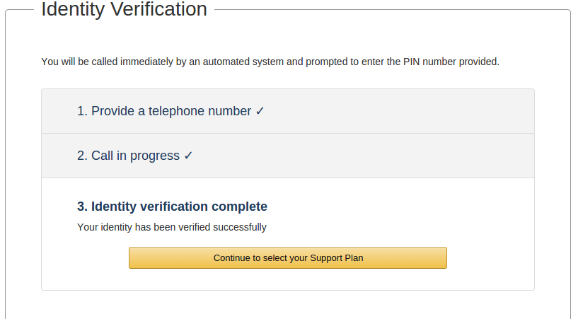

This guide provides instructions for creating an Amazon Web Services Account. It was originally written for use by participants in the course *[Exploring the Human Connectome 2017](https://store.humanconnectome.org/courses/2017/exploring-the-human-connectome.php)* and is based on similar materials prepared for the 2015 and 2016 editions of the course. It is intended to be useful even for users who were not participants in the course.

You will need an Amazon Web Services (AWS) account in order to create and run Amazon EC2 instances that can run HCP Pipeline Scripts. If you already have an AWS account (not just an Amazon account), then you can skip these instructions.

1. If you already have an Amazon account (one you have used for purchasing items from [Amazon.com](http://Amazon.com)), you can choose to use that existing user id (email address) and password or you can choose to create a new account using a different email address (perhaps using your institution email address, as in [john.doe@wustl.edu](mailto:john.doe@wustl.edu)).  

---
2. Using a web browser, visit <https://aws.amazon.com>

---
3. Select the *My Account* pull down menu and select the AWS Management Console option.  

---
4. This should take you to the *Sign In or Create and AWS Account* page.  

---
5. If you will be using your existing Amazon account, enter the email address associated with that account, select the *I am a returning user and my password is:* option, enter your password, and select the *Sign in using our secure server* button to log in.

---
6. If you will be creating a new account associated with a new email address, enter the email address you would like to use, select the *I am a new user* option, and select the *Sign in using our secure server* button. You will be taken to a page where you will need to supply your name and provide a password to create a new Amazon account.

---
7. In either case, you should next arrive at the *Amazon Web Services Sign Up* page (see Figure 1).  

---

 
  
Figure 1: Amazon Web Services Sign Up  
  

---
8. If, instead of seeing the *Amazon Web Services Sign Up* page, you see your AWS console (see Figure 2), then you already have an AWS account.  

---

Figure 2: AWS console  
  

---
9. To create an AWS account: fill in the contact information, fill in the security check box, agree to Amazon's AWS Customer Agreement, and select the *Create Account and Continue* button.

---
10. **You will then have to supply Amazon with credit card information.** Amazon has a *Free Tier* of AWS service, but if you use parts of AWS that are not part of the Free Tier, they want to have a credit card to use to charge you for those non-free services. This is not something that is under the control of the HCP, and we cannot have Amazon allow you to create an AWS account without supplying a credit card.

---
11. After pressing the *Continue* button, you will have to go through an Identity Verification process that involves an automated system placing a call to a phone number that you supply, you entering (via your phone touchpad) a PIN that is provided on the web page. After completing this process, you should arrive at the *Identity verification complete* page (see Figure 3).  

---

  
     
  
Figure 3: Identity Verification Complete  
  

---
12. Select the *Continue to select your Support Plan* button.

---
13. Unless you already know that you want a higher level support plan, select the *Basic (Free)* plan and then select *Continue.* 

---
14. You should arrive at the *Welcome to Amazon Web Services* page from which you can select to *Sign in to the Console.* 

---
15. Selecting *Sign in to the Console* should take you back to the *Sign In or Create an AWS Account* page where you can now log in to you AWS account. After logging in to your AWS account, you should see the AWS Console.

## Related articles

  

  
