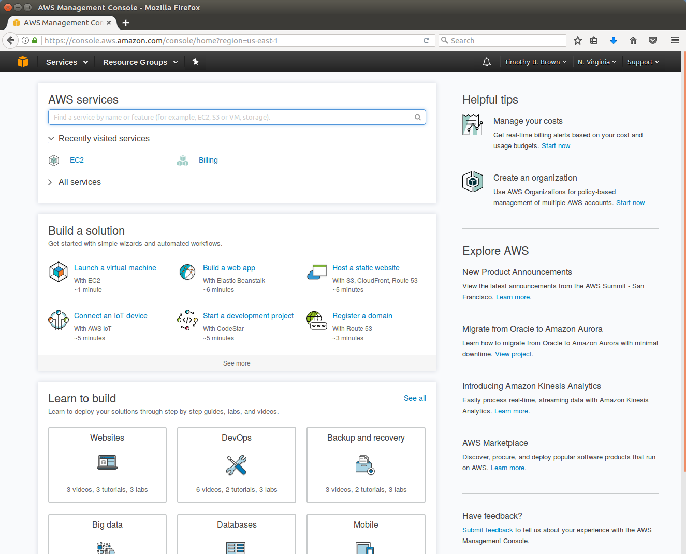
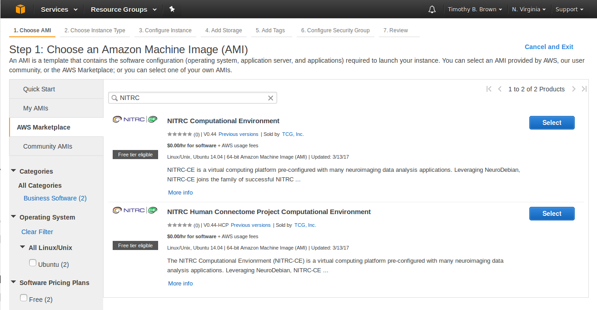
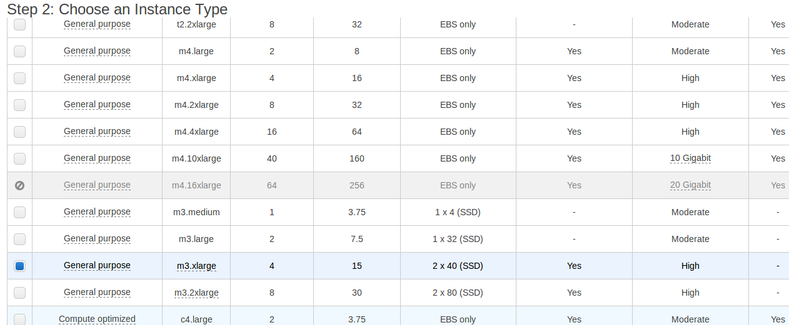
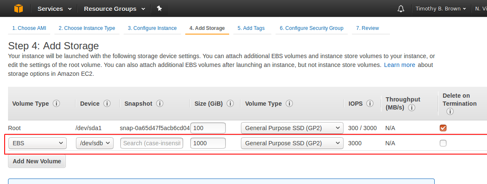
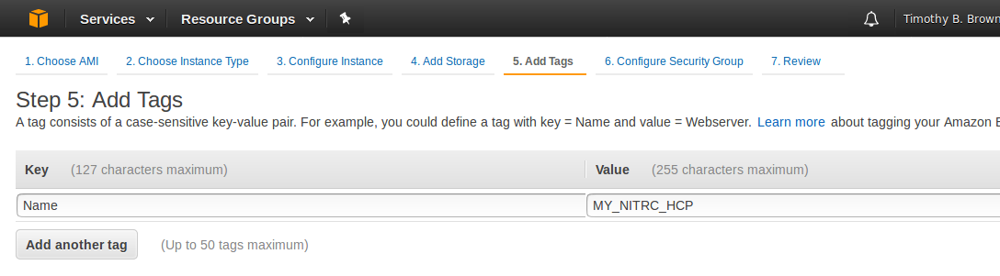
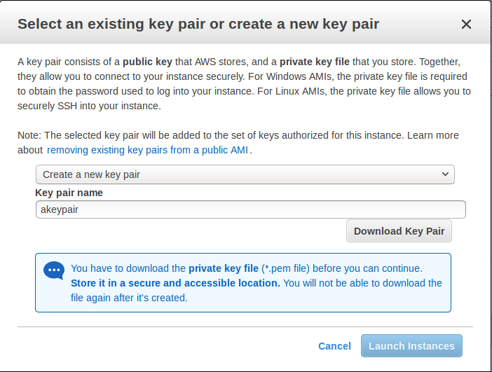
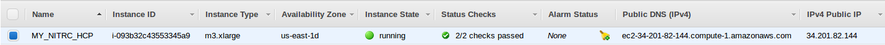
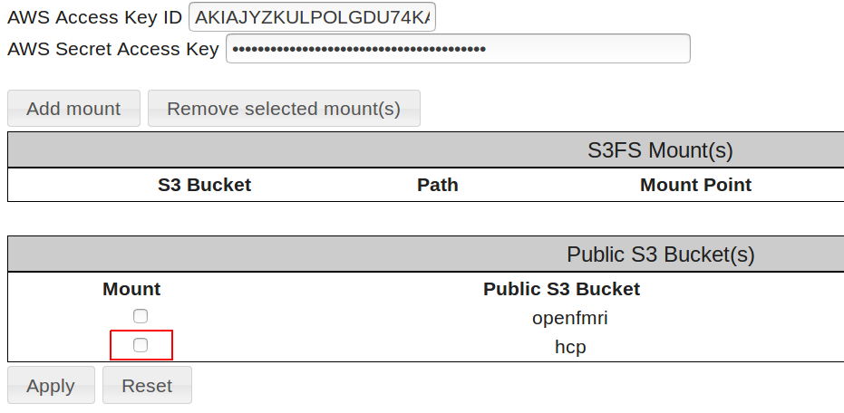
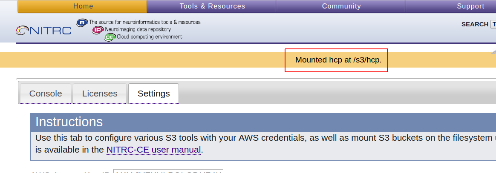

This guide was originally written for participants in the course *[Exploring the Human Connectome 2017](https://store.humanconnectome.org/courses/2017/exploring-the-human-connectome.php)* and is based on similar materials prepared for the 2015 and 2016 editions of the course.

During the course, an optional practical session titled *Cloud-based Processing Using HCP Pipelines and Amazon Web Services* was held. That session was devoted to a demonstration of *Creating an EC2 instance for HCP Pipeline Processing.* That demonstration was intended to give participants a general feel for what is necessary to create such an EC2 instance. However, participants were not expected to actually execute the process during the demonstration. 

The guide is for participants who wish to actually create their own Amazon EC2 instance for HCP Pipeline Processing following the steps that were carried out during the demonstration. The steps documented here are not the only way an EC2 instance can be created for running the HCP Pipeline Processing.

This material may also be useful for non-participants.

This guide assumes an understanding of Amazon Web Services concepts provided by the course lecture *ConnectomeDB, Connectome Coordination Facility, Amazon Web Services*.

This guide assumes that you already have credentials for accessing the HCP OpenAccess S3 Bucket. If you do not have those credentials, please follow the instructions at [How to Get Access to the HCP OpenAccess Amazon S3 Bucket](./How%20to%20Get%20Access%20to%20the%20HCP%20OpenAccess%20Amazon%20S3%20Bucket.md).

This guide assumes that you already have an AWS account. If you do not have an AWS account, please follow the instructions at [How to Create an Amazon Web Services Account](./How%20to%20Create%20an%20Amazon%20Web%20Services%20Account.md).

***Some of the steps in this guide use services that are part of AWS that are not in the Free Tier of AWS. That means that in carrying out these steps, there may be charges from Amazon to the credit card associated with your AWS account.***

## Step 1a: Login to AWS

* Open a web browser and visit <https://aws.amazon.com/console>.
* Select the    button in the upper right hand corner of the browser.
* Login to your Amazon AWS account using your email address and password.
	+ Note: Use your AWS account login information, not your credentials for getting access to the HCP S3 bucket
* You should see an AWS Console page that looks similar to Figure 1.

  
  

Figure 1: Amazon AWS Console  
  


* Note: Amazon changes the way the console looks from time to time, and the way your console looks changes based upon your recent AWS activities. So don't be too concerned if your AWS Console doesn't match the figure exactly.
* In the upper right of the web page, just to the right of the name associated with your account, there is a region indication (e.g. N. Virginia, Ohio, Oregon, Ireland, Sydney, etc.) At the time these instructions were written, the AMI that we will be using is available only in the US East (N. Virginia) region. If your region indication does not read *N. Virginia*, select the down arrow to the right of the region and select *US East (N. Virgina).*

## Step 1b: Start Creating an Instance

* We want to create a Virtual Machine (VM) in the Amazon Cloud on which to run HCP Pipelines. In AWS terms, that means creating an EC2 instance.
* Starting at the Services menu (near the upper left) navigate: *Services → Compute → EC2* (See Figure 2).

  
  

Figure 2: Selecting the EC2 service  
  


* This should get you to the *EC2 Dashboard* (see Figure 3).

  

Figure 3: EC2 Dashboard

## Step 2: Launch an EC2 Instance

* Select the   button
* We are configuring a "computer". Our first task is to select the base software
	+ The base software = the Operating System and any other pre-installed software
	+ In AWS terminology, this base software is an Amazon Machine Image (AMI)
* So the first page you will be presented with is used to select the AMI to use for your instance (see Figure 4).

  

Figure 4: Choose and AMI page  
  


* The *My AMIs* tab on the left is for AMIs you have created yourself.
* The *AWS Marketplace* tab is for AMIs that are verified by AWS.
* The *Community AMIs* are for AMIs that users have made available but have not be verified by AWS.

## Step 3: Find and Select an AMI

* Select the *AWS Marketplace* tab.
* In the search box, enter NITRC
	+ Our friends at the Neuroimaging Informatics Tools and Resources Clearinghouse (NITRC) have created an AMI called the NITRC Computational Environment - NITRC-CE. This includes installation of many of the tools that are commonly used in Neuroimaging (FSL, FreeSurfer, Connectome Workbench, etc.)
	+ They have further customized the NITRC-CE to create the NITRC-HCP-CE - the Human Connectome Project release of the NITRC-CE
* Select the NITRC-HCP-CE - The NITRC Human Connectome Project Computing Environment (See Figure 5)

  

Figure 5: Result of searching for NITRC within the *AWS Marketplace* AMIs  
  


* Note: By the time you use these instructions NITRC may have released an updated version of the NITRC-HCP-CE. If so, your search results may look different than Figure 5. You will probably benefit from using the latest version they have released. However, if you use a later version of the NITRC-HCP-CE and find that things are not working as described here, you might need to revert back to using the latest version as of this writing (V0.44-HCP)
* Press the   button to the right of the AMI to use.

## Step 4: Select an Instance Type

* Having selected the base software, now it's time to select the "hardware"
* This is like selecting a computer you are going to buy. (In this case rent.)
* AWS has categorized the machines and created machine "types"
* You can select based on # of CPUs, RAM, Network Performance, etc.
* Costs vary - a few are available for free (in the Amazon *Free Tier*), but those will not be adequate for running a pipeline.
* We'll select one that will allow us to run one phase of the HCP Structural Preprocessing Pipeline
* Choose: *General purpose - m3.xlarge - 4 CPUs, 15GB RAM* (see Figure 6).

  

Figure 6: Choosing the m3.xlarge Instance Type

## Step 5: Add Storage

* Next we'd like to add some EBS storage that will be attached to this machine like an external drive. It will outlive the machine.
* We are not yet ready to *Review and Launch* the instance. Instead, select the   button, followed by the   button.
* This should get you to the *Add Storage* page (see Figure 7).

  

Figure 7: Add Storage page  
  


* Notice that there is already a 100GB internal EBS/SSD already part of the Instance we are creating. This is the "internal" disk on which the software will be installed. It is not nearly big enough for the neuroimaging data that we would like to be able to analyze. This "internal" disk will also not be accessible when this instance is running and will be gone when the instance is terminated.
* We want some storage that is both big enough to hold some neuroimaging data and is not dependent upon this instance (like an external disk that can be attached to different machines.)
* Select the   button to get a new row added to the storage table, leave the *Volume Type* as EBS, enter a size of 1000 GB (1 TB), and make sure that *Delete on Termination* is **not checked** (see Figure 8).

  

Figure 8: Configuration of "external" volume

## Step 6: Tag Your Instance

* Select the   button.
* Tagging is optional, but can be used to label attributes of you instance and to give your instance a "name" by which you can recognize it and refer to it.
* Tags are Key - Value pairs that you assign.
* Select the   button.
* Provide a Key of *Name* and a Value of *MY\_NITRIC\_AMI* (see Figure 9).

  

Figure 9: Tagging your instance  
  


* Select the   button.

## Step 7: Configure Security Group

* A security group is a set of firewall rules that control the traffic for your instance.
* We need to use security settings that allow traffic through ports that will be used by SSH for accessing our machine instance and through ports that are used for communication between a VNC Server and VNC Clients.
* Once you've created a set of rules, you can name them and use the again.
* NITRC has created a security group and given it a name like "NITRC Human Connectome Project Computational Environment-v0-44-HCP-AutogenByAWSMP-"
* We do not need to change this security information.

## Step 8: Review your instance

* Select the   button.
* Review your instance settings.
* Notice the warnings about the security settings and about the instance not being free.

## Step 9: Create access keys

* Select the   button
* You should be presented with a dialog asking about a key pair
	+ This is a set of credentials that you will need in order to access (log on) to the VM you are creating
	+ There are credentials for logging in to ConnectomeDB and credentials for getting access to the S3 Bucket. These credentials are neither of those. They are instead credentials for accessing the VM.
	+ If we never want to use SSH to access our VM, or we don't mind typing our password every time we access the VM, then these credentials are not essential. But we'll go ahead and generate them for now.
* On the *Select an existing key pair or create a new key pair* dialog (see Figure 10), select the *create a new key pair* option and give the key pair a name of your choosing.

  

Figure 10: Creating a new key pair  
  


* Select the    button to save the key pair to a file for possible later use. Be sure you keep track of where this file is saved and what it is named.
* Finally, select the   button to actually launch your instance.
* Now your instance will be launching (i.e. booting up)

## Step 10: Gather information

* There are some pieces of information about your instance that you will need to have in order to access (log on to) it.
* Take note of your instance ID (see Figure 11).

  

Figure 11: Instance ID  
  


* Notice that the Instance ID presented is a link. Select the instance ID link to be taken to a table listing information about your instance.
* The Instance Table will show you the following important information (see Figure 12).
  	+ Public DNS (IPv4): e.g. ec2-34-201-82-144-compute-1.amazonaws.com
	+ IPv4 Public IP: e.g. 34.201.82.144
	+ Key Name: e.g. akeypair
	
* Take note of this information, you will need some of it to access your machine.
* Note: Each time you restart your instance you will get a different Public DNS and Public IP address.

  

Figure 12: Table entry for a running instance

## Step 11: NITRC-HCP-CE Configuration - Part 1

* In a separate browser tab, visit your running instance at it's public DNS
* A NITRC-HCP-CE has a web server running so you can visit it via a browser and perform the necessary configuration
	+ Note: If you see a page indicating that a connection was refused or you were unable to connect, it is likely that the web server is still getting started. Wait a minute or two and try again.
* You will likely be first presented with a *Security Redirect* page.
* On the *Security Redirect* page, select the here link in the phrase, "For better security, please click here to open an encrypted..."
* When you select the here link, your browser will likely respond with a warning that your connection isn't secure. This will take different form with different browsers.
* Work your way passed the security issues using whatever options your browser gives you for doing so.
* This should get you to the main NITRC-CE configuration page for your instance (see Figure 12).

  

Figure 12: Main NITRC-CE Configuration page  
  


* Enter your Amazon Instance ID
* Select and enter a username (e.g. hcpuser) - this will be your username for your account on the running NITRC-HCP-CE instance  
Select and enter (twice) a password (e.g. hcppassword) - this will be the password for your account on the running NITRC-HCP-CE instance
* You do not have to use hcpuser and hcppassword. These are just examples for use in these notes.
* Enter an alarm email address
* Select the   button
* If all went as it should, you should receive confirmation that your account was successfully configured (see Figure 13).

  

Figure 13: NITRC-HCP-CE account successfully configured  
  


* You now have a running EC2 instance to which you can login.

## Step 12: NITRC-HCP-CE Configuration - Part 2

* The NITRC-HCP-CE provides a Control Panel
* It allows you to:  

	+ Connect to your running instance via VNC
	+ Allow SSH access to your instance
	+ Configure the software licenses for your instance
	+ Set up s3fs access to the HCP OpenAccess S3 bucket from your instance
* Select the   button to see the Control Panel (see Figure 14)

  

Figure 14: NITRC-HCP-CE Control Panel  
  


* Notice that the Control Panel has 3 tabs across the top: *Console*, *Licenses*, and *Settings*
	+ The *Console* tab is where you manage connections to your running instance
	+ The *Licenses* tab is where you manage software licenses (e.g. FreeSurfer)
	+ The *Settings* tab is where you mount S3 buckets to your instance via s3fs
* On the *Console* tab, select the checkbox to enable SSH access and press the *Submit* button.
* On the *Licenses* tab, update your FreeSurfer License by selecting the click here link in the phrase: "To update your FreeSurfer License, please click here."
	+ You will need to get your own FreeSurfer License by visiting <https://surfer.nmr.mgh.harvard.edu/registration.html>
	+ Don't forget to select the *Submit Query* button after you have entered your license information in the text area.
		- If there is an error writing the FreeSurfer license file, you will need to follow the instructions to save it manually at /usr/local/freesurfer/.license. You'll do this after successfully logging on to your instance. You will need to be the "root" user to edit/create the /usr/local/freesurfer/.license file. We will see how to become the root user in a subsequent step.

## Step 13: NITRC-HCP-CE Configuration - Part 3

* Select the *Settings* tab of the Control Panel
* This is where we will configure our S3 Access and mount the HCP OpenAccess S3 bucket using s3fs
* Enter your AWS Access Key ID and your AWS Secret Access Key in the fields provided
	+ Be careful. You will probably want to copy and paste these field values from a text file.
	+ If you enter them incorrectly, no error will be reported, but mounting the data will not work. You will only notice the mounting not working when you actually log in and try to access the data at /s3/hcp.
* Select the    button to store your AWS Access Key ID and AWS Secret Access Key on your running instance and enable the mounting of the HCP OpenAccess S3 Bucket
* Notice that after you press the *Apply* button, the field under the Mount heading to the left of the hcp bucket entry becomes a checkbox (see Figure 15).

  
  

Figure 15: After applying AWS credentials  
  


* Select/check the checkbox to the left of the HCP public S3 bucket and press the *Apply* button again.
* Notice the status information near the top indicating that the data has been mounted at /s3/hcp (see Figure 16).

  

Figure 16: Successful mounting of HCP S3 bucket

## Step 14: Access your instance via VNC/Guacamole

* Select the *Console* tab
* If you do not see a   button, then select the   button to start a VNC server session on your running instance.
	+ Take note of the URL to use for accessing the VNC server session e.g. **ec2-184-72-65-166.compute-1.amazonaws.com::5901**
	+ You could use this URL with a VNC Client running on your local system to connect to the running server session.
	+ You would need to have VNC Client software installed on your local system to do this.
	+ Configuring your VNC Client to connect to this VNC Server is beyond the scope of this demonstration.
* Once you see a   button, go ahead and select it to connect to a running VNC server session.
* You will then need to enter your Username and Password. These are the Username and Password for an account on your running instance that you created back in Step 11 (e.g. hcpuser and hcppassword)
* This should take you to the [Guacamole](https://guacamole.incubator.apache.org) connections page (see Figure 17).

  

Figure 17: Guacamole connections page  
  


* Select the NITRC-CE Desktop link in the All Connections section. Note: It is not obvious from its appearance that the text *NITRC-CE Desktop* is a link, but it is.
* Selecting that link should open another tab in your browser and connect you to a running VNC server session on your instance (see Figure 18).

  

Figure 18: Connected to a VNC server session

* Notice that you have read only HCP data mounted at /s3/hcp
	+ cd to /s3/hcp and issue an ls command
	+ It can take a long time (up to a few minutes) to show you the list of subject IDs that make up the subdirectories there.
	+ The fact that it is taking a long time is actually good as it indicates that you have successfully mounted the HCP S3 bucket. A quick return of an empty directory listing indicates failure to mount the HCP S3 bucket.
* Notice that if you use the terminal to issue a command like fsl, you see that you have version v5.0.9 installed.
	+ Note: Version v5.0.10 was recently released. You may want to install the newer version.
* Issuing the command like freesurfer will show that you are using version v5.3.0-HCP of FreeSurfer
* wb\_view shows version 1.2.3 of Connectome Workbench
* more ~/tools/Pipelines/version.txt to see the version of the HCP Pipeline Scripts installed
	+ Note: You may want to override this by installing a different version of the HCP Pipeline Scripts

## Step 15: Access your instance via SSH

* Open a Terminal on your local machine
* Issue a command like:  
  

```
ssh -Y hcpuser@<your-public-dns>
```
* You will need to substitute your running instance's actual public DNS for <your-public-dns> in the above command.
* You will also need to substitute the username for an account on your running instance for hcpuser in the above command
* Acknowledge warning about authenticity of the host by simply pressing return or entering yes to the "Are you sure..." prompt.
* Enter your password when prompted.
* You now have a simple terminal connection to your running instance
	+ Not particularly good for GUI stuff, but better for editing files and pipeline running

## Step 16: Mounting your "external" EBS drive - Part 1

* Notice what disk space you have available  
  
```
hcpuser@nitrcce:~$ df -h
Filesystem      Size  Used Avail Use% Mounted on
udev            7.4G   12K  7.4G   1% /dev
tmpfs           1.5G  820K  1.5G   1% /run
/dev/xvda1       99G   22G   73G  23% /
none            4.0K     0  4.0K   0% /sys/fs/cgroup
none            5.0M     0  5.0M   0% /run/lock
none            7.4G  144K  7.4G   1% /run/shm
none            100M   32K  100M   1% /run/user
s3fs            256T     0  256T   0% /s3/hcp
hcpuser@nitrcce:~$
```
* The s3fs row shows that the HCP S3 bucket is mounted at /s3/hcp. – Good
* The /dev/xvda1 row shows that your primary disk (~100GB) is mounted at / – Good
* But where is that 1000GB = 1TB "external" disk that we created when we were creating this instance?
	+ It doesn't have a file system created for it, and it isn't yet mounted.
* View the available disk devices  
  
```
hcpuser@nitrcce:~$ lsblk
NAME    MAJ:MIN RM   SIZE RO TYPE MOUNTPOINT
xvda    202:0    0   100G  0 disk
└─xvda1 202:1    0   100G  0 part /
xvdb    202:16   0  1000G  0 disk
hcpuser@nitrcce:~$
```
* The device is showing up as xvdb
* Determine if you need to create a file system on the device. (You do.)  

```
hcpuser@nitrcce:~$ sudo file -s /dev/xvdb
[sudo] password for hcpuser:
/dev/xvdb: data
hcpuser@nitrcce:~$
```
* The response: **/dev/xvdb: data** means that there is no file system on the device and it needs to be created
* Create an ext4 file system on the volume 
```
hcpuser@nitrcce:~$ sudo mkfs -t ext4 /dev/xvdb
mke2fs 1.42.9 (4-Feb-2014)
Filesystem label=OS type: Linux
Block size=4096 (log=2)
Fragment size=4096 (log=2)
Stride=0 blocks, Stripe width=0 blocks
65536000 inodes, 262144000 blocks
13107200 blocks (5.00%) reserved for the super user
First data block=0
Maximum filesystem blocks=4294967296
8000 block groups
32768 blocks per group, 32768 fragments per group
8192 inodes per group
Superblock backups stored on blocks:
    32768, 98304, 163840, 229376, 294912, 819200, 884736, 1605632, 2654208,
    4096000, 7962624, 11239424, 20480000, 23887872, 71663616, 78675968,
    102400000, 214990848

Allocating group tables: done
Writing inode tables: done
Creating journal (32768 blocks): done
Writing superblocks and filesystem accounting information: done

hcpuser@nitrcce:~$
```

## Step 17: Mounting your "external" EBS drive - Part 2

* Make a mount point and mount the device  
  


| 
```
hcpuser@nitrcce:~$ sudo mkdir /datahcpuser@nitrcce:~$ sudo mount /dev/xvdb /datahcpuser@nitrcce:~$ df -hFilesystem      Size  Used Avail Use% Mounted onudev            7.4G   12K  7.4G   1% /devtmpfs           1.5G  820K  1.5G   1% /run/dev/xvda1       99G   22G   73G  23% /none            4.0K     0  4.0K   0% /sys/fs/cgroupnone            5.0M     0  5.0M   0% /run/locknone            7.4G  144K  7.4G   1% /run/shmnone            100M   32K  100M   1% /run/users3fs            256T     0  256T   0% /s3/hcp/dev/xvdb       985G   72M  935G   1% /datahcpuser@nitrcce:~$ sudo chmod 777 /datahcpuser@nitrcce:~$
```
 |
| --- |
* Notice that /dev/xvdb is now mounted at /data and has 935GB free space.
* You will want to mount the volume on every reboot.
* Edit the file /etc/fstab and add a line that looks like the following:  
  


| 
```
/dev/xvdb   /data  ext4  defaults,nofail  0 2
```
 |
| --- |
* **There are <TAB> characters between the fields. Except between the 0 and the 2 there is just a single space character.**
* **You must be very careful here. Editing this file incorrectly can make your instance unusable.**
* You will need to be "root" or "superuser" to edit the file, so your command to edit the file using the nano editor would look something like:  
  


| 
```
hcpuser@nitrcce:~$ sudo nano /etc/fstab
```
 |
| --- |
* See <http://docs.aws.amazon.com/AWSEC2/latest/UserGuide/ebs-using-volumes.html> for further information about mounting and use EBS volumes.

## Step 18: Shutting down/Restarting your instance

* Go back to your EC2 Management Console in the browser tab where you are logged in to your AWS Console
* Select the instance/machine you want to shut down
* Select *Actions* *→ Stop*
* Note that *Actions → Terminate* is a different operation
* Stopping is analogous to simply shutting down your machine.
* Terminating is analogous to pitching the machine in the trash, or returning it to the place you got it.
* While the machine is stopped you will not be charged for processing time.
* But you will continue to be charged for EBS disk space.
* Also note that when you restart a stopped machine, you will get a different public DNS and different IP Address than you previously had.

  


> [!info] 
> You may also want to use visual panels to communicate related information, tips or things users need to be aware of.
## Related articles

Related articles appear here based on the labels you select. Click to edit the macro and add or change labels.

  


> [!details] 
> Related issues
  


  


# Attachments

- 
- 
- 
- 
- 
- 
- 
- [ApplyButtonForAWSs3fs](./assets/ApplyButtonForAWSs3fs)
- 
- 
- 
- 
- 
- 
- 
- 
- 
- 
- 
- 
- 
- 
- 
- 
- 
- 
- 
- 
- 
- [NextConfigure](./assets/NextConfigure)
- 
- 
- 
- 
- 
- 
- 
- 
- 
