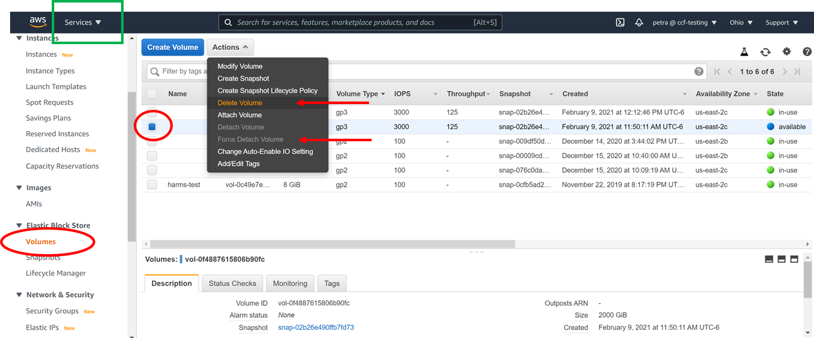

## Purpose:  Extend your exposure to nuts and bolts of AWS cloud computing so that you can translate what you may be used to doing locally to more scalable, reproducible, and meta-analyzable compute infrastructure.  Knowing this stuff will make using that stuff more intuitive.

* [computational credits](https://nda.nih.gov/get/computational-credits.html) in an NDA managed AWS account.  Not strictly necessary to experiment with AWS, but if the NIH keeps pushing cloud computing, you might as well have the NIH also pay for your tutelage (this is the purpose of the computational credits, after all).  Once approved, the NDA will send you instructions (and a password that expires quickly).  **We cost the NDA at least $900 in AWS experiments to write this tutorial**.
* A separate window with  for quick reference when you start drowning in acronym soup

  

Steps

A. Log in

B. find and click the 'Launch' instance button

C. Configure the instance

D. Create a key to ssh into this instance from your local machine, and Launch

E.  Find the instructions on how to connect to the instance

F.  connect

G

  

A. Log into the console (find the big orange button) at <https://aws.amazon.com/console/>, and type in the IAM user credentials that the NDA gave you when you asked for computational credits.  If you have your own AWS account with root privileges, be advised that some of the options chosen below will cost you $$$.  Choose 'free tier' where ever applicable, if you're using your own account.  

  

B. From the Services Drop-Down menu in the upper left hand corner (green ellipse) or or other link, navigate to the EC2 dashboard and find 'Instances' on the left hand side bar (red ellipse).  Once there, click the big orange 'Launch Instances' button (blue arrow).  

  

  

C. Follow the AWS steps to launch a brand new instance from the instances menu with an Ubuntu 20.04 LTS AMI (step1) on a  t3.2xlarge (step 2:  this machine has 8 cores, which is handy for multithreaded or multi-cored downloads, but it WILL cost you extra), accept defaults (step 3), and add 2000G to a General Purpose SSD (gp3) 3000 IOPS and 125 Throughput (step 4 - WILL cost you extra).  If you prefer to not pay anything, choose the free tier wherever indicated, but know that this may limit your download abilities to whatever can fit onto the selected micro machine.  

  

  

AWS instance launcher step 3: accept defaults

AWS instance launcher step 4: change storage parameters, as shown in the green ellipses below, and then click 'Review and launch' (blue arrow):

  

  

D. You should now be at the 'key' page.  Create and save a new key, or use an old key, and then Launch.  

  

E) Navigate back to the instances page, find your newly launched instance, make sure that it's running and that 2/2 status checks passed (green text), select the one you just created (it won't have a name), and hit 'connect.'  

  

F. ssh into your machine per instructions. 

   

E.G. from your local Ubuntu terminal, your MacOS terminal window, or the terminal windows that came when you installed [GitBash](https://gitforwindows.org/) or  <https://www.putty.org/> because you use Windows:

> ssh -i "key2ccfsetup2020.pem" [ubuntu@ec2-18-223-32-40.us-east-2.compute.amazonaws.com](mailto:ubuntu@ec2-18-223-32-40.us-east-2.compute.amazonaws.com)

  

G. Turn off and delete everything so you (or taxpayers) don't get charged

1. Go to the 'Instance State' drop down menu to the left of the orange 'Launch Instances' button, where you have several options.  You want to '**Stop' the machine** to turn it off.  Don't 'Terminate' the machine unless you want to go through this entire step all over again, because 'Terminating' will completely delete your EC2 instance.  'Reboot' if you want to.  

**2. Detach AND Delete** your gp2 or other storage device, by navigating to the Volumes menu on the left side bar, selecting your volume, and forcing the detach and delete...unless you're ready to start building cloud compute infrastructure in earnest (if so, go to the Services menu in the upper left hand corner, find 'billing' and see how much you've spent so far)

  

  

3. If you want, go to Actions→ Image and templates → Create image, if you want to create and save your own AMI and ...say...make it publicly available to the hcp community (h[cp-users@humanconnectome.org](mailto:hcp-users@humanconnectome.org)).  We'd recommend using [NITRC\_CE](https://www.nitrc.org/projects/nitrc_es/) as your benchmark for usefulness in this regard.  Future users can then use this 'community AMI' in step 1 of the AWS instance launcher.  

4. Want to try connecting an Instance to an EFS and syncing Workbench Tutorial Data?  [Try this](../pages/5d16aebf-2bcf-4099-ae57-8a098bfdfc51&.md)

  

# Attachments

- 
- 
- 
- 
- 
- 
- 
- 
- 
- 