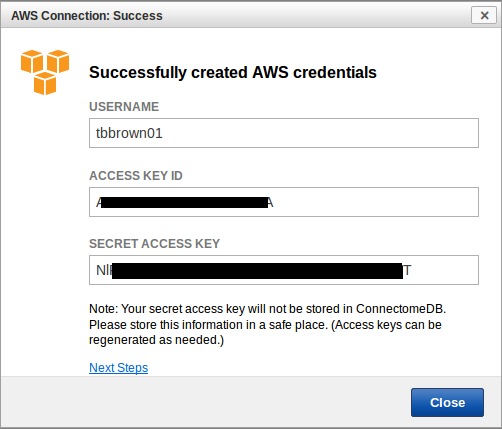

This guide provides instructions for getting access to the HCP OpenAccess Amazon S3 Bucket. It was originally written for use by participants in the course *[Exploring the Human Connectome 2017](https://store.humanconnectome.org/courses/2017/exploring-the-human-connectome.php)* and is based on similar materials prepared for the 2015 and 2016 editions of the course. It is intended to be useful even for users who were not participants in the course.

## 1. Get access to the Human Connectome Project database (ConnectomeDB)

* If you do not already have an account for accessing the HCP database, you will need to use a web browser to visit the ConnectomeDB at <https://db.humanconnectome.org>.
* Towards the right side of the page is a box labeled *Create an Account* that contains a *Register* button. Select the *Register* button, complete the registration form, and agree to the Data Use Terms to get access to the the HCP Open Access Data. You **must** agree to the Data Use Terms (DUT) before you can access the data via any mechanism (download, CinaB, or Amazon S3).

## 2. Get credentials to access the HCP S3 bucket

* In a web browser, login to your ConnectomeDB account by visiting <https://db.humanconnectome.org> and entering your ConnectomeDB username and password. Once you have logged on to ConnectomeDB, what you see will reflect one of three different states you account can be in with respect to access to the S3 data:
1. Data Use Terms not yet accepted
2. Data Use Terms accepted, AWS Access for HCP Data not yet set up
3. Data Use Terms accepted, AWS Access for HCP Data set up
* Steps 2a, 2b, and 2c address what you should do in each of these states.

### 2a - Data Use Terms not yet accepted

* If you have not already signed the Data Use Terms, the **WU-Minn HCP Data - 1200 Subjects** section near the top of the page will contain a *Data Use Terms Required* button and a *Data Available on Amazon S3* button (see Figure 1).

  

Figure 1: Data Use Terms not yet accepted

* In this case, you will need to select the *Data Use Terms Required* button and go through the process of accepting the terms. Once that process is complete, return to this guide and continue with step 2b.

### 2b - Data Use Terms accepted, AWS Access for HCP Data not yet set up

* If you have already accepted the Data Use Terms, but have not yet set up AWS Access for HCP Data, the **WU-Minn HCP Data - 1200 Subjects** section will contain an *Open Access Terms Accepted* link and a *Data Available on Amazon S3* button (see Figure 2).

  

Figure 2: Data Use Terms accepted, AWS Access for HCP Data not yet set up 

* In this case, you will need to set up AWS Access for HCP Data by completing the following steps.
* Select the *Data Available on Amazon S3* button. You should then see a pop up dialog box titled: *AWS Connectome: Set Up Credentials* (see Figure 3).

  

Figure 3: Set Up Credentials

* Select the *Create my AWS Credentials* button on the dialog.
* When your credentials have been created, you should see the *AWS Connection: Success* dialog (see Figure 4).

  

Figure 4: Successfully created AWS credentials

* You will want to copy and paste the following items into a secure text file or password manager program for future use. These make up your AWS credentials for accessing the HCP S3 bucket.
+ Your USERNAME (which should match your ConnectomeDB username)
+ Your ACCESS KEY ID, and
+ Your SECRET ACCESS KEY

* The ACCESS KEY ID and SECRET ACCESS KEY are effectively your ID and password respectively for accessing the HCP S3 bucket.
* Once you have this information securely copied somewhere for future use, you can select the *Close* button on the *AWS Connection: Success* dialog.

### 2c - Data Use Terms accepted, AWS Access for HCP Data set up

* Once you have both accepted the data use terms and properly set up AWS Access for HCP Data, the **WU-Minn HCP Data - 1200 Subjects** section should contain both a *Data Access Terms Accepted* link and an *Amazon S3 Access Enabled* button (see Figure 5).

  

Figure 5: Data Use Terms accepted, AWS Access for HCP Data set up

* If you have accepted the data use terms and set up AWS Access for HCP Data, but have forgotten or lost your AWS credentials, you can select the *Amazon S3 Access Enabled* button to see the *AWS Connection Manager* dialog (see Figure 6).

  

Figure 6: AWS Connection Manager dialog

* Then you can select the *Recreate my AWS Credentials* button to generate a new ACCESS KEY ID and new SECRET ACCESS KEY.
* Keep in mind that if you do recreate your AWS credentials, your previous AWS ACCESS KEY ID and SECRET ACCESS KEY pair will be completely disabled. Thus, if you have previously used the disabled credentials (e.g. to configure s3fs access in an AWS EC2 instance), then those credentials will no longer work.

  

> [!info] 
> You may also want to use visual panels to communicate related information, tips or things users need to be aware of.
## Related articles

Related articles appear here based on the labels you select. Click to edit the macro and add or change labels.

  

> [!details] 
> Related issues
  

  

# Attachments

- 
- 
- 
- 
- 
- 