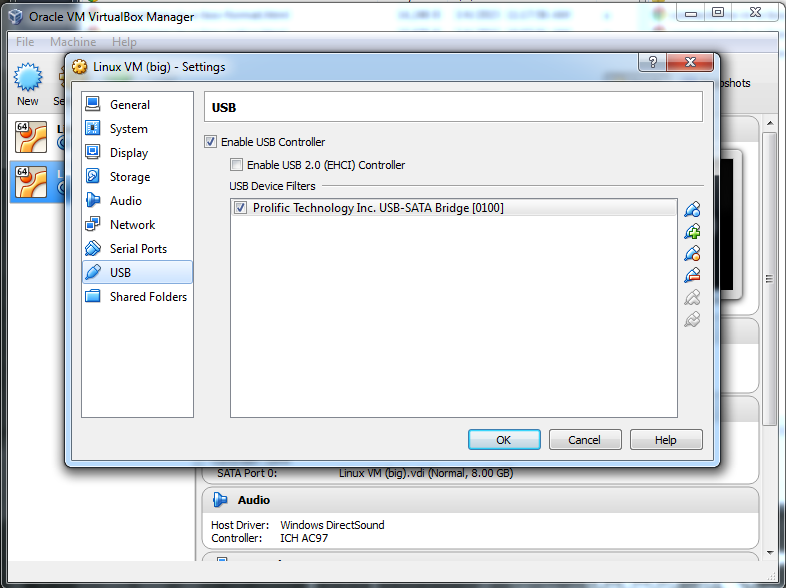

As [our note on Connectome In A Box formats](http://humanconnectome.org/data/connectome-in-a-box-format.html) states, we only guarantee full read-write access to Connectome hard drives for users with Linux-based computers (and ideally with enterprise storage to house the data). However, we recognize that some researchers will not have access to this kind of working environment. For those users with Windows PCs, this walkthrough may be helpful.

The most reliable approach is to build a virtual machine (VM) on your PC that runs Linux, then mount the drive inside that VM. 

## Step-by-step guide

There are many options available in both virtual machine technology and Linux operating systems. We used the freely available [VirtualBox](https://www.virtualbox.org/) and [Linux Ubuntu 14.10](http://www.ubuntu.com/) for our test. 

**1: Install your Linux VM.** Download and install the virtual machine software on your PC, then install Linux inside that VM. [This Instructables tutorial](http://www.instructables.com/id/Introduction-38/) does an excellent job of walking you through these steps. 

> [!note] 
> When defining the settings for your VM, do not allocate more than 50% of your host PC's available memory or storage to your VM. This will lead to significant performance degradation.
 

**2: Ensure your drive will mount.** If you are using an enclosure to mount your Connectome hard drive to your PC, you may need to download and install the USB driver for that enclosure. We used a [Vantec NexStar3](http://www.vantecusa.com/en/product/view_detail/212) single-drive enclosure for our test. 

**3: Configure your Linux VM to "capture" your drive.** In order to get your attached USB Linux drive to mount inside your Linux VM, you will need to set up a USB filter in the Linux VM Controller. (If you installed VirtualBox, then VirtualBox is your VM Controller.) 

  

**4: Start your VM and mount your USB drive.** From this point forward, you should be able to access your data. 

# Alternatives to this approach

If you find that working in a Linux VM does not offer you enough processing performance for your research, consider accessing HCP data via Amazon Public Data. 

 

## Related articles

 

# Attachments

- [linux-vm-usb-filter.PNG](./assets/linux-vm-usb-filter.PNG)