> [!tip] 
> This tutorial should take about 1 hour to complete, not including download times.
## **Purpose**

### Primary Purpose:  Get data from the NDA using (mostly) command line tools.

### Secondary Purpose:  Extend your exposure to AWS cloud computing from your desktop machine, whilst gaining exposure to the python virtual environment management tools that will make it possible to translate what you may be used to doing locally to more scalable, reproducible, and meta-analyzable compute infrastructure.  Knowing this stuff will make using that stuff more intuitive.

**Prerequisites:**

* An [account at the NDA](https://nda.nih.gov/user/create_account.html).
* [Access](https://nda.nih.gov/get/access-data.html) to data from your account at the NDA. See [Lifespan 2.0 Data Access & Download Instructions](https://www.humanconnectome.org/storage/app/media/documentation/data_release/LS_Release_2.0_Access_Instructions.pdf) for full instructions on getting access. The following steps should allow you to download any package to which your data use certification (DUC) grants you access.
* A data package that you want to download from the NDA, i.e. a 'shared' package, a package we created that you added to your account, or a package you created yourself.  In particular, one that contains a 'datastructure\_manifest.txt' file which is created as a part of the package creation process. Note that the NDA appears to be in the process of rewriting the rules on datastructure\_manifest.txt file usage and sharing in general, so the defaults for package generation might change (if this happens we will update these instructions). Using the downloadcmd tool to get subsets of a particular package of data ***currently*** depends on your ability to locate and parse the datastructure\_manifest.txt file for S3 links. Step 7 of this tutorial will help you to locate and parse the datastructure\_manifest.txt
* Willingness to locate or create a terminal to a Linux/MacOS operating system that affords you **permission** **to install** software **and** has access to a filesystem location with **space for a download** (downloads including imaging data for all HCA or HCD subjects can be hundreds of GB to 20TB, depending on which data you select).

  


> [!note] 
> These instructions were tested in a clean ubuntu 20.04 instance 'owned' by an account with pre-loaded computational credits for CCF users at the NDA.  Having a controlled environment, e.g. by way of containers, AMIs, or virtual environments, becomes ever more important as dependencies (think Freesurfer versions, and Juptyer notebook Python library requirements) interfere with one another.  ReproNim Investigators and others have extended the practical reasons for environment control and format standardization in a compelling case that indeed EVERYTHING MATTERS to downstream scientific analysis and meaning construction.  However, there are no reasons in theory this particular tutorial shouldn't work with minimal help from Google in your Ubuntu-esque local machine.

## **Overview of steps**

Step 1: Identify the package number you wish to download from the NDA.  If your purpose is to download a subset of data from the NDA (individual files you specify at the command line), then this package should NOT actually contain the image data (e.g. no associated files).  Rather, it will contain metadata about the available image data files.  I.E. where it is located in S3, and how it is organized.  

Step 2: Locate or create a command line environment that has access to adequate storage space AND permission to install software, and then navigate to this environment (for example, with AWS in [this tutorial](./How%20to%20Create%20an%20Ubuntu%20Instance%20in%20the%20AWS%20account%20that%20the%20NDA%20gives%20you%20when%20you%20request%20access%20to%20computational%20credits.md), using [computational credits](https://nda.nih.gov/get/computational-credits.html) for CCF users at the NDA).

Step 3: Confirm that this environment has all the requirements.

Step 4: Install software from  <https://github.com/NDAR/nda-tools>, Skip to **bolded text** if you don't wish to care about Python's virtual environments if you don't have to. 

Step 5: Use 'downloadcmd' to download the package you identified in step 1.

Step 6: Confirm that the contents of your download are as expected (in terms of size, file count, etc).

Step 7: Subset the datastructure\_manifest.txt file therein for the associated data files you wish to download.  

Step 8: Download the associated image data.  

Step 9:  Turn off AWS machines and/or delete devices,  [if applicable](./How%20to%20Create%20an%20Ubuntu%20Instance%20in%20the%20AWS%20account%20that%20the%20NDA%20gives%20you%20when%20you%20request%20access%20to%20computational%20credits.md).  

  


## **Step 1:**

Identify the package number you wish to download via information available at <https://nda.nih.gov/user/dashboard/packages.html>, after logging into your NDA account (you have succeeded if the upper right hand corner of page contains your username and the ability to logout).  You are now on the Data Packages tab (red ellipse on right) of your account profile.  Record the number of the package you want to grab from the command line (red ellipse on left).  Note that the number you see in your packages may not be the same as this screenshot from my account, here.  If you have CCF/ABCD data permissions, you will have access to the HCP shared packages below, provide you toggle the drop down menu to 'Shared Data Package' (red arrow).  At this time, you do NOT need to associate these packages to your account by selecting "Add to My Data Packages" from the 'Actions' dropdown.  

  

  


## **Step 2:**

Find a terminal to a machine with a **Linux/MacOS operating system** that affords you **permission** **to install** software **and** has access to a filesystem location with storage **space for a download**.   

a.  Find *any* terminal on your computer.    

If you need a terminal refresher, you can start here: <https://www.youtube.com/watch?v=MBBWVgE0ewk> (Windows), <https://macpaw.com/how-to/use-terminal-on-mac> (Mac), or <https://tutorials.ubuntu.com/tutorial/command-line-for-beginners#0> (ubuntu/linux/unix).   

b.  Determine if this terminal is capable of giving you access to a machine with the appropriate requirements (Linux/MacOS, permissions, and space).  

* + The Windows Command Prompt is not going to be useful for this tutorial.
	+ If you have a Windows machine with enough space, but you just don't have the Linux terminal, you can install [Ubuntu for Windows](https://ubuntu.com/tutorials/ubuntu-on-windows#1-overview) or explore  [VirtualBox](https://www.virtualbox.org/) to create a virtual Ubuntu machine on your Windows host.
* + If you're a Window user and you want to access a machine that someone else owns and manages (e.g. on a cluster at your university or on AWS because that's where the 45TB of space resides), you'll need to install something that can handle an ssh command to this environment, such as [Ubuntu for Windows](https://ubuntu.com/tutorials/ubuntu-on-windows#1-overview), [GitBash](https://gitforwindows.org/), or <https://www.putty.org/>

c.  Consider following [this tutorial,](./How%20to%20Create%20an%20Ubuntu%20Instance%20in%20the%20AWS%20account%20that%20the%20NDA%20gives%20you%20when%20you%20request%20access%20to%20computational%20credits.md) to create such a workspace for yourself in AWS, using  [computational credits](https://nda.nih.gov/get/computational-credits.html) for CCF users at the NDA.

d.  ssh to this machine, if ssh'ing is in order:

For example, if you created an Ubuntu Instance in the cloud, as in [this tutorial](./How%20to%20Create%20an%20Ubuntu%20Instance%20in%20the%20AWS%20account%20that%20the%20NDA%20gives%20you%20when%20you%20request%20access%20to%20computational%20credits.md), you might ssh in like this from your terminal:

```
> ssh -i "key2ccfsetup2020.pem" ubuntu@ec2-18-223-32-40.us-east-2.compute.amazonaws.com
```

If you were given permission to use a university cluster, you might be instructed to turn on your university VPN and ssh with a password in like this:

```
> ssh petra@123.456.78.90
```


## **Step 3:**

Confirm that your workspace has the necessary requirements. 

1. Ask the person who gave you permission to use their cluster if it's okay to install <https://github.com/NDAR/nda-tools> and download large quantities of data.

2. Double check that you have the space for the download, for example, by getting a list of the space in filesystems mounted to your machine as follows:

```
> df -h
```

This is what 2000G of gp3 space looks like in the Ubuntu 20.04 machine from [this tutorial](./How%20to%20Create%20an%20Ubuntu%20Instance%20in%20the%20AWS%20account%20that%20the%20NDA%20gives%20you%20when%20you%20request%20access%20to%20computational%20credits.md):

 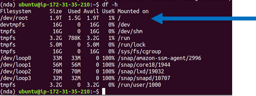 

3. Figure out more about your specific flavor of Linux or MacOS operating system by typing:

```
> lsb_release -a
```

or

```
> cat /etc/*-release
```

or

```
> sw_vers
```


## **Step 4:**

Install the tools.  Follow instructions here:  <https://github.com/NDAR/nda-tools>, or see if you can get away error-free with the three **bolded** command lines below. 

*BETTER YET* (and possibly necessary, depending on how comfortable you are messing up someone else's dependencies on a shared cluster), run **all** of the following commands to put nda-tools into a python3 virtual environment.  

* If you're not yet familiar with virtual environments in python, creating virtual environments is a good habit to get into if you ever **want to install the list of packages in a 'requirements.txt'** file you found on a repo somewhere (see Step 5 detour).  Python virtual environments come with a little bit of a learning curve, though.  It's helpful to know that Python2, Python3, and Anaconda (Miniconda) have different tools/syntax for creating and managing virtual environments.  It's also helpful to know that installing these tools depends on your particular operating system.  Begin by typing > cat /etc/\*-release in your command line to find out more about your particular operating system and whether your particular flavor of Linux needs a  ['yum-ish,' 'apt-ish', or 'dnf-ish'](https://www.digitalocean.com/community/tutorials/package-management-basics-apt-yum-dnf-pkg) command to download and install packages outside of 'pip' control.
* **Docker/Singularity** containers can only render the python virtual environment conversation moot to the extent that the tools within them lack conflicting dependencies (translation:  you might as well start to learn about python virtual environments if you're not there yet).
* Your environment may already have a virtual environment maker installed, but its important to know WHICH version of python and WHICH version of the virtual environment maker you're using.  The commands below will install a **python3** virtual environment maker

  


**Skip to the commands in bold, if you want to save virtual environments for another day and don't really care what version of python you're using provided it works.**


| command | comments |
| ----- | --- |
|    ``` cat /etc/\*-release ``` 
or 
```  lsb\_release -a ```
or
```  sw\_vers ```    | find out more about your particular operating system and whether your particular environment needs a  ['yum-ish,' 'apt-ish', or 'dnf-ish'](https://www.digitalocean.com/community/tutorials/package-management-basics-apt-yum-dnf-pkg) or ['brew-ish'](https://www.howtogeek.com/211541/homebrew-for-os-x-easily-installs-desktop-apps-and-terminal-utilities/)  command to download and install packages outside of Python's 'pip' control (the virtual environment maker is distributed separately from Python itself, in a lot of cases, you'll need to know what package management service you have installed.  Note to Mac Users who have never used their command line:  its possible you'll need to explicitly install [Homebrew](https://www.howtogeek.com/211541/homebrew-for-os-x-easily-installs-desktop-apps-and-terminal-utilities/) |
| ```  sudo apt update ``` | Get a status update for the packages in your particular flavor of Linux.  Problems?  The syntax is different depending on your operating system.  [Google is your friend.](https://unix.stackexchange.com/questions/367872/what-is-the-similar-command-of-ubuntus-sudo-apt-get-update-in-fedora/367980)  Ask google what the 'sudo apt update' equivalent is in MacOS, for example.   |
| ```python --version```| This will usually spit out the python 2 version, if you have it installed and aren't already in an activated virtual environment.  There is a slight chance that your network admin mapped 'python' to 'python 3,' though, so it's always good to check.  If you really don't want to work with virtual environments, skip to the pip install nda-tools line bolded below.  If you want to work with a python 2 virtual environment, you're on your own.    |
|  ``` which python3 ``` | outside of the virtual environment, 'which' tells me that the python3 installation on my machine is /usr/bin/python3 |
| ``` python3 --version ```| my machine has the 'python3' command mapped to the installed Python 3.8.5 distribution (no python 2 on the Ubuntu 20.04 LTS AMI on AWS) |
| ``` sudo apt-get install python3-venv ```| ['yum, apt, dnf](https://www.digitalocean.com/community/tutorials/package-management-basics-apt-yum-dnf-pkg) or [brew'](https://www.howtogeek.com/211541/homebrew-for-os-x-easily-installs-desktop-apps-and-terminal-utilities/)  install the python 3 virtual environment management package.  Miniconda starts in a 'base' virtual environment -i.e. you already have a  environment making environment, so you can skip this step.   |
| ``` python3 -m venv nda ```| Create a virtual environment named 'nda.'  This command line is analogous to 'conda create nda' in Anaconda or Miniconda |
| ``` source nda/bin/activate ```| Activate this new virtual environment.  This command is analogous to 'conda activate nda.'  You'll know you're in the activated virtual environment because (nda) will precede your terminal prompt.   |
| ``` which python3 ```| inside the virtual environment, 'which' tells me my python3 installation is /home/ubuntu/nda/bin/python3.  Note that this is different than outside the virtual environment.   |
| **pip install nda-tools** | install nda-tools (this will also install vtcmd, which can be used for uploading data to the NDA via the command line).  If you run into problems, see  <https://github.com/NDAR/nda-tools>, and/or go back to the beginning of this section and DON'T skip to the bolded text.   |
| **downloadcmd --help**  | show all the options available for the downloadcmd  - if you've gotten to this point without errors, then you can proceed to Step 5, with or without a virtual environment.   |
| **df -h** | figure out how much space you have for downloading, and where you want to point the download |
| ``` less /home/ubuntu/nda/config/settings.cfg ```| peek at the settings.cfg file, so you know where to change the debug log destination, if you ever so choose.  The full path to your config file will be different, or course, and depend on where YOU actually created your virtual environment, called 'nda' |

  


In other words:

```
> cat /etc/*-release
> sudo apt update                                        
> python --version                                       
> which python3                                          
> python3 --version                                     
> sudo apt-get install python3-venv            
> python3 -m venv nda                               
> source nda/bin/activate                               
> which python3                                         
> pip install nda-tools                                   
> downloadcmd --help                                  
> df -h                                                            
> less /home/ubuntu/nda/config/settings.cfg
```

  


## **Step 5:**

Refer to the screenshot in Step 1.  **Download package #1185256 using 8 threads** (for comparison, on a t3.2xlarge it took 5.5 hours to download 1300G using 4 threads vs 3.5 hours on 8 threads using the machine I created in the Computational Credits account at the NDA, per [this tutorial](./How%20to%20Create%20an%20Ubuntu%20Instance%20in%20the%20AWS%20account%20that%20the%20NDA%20gives%20you%20when%20you%20request%20access%20to%20computational%20credits.md).  Name the directory for download 'HCPDevImgManifestBeh' so that it matches the name in the NDA, even though you don't have to.  You may be asked to hit 'enter' a couple times if you don't have a token (this method doesn't require a token).  

```
> downloadcmd -dp 1185256 -u <your NDA username> -d  HCPDevImgManifestBeh -wt 8 
```

If you get a password error enter this:

```
> export PYTHON_KEYRING_BACKEND=keyring.backends.null.Keyring
```
Then enter the downloadcmd command again. You will be asked for your NDA password.

It usually takes a minute to get rolling, but you should start seeing messages about files being downloaded.  If you don't see evidence that the package is downloading, it's likely that the NDA has changed something.  Contact their helpdesk:  [ndahelp@mail.nih.gov](mailto:ndahelp@mail.nih.gov) for updates.  Look for updates on the NDAR repo pages ([https://github.com/NDAR](https://github.com/NDAR/nda-tools)).  The CCF will try to keep up with their breaking changes, too, and will update our instructions accordingly.   If you get errors, first check for typos in the package number, your credentials, or the options used.  Then send your question to ndahelp@mail.nih.gov with the command you typed and the error you're seeing.  Note that 2 out of 2 people who tested this particular tutorial from start to finish encountered issues related to account permissions managed by the NDA and needed to open helpdesk tickets.  Check for typos before you send them a help desk ticket, but don't be shy.  

  


**Step5 detour:** Let's pretend you wanted to clone the  [abcd downloader](https://github.com/ABCD-STUDY/nda-abcd-s3-downloader.git) and install *those* requirements.  Open another terminal window or deactivate the nda virtual environment.

```
>  deactivate                           # deactivates the nda virtual environment (or whatever environment was currently active)
>  python3 -m venv abcd3.5.1         	# create a new python 3 virtual environment for the abcd download tool
>  source abcd3.5.1/bin/activate     	# activate this new environment
>  git clone https://github.com/ABCD-STUDY/nda-abcd-s3-downloader.git   #clone (download/copy) the repository
>  cd nda-abcd-s3-downloader/    		# navigate into the cloned directory and locate the requirements.txt file
>  pip install -r requirements.txt 		# install requirements and then figure out what to do with the cloned programs, based on instructions in the repo's README
>  cd ..                                # move back to the parent directory
```

## **Step 6:**

Confirm that the downloaded directory is the size you're expecting.  If it is not the right size, confirm that you haven't maxed your download space, and then try again.  If it is still not the right size, contact NDA's helpdesk: [ndahelp@mail.nih.gov](mailto:ndahelp@mail.nih.gov) and include the (likely uninformative) contents of the debug log, along with the exact downloadcmd you used.  

```
> du -h HCPDevImgManifestBeh      # if it is not the size you're expecting (e.g. 102 KB per the screenshot in Step 1)

> sudo apt install tree           # this is a handy little tool that will show you the directory structure of your download and also output a count of files and folders therein.

> tree HCPDevImgManifestBeh       # make note of the number of folders and files in the directory...is this what you're expecting?

> df -h                           # see if you still have space

> less NDAValidationResults/debug_log_<latest datetime stamp>.txt      # copy the contents into your ticket to the help desk, if needed
```

  


## **Step 7:**

**Assuming you have had no issues, and your** **HCPDevImgManifestBeh** folder is the expected size, look at the datastructure\_manifest.txt file.  This file contains the S3 links for associated imaging data files. Note: If you happened to download a package that was created WITH associated imaging files, then this step is irrelevant - you are done. You likely wish to download only a subset of the files listed in the datastructure\_manifest.txt file (if you downloaded all the imaging files for HCD, you would need 20 TB+ of space and many of the files would not be necessary for your analyses). The following command examples will help you create your desired subset of S3 links to pass to the downloadcmd 'round 2' of the downloadcmd process, as described in Step 8.

**NOTE:  the datastructure\_manifest.txt file is the closest thing you have to a 'filesystem' view of the data at the NDA as of 2/23/2021.  There will likely be much confusion surrounding the use of datastructure\_manifest.txt files once the NDA retires the 'DataManager' Service which supports a lot of tools that use tokens to grab data at the end of S3 links (including downloadcmd).**  

  


#Take a peek.

```
> cd HCPDevImgManifestBeh 
> ls -al 
> less datastructure_manifest.txt
```

  


# Look even closer:  Extract the 6th column of this file and pipe the output to 'less' for viewing

```
> cut -f6 datastructure_manifest.txt | less
```

  


#  Even closer:  From the 6th column of the datastructure\_manifest.txt file, treat '/' as the delimiter to get all the so-defined 'columns' after the 4th '/' (and then remove the trailing " with sed)

```
> cut -f6 datastructure_manifest.txt | cut -f5- -d'/' | sed 's/"//g' | less
```

  


#  Instead of manipulating the datastructure\_manifest.txt file for a filesystem view, let's get it to pipe the complete S3 list (sans extraneous quotations) to a new file for extraction of subsets

```
> cut -f6 datastructure_manifest.txt | sed 's/"//g' > HCPDevImgManifestBeh_S3links
```

  


#  Observe that the fourth column of the datastructure manifest contains the HCD-specific (Lifespan 2.0) subset of our HCP-style package shortnames. This is where our our predefined "HCP packages" (available dataset filters on [https://nda.nih.gov/general-query.html?q=query=featured-datasets:HCP%20Aging%20and%20Development](https://nda.nih.gov/general-query.html?q=query=featured-datasets:Lifespan%20Human%20Connectome%20Projects%20(HCP))) overlap with naming conventions in the datastructure\_manifest.txt file.  

```
> cut -f4 datastructure_manifest.txt  | cut -f4 -d'_' | sort -u
```

 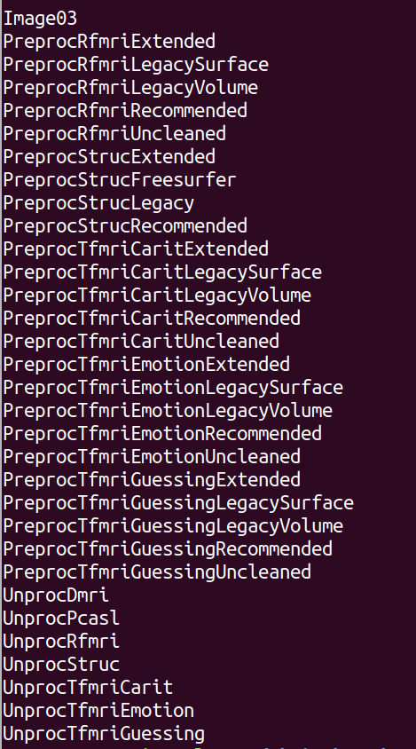 

  


#  Subset to just the S3 links of a golden HCD subject (an HCP-D subject that has complete data for the Lifespan 2.0 Release):  

```
> grep HCD0001305 HCPDevImgManifestBeh_S3links > GoldenHCD_S3links
```

  


**# Create a list of subjects for whom you'd like to grab a particular subset HCP package of imaging data - do it your way (e.g. by creating a list from the ndar\_subject01.txt Subject Inventory file) or do this for proof of concept:**

```
> echo HCD0001305 > subjectlist.txt   
> echo HCD0008117 >> subjectlist.txt   		# append to this list
```

  


**# String these commands together to create a file containing the S3 links for all of the PreprocStrucRecommended HCP package data for the two subjects in your list subjectlist.txt file**

```
> grep -f subjectlist.txt datastructure_manifest.txt | grep PreprocStrucRecommended | cut -f6 | sed 's/"//g' > PreprocStrucRecommendedSubjectSubsetS3s
```

  


## **Step 8:**

Having identified the subjects and packages you want to download and created a list of S3 links from the manifest, send this list to the downloadcmd for downloading.

Note:  Don't forget to make sure your python virtual environment is activated, if applicable.  Remember to check downloadcmd  --help for updates.  Also double check your storage space.  Red arrows in this screenshot point to the commands that can perform these functions, if you don't want to go back to previous steps in this tutorial to copy and paste them again.  

  

  


Remember that the size of your download will be larger than that of the original package (e.g. 102KB for HCPDevImgManifestBeh in the table below) which *didn't* include associated files.  **You are now about to download the associated image files (big data), but there is no good way to know how large this download will be using the downloadcmd --help options** described in the screenshot above.  You will have to estimate the space you'll need based on the shared package sizes and the sizes of the HCP-style packages for all subjects below. (Eventually we will add updated tables for HCP package sizes for one complete subject). 

For reference, the list of links you created in Step 7 represents two subjects' Preproc Structural Recommended Data; based on the tables below, this means that AT MOST, it will have in the neighborhood of 62 GB (31\*2) of data.  Given that the recommended data is roughly  7% (1669/22789), of All data, you may be able to reduce this estimate:  7% of 62G is 4.5G.   Use df -h (screenshot above) to see if you have that much space at your disposal. 


**Lifespan 2.0 Shared Packages**
| **Shared Package ID** | **Shared Package Name** | **Size** |
| --- | --- | --- |
| 1185256 | HCPDevImgManifestBeh | 102 KB |
| 1185057 | HCPAgingImgManifestBeh | 102 KB |
| 1185341 | HCPDevelopment1Sub | 31 GB |
| 1185340 | HCPAging1Sub | 27 GB |
| 1185264 | HCPDevelopmentRec | 1669 GB |
| 1185234 | HCPAgingRec | 1742 GB |
| 1185249 | HCPDevAllFiles | 22789 GB |
| 1184998 | HCPAgingAllFiles | 22858 GB |

  


**Lifespan 2.0 Datasets (HCP-style Packages) available in OPTION 2:**


| **Study** | **NDA structure** | **HCP-Style Package shortname** | **HCP-Style Package** **OPTION 2 Filter Name** | **Size** **All Subjects** | **HCP Package Contents** |
| --- | --- | --- | --- | --- | --- |
| HCA HCD | imagingcollection01 | UnprocStruc | Structural Unprocessed | 194 GB 203 GB | multi-echo MPRAGE (T1 weighted) and T2-SPACE (T2 weighted) scans (in NIFTI format) |
| HCA | imagingcollection01 | UnprocTseHires | HiResHp Structural Unprocessed  | 10 GB | turbo-spin-echo high spatial resolution hippocampal structural scan (in NIFTI format) |
| HCA HCD | imagingcollection01 | UnprocRfmri | Resting State rfMRI Unprocessed | 1.3 TB  1.3 TB | both pairs of resting state fMRI scans (in NIFTI format) |
| HCA HCD | imagingcollection01 | UnprocTfmriCarit | tfMRI CARIT Unprocessed | 237 GB 417 GB | fMRI scans for the CARIT task (in NIFTI format; Go/NoGo Conditioned Approach Response Inhibition Task) |
| HCA | imagingcollection01 | UnprocTfmriFacename | tfMRI FACENAME Unprocessed | 271 GB | fMRI scan for the FACENAME task (in NIFTI format; paired-associative memory task) |
| HCA | imagingcollection01 | UnprocTfmriVismotor | tfMRI VISMOTOR Unprocessed | 154 GB | fMRI scan for the VISMOTOR task (in NIFTI format; simultaneous motor and visual activation task) |
| HCD | imagingcollection01 | UnprocTfmriEmotion | tfMRI EMOTION Unprocessed | 126 GB | fMRI scan for the EMOTION task (in NIFTI format; emotion and face-processing task) |
| HCD | imagingcollection01 | UnprocTfmriGuessing | tfMRI GUESSING Unprocessed | 391 GB | fMRI scans for the GUESSING task (in NIFTI format; reward, punishment, anticipatory reactivity task) |
| HCA HCD | imagingcollection01 | UnprocDmri | Diffusion Unprocessed | 528 GB 566 GB | dMRI scans (in NIFTI format), bval, and bvec files for the two sets of diffusion sensitizing directions ('dir98' and 'dir99') |
| HCA HCD | imagingcollection01 | UnprocPcasl | ASL Unprocessed | 27 GB  27 GB | mbPCASLhr scan (in NIFTI format; multiband 2D EPI pseudo-continuous arterial spin labeling with high spatial resolution) |
| HCA HCD | fmriresults01 | PreprocStrucRecommended | Structural Preprocessed Recommended | 521 GB 476 GB | recommended starting point for structural analyses and contains files precisely aligned across subjects using the MSMAll multi-modal surface registration |
| HCA HCD | fmriresults01 | PreprocStrucLegacy | Structural Preprocessed Legacy | 526 GB 481 GB | structural files coarsely aligned across subjects using the MSMSulc folding surface registration |
| HCA HCD | fmriresults01 | PreprocStrucFreesurfer | Structural Preprocessed FreeSurfer | 585 GB 541 GB | actual outputs from the FreeSurferPipeline stage of the HCP Structural Preprocessing, in FreeSurfer's native file formats and directory structure |
| HCA HCD | fmriresults01 | PreprocStrucExtended | Structural Preprocessed Extended | 160 GB 147 GB | additional files related to QC on structural preprocessing outputs and other extra files that may be useful to select users |
| HCA HCD | fmriresults01 | PreprocRfmriRecommended | rfMRI Preprocessed Recommended | 991 GB 883 GB | recommended starting point for rfMRI analyses and contains cleaned files precisely aligned across subjects using the MSMAll multi-modal surface registration |
| HCA HCD | fmriresults01 | PreprocRfmriLegacySurface | rfMRI Preprocessed Legacy Surface | 989 GB 881 GB | cleaned files coarsely aligned across subjects using the MSMSulc folding surface registration, and hcp\_fix\_multi\_run. |
| HCA HCD | fmriresults01 | PreprocRfmriLegacyVolume | rfMRI Preprocessed Legacy Volume | 2.1 TB 2.0 TB | cleaned rfMRI files poorly aligned across subjects using nonlinear volume registration |
| HCA HCD | fmriresults01 | PreprocRfmriUncleaned | rfMRI Preprocessed Uncleaned | 3.5 TB 2.4 TB | uncleaned resting state data of all registration types for use in testing alternative data cleanup strategies |
| HCA HCD | fmriresults01 | PreprocRfmriExtended | rfMRI Preprocessed Extended | 4.9 TB 5.1 TB | additional files related to rfMRI data cleanup and other extra files that may be useful to select users |
| HCA HCD | fmriresults01 | PreprocTfmriCaritRecommended | tfMRI CARIT Preprocessed Recommended | 82 GB 154 GB | recommended starting point for CARIT tfMRI analyses and contains cleaned files precisely aligned across subjects using the MSMAll multi-modal surface registration |
| HCA HCD | fmriresults01 | PreprocTfmriCaritLegacySurface | tfMRI CARIT Preprocessed Legacy Surface | 82 GB 154 GB | cleaned CARIT tfMRI files coarsely aligned across subjects using the MSMSulc folding surface registration |
| HCA HCD | fmriresults01 | PreprocTfmriCaritLegacyVolume | tfMRI CARIT Preprocessed Legacy Volume | 166 GB 328 GB | cleaned CARIT tfMRI files poorly aligned across subjects using nonlinear volume registration |
| HCA HCD | fmriresults01 | PreprocTfmriCaritUncleaned | tfMRI CARIT Preprocessed Uncleaned | 540 GB 1.0 TB | uncleaned tfMRI CARIT data of all registration types for use in testing alternative data cleanup strategies |
| HCA HCD | fmriresults01 | PreprocTfmriCaritExtended | tfMRI CARIT Preprocessed Extended | 50 GB 93 GB | additional CARIT tfMRI files related to data cleanup and other extra files that may be useful to select users |
| HCA | fmriresults01 | PreprocTfmriFacenameRecommended | tfMRI FACENAME Preprocessed Recommended | 93 GB | recommended starting point for FACENAME tfMRI analyses and contains cleaned files precisely aligned across subjects using the MSMAll multi-modal surface registration |
| HCA | fmriresults01 | PreprocTfmriFacenameLegacySurface | tfMRI FACENAME Preprocessed Legacy Surface | 93 GB | cleaned FACENAME tfMRI files coarsely aligned across subjects using the MSMSulc folding surface registration |
| HCA | fmriresults01 | PreprocTfmriFacenameLegacyVolume | tfMRI FACENAME Preprocessed Legacy Volume | 189 GB | cleaned FACENAME tfMRI files poorly aligned across subjects using nonlinear volume registration |
| HCA | fmriresults01 | PreprocTfmriFacenameUncleaned | tfMRI FACENAME Preprocessed Uncleaned | 619 GB | uncleaned tfMRI FACENAME data of all registration types for use in testing alternative data cleanup strategies |
| HCA | fmriresults01 | PreprocTfmriFacenameExtended | tfMRI FACENAME Preprocessed Extended | 50 GB | additional FACENAME tfMRI files related to data cleanup and other extra files that may be useful to select users |
| HCA | fmriresults01 | PreprocTfmriVismotorRecommended | tfMRI VISMOTOR Preprocessed Recommended | 56 GB | recommended starting point for VISMOTOR tfMRI analyses and contains cleaned files precisely aligned across subjects using the MSMAll multi-modal surface registration |
| HCA | fmriresults01 | PreprocTfmriVismotorLegacySurface | tfMRI VISMOTOR Preprocessed Legacy Surface | 56 GB | cleaned VISMOTOR tfMRI files coarsely aligned across subjects using the MSMSulc folding surface registration |
| HCA | fmriresults01 | PreprocTfmriVismotorLegacyVolume | tfMRI VISMOTOR Preprocessed Legacy Volume | 109 GB | cleaned VISMOTOR tfMRI files poorly aligned across subjects using nonlinear volume registration |
| HCA | fmriresults01 | PreprocTfmriVismotorUncleaned | tfMRI VISMOTOR Preprocessed Uncleaned | 346 GB | uncleaned tfMRI VISMOTOR data of all registration types for use in testing alternative data cleanup strategies |
| HCA | fmriresults01 | PreprocTfmriVismotorExtended | tfMRI VISMOTOR Preprocessed Extended | 50 GB | additional VISMOTOR tfMRI files related to data cleanup and other extra files that may be useful to select users |
| HCD | fmriresults01 | PreprocTfmriEmotionRecommended | tfMRI EMOTION Preprocessed Recommended | 55 GB | recommended starting point for EMOTION tfMRI analyses and contains cleaned files precisely aligned across subjects using the MSMAll multi-modal surface registration |
| HCD | fmriresults01 | PreprocTfmriEmotionLegacySurface | tfMRI EMOTION Preprocessed Legacy Surface | 55 GB | cleaned EMOTION tfMRI files coarsely aligned across subjects using the MSMSulc folding surface registration. |
| HCD | fmriresults01 | PreprocTfmriEmotionLegacyVolume | tfMRI EMOTION Preprocessed Legacy Volume | 114 GB | cleaned EMOTION tfMRI files poorly aligned across subjects using nonlinear volume registration |
| HCD | fmriresults01 | PreprocTfmriEmotionUncleaned | tfMRI EMOTION Preprocessed Uncleaned | 308 GB | uncleaned tfMRI EMOTION data of all registration types for use in testing alternative data cleanup strategies |
| HCD | fmriresults01 | PreprocTfmriEmotionExtended | tfMRI EMOTION Preprocessed Extended | 47 GB | additional EMOTION tfMRI files related to data cleanup and other extra files that may be useful to select users |
| HCD | fmriresults01 | PreprocTfmriGuessingRecommended | tfMRI GUESSING Preprocessed Recommended | 101 GB | recommended starting point for GUESSING tfMRI analyses and contains cleaned files precisely aligned across subjects using the MSMAll multi-modal surface registration |
| HCD | fmriresults01 | PreprocTfmriGuessingLegacySurface | tfMRI GUESSING Preprocessed Legacy Surface | 145 GB | cleaned GUESSING tfMRI files coarsely aligned across subjects using the MSMSulc folding surface registration |
| HCD | fmriresults01 | PreprocTfmriGuessingLegacyVolume | tfMRI GUESSING Preprocessed Legacy Volume | 309 GB | cleaned GUESSING tfMRI files poorly aligned across subjects using nonlinear volume registration |
| HCD | fmriresults01 | PreprocTfmriGuessingUncleaned | tfMRI GUESSING Preprocessed Uncleaned | 651 GB | uncleaned tfMRI GUESSING data of all registration types for use in testing alternative data cleanup strategies |
| HCD | fmriresults01 | PreprocTfmriGuessingExtended | tfMRI GUESSING Preprocessed Extended | 94 GB | additional GUESSING tfMRI files related to data cleanup and other extra files that may be useful to select users |

  


**# Having identified the subjects and packages you want to download and created a list of S3 links from the manifest, send this list to the downloadcmd for downloading.**

```
> source ../nda/bin/activate 
> downloadcmd -dp 1185249 -t  PreprocStrucRecommendedSubjectSubsetS3s -u <your username> -d  HCPDevImgManifestBehSUBSET -wt 8
```

  


**Note: you can also just download a single file as follows:**

```
> downloadcmd -dp 1185249 s3://NDAR_Central_3/submission_33230/HCD0008117_V1_MR/T1w/T1w_acpc_dc_restore.nii.gz -u <your username> -d HCPDevImgManifestBehSingleLink -wt 8
```

  


**Once again, check that your download contains the data expected, for example with du and tree commands.**

```
>  du -h HCPDevImgManifestBehSUBSET
>  tree HCPDevImgManifestBehSUBSET
```

  


**Helpful tip:  If you're on a VPN and the VPN times out before the download completes, you may wish to preface your command with nohup (no hangup) to keep the command running in the background).  You can also time how long it takes to download.**

**eg. the following will download a specific S3 link, send the verbose output AND the time it took to download everything to jobtimer.txt**

**> nohup time downloadcmd -dp 1185249 s3://NDAR\_Central\_3/submission\_33230/HCD0008117\_V1\_MR/T1w/T1w\_acpc\_dc\_restore.nii.gz -u <your username>  -d HCPDevImgManifestBehSingleLink -wt 8 > jobtimer.txt 2>&1 &**


**ALL CAPS EXTRA SPECIAL NOTE:**

**You must put BOTH a package number AND a list of S3 links in the command to download subsets via the command line.**

**BUT HERE IS THE CATCH:  the number of the package has to be associated with a 'fully loaded' and shared package (one containing all imaging data files, e.g. HCPDevAllFiles, that you don't want to download unless you have 23 TB handy and endless free time to babysit the process).  Currently, the only way to obtain the datastructure\_manifest.txt without downloading the entire release is through the HCPDevImgManifestBeh package.  Contact NDA's helpdesk:  ndahelp@mail.nih.gov for updates.  Look for updates on the NDAR repo pages ([https://github.com/NDAR](https://github.com/NDAR/nda-tools)).**


# Attachments

- 
- 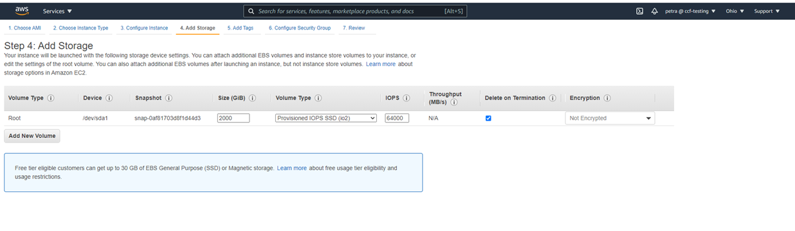
- 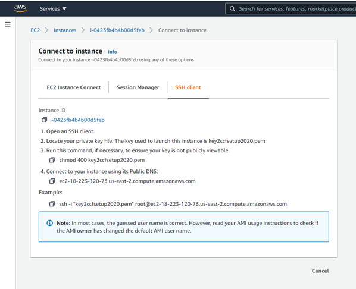
- 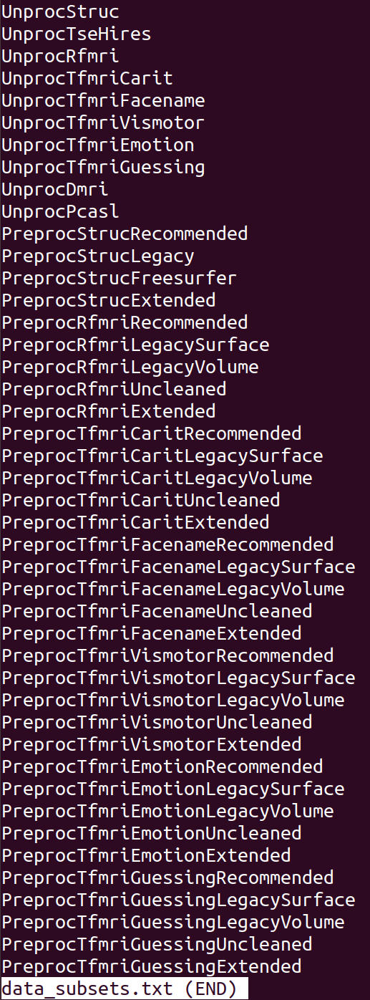
- 
- 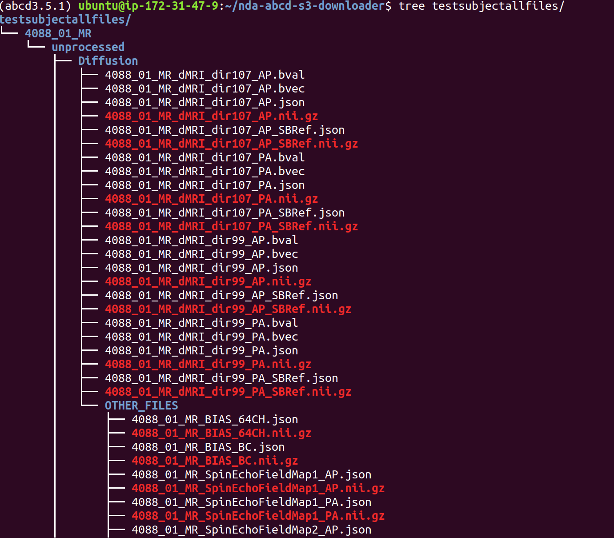
- 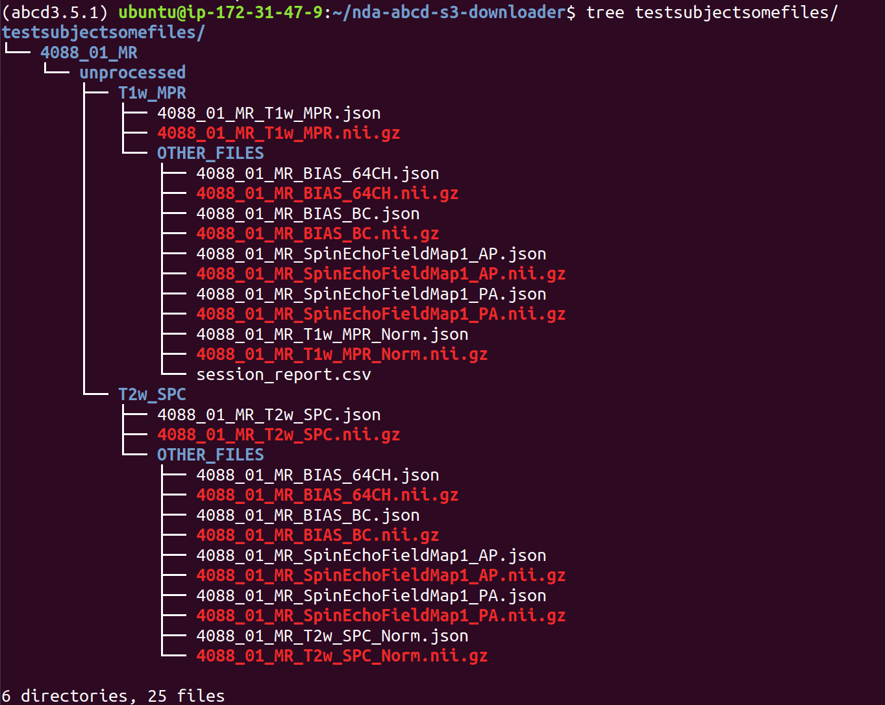
- 
- 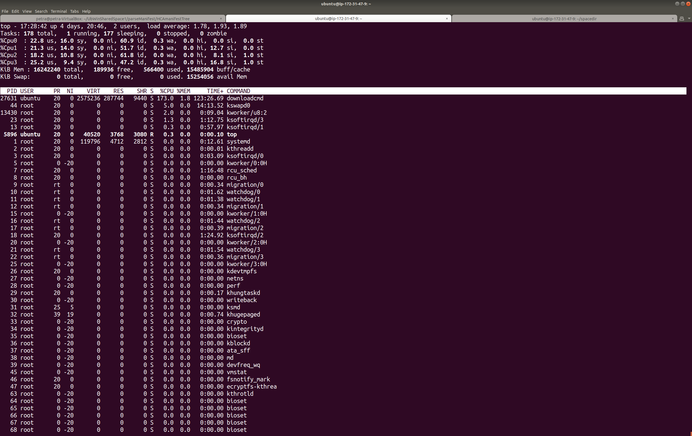
- 
- 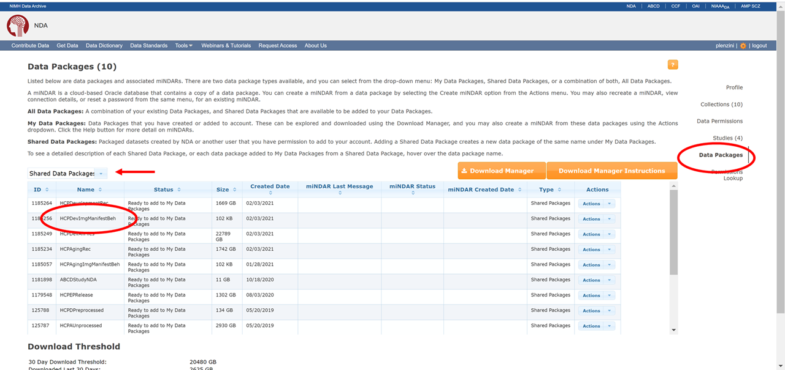
- 
- 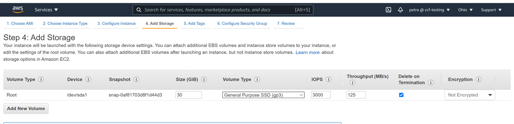
- 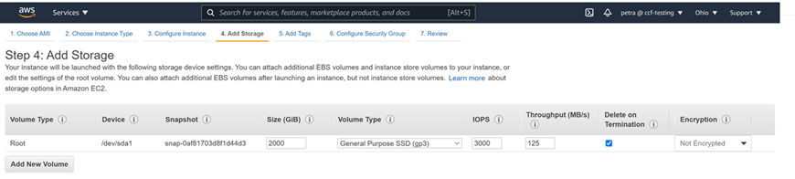
- 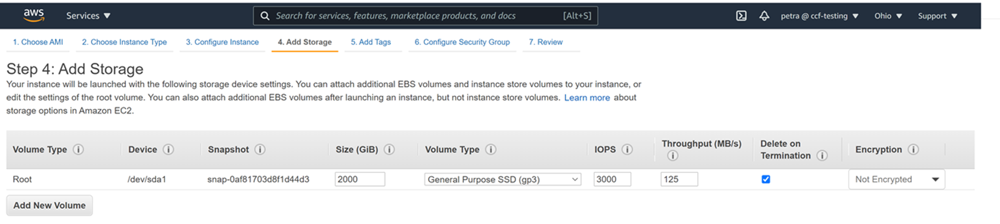
- 
- 
- 
- 
- 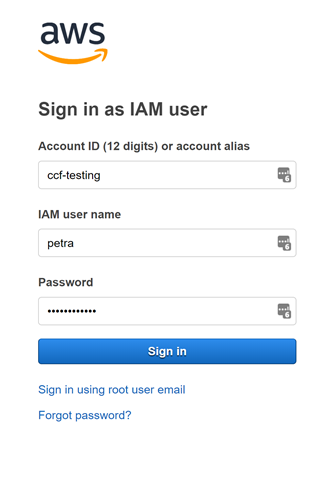
- 
- 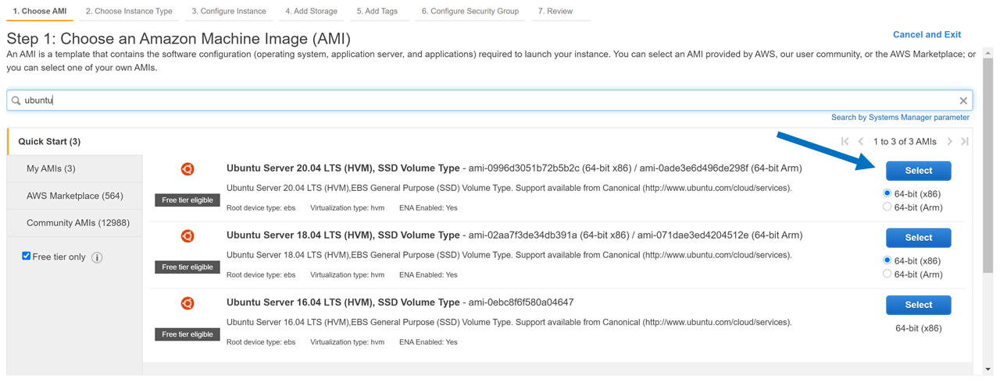
- 
- 
- 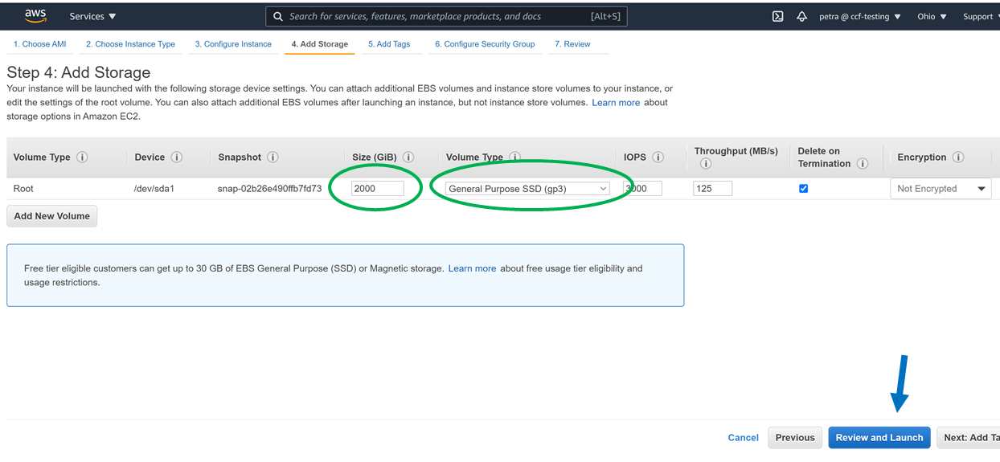
- 
- 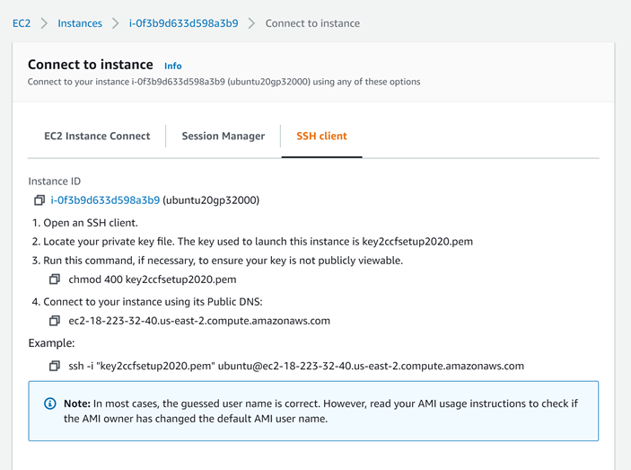
- 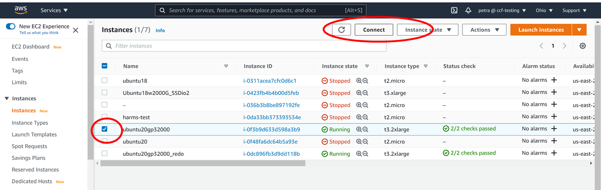
- 
- 
- 
- [HCP_subsets4nda-abcd-s3-downloader.txt.docx](./assets/HCP_subsets4nda-abcd-s3-downloader.txt.docx)
- [HCPshortnames.txt](./assets/HCPshortnames.txt)
- 
