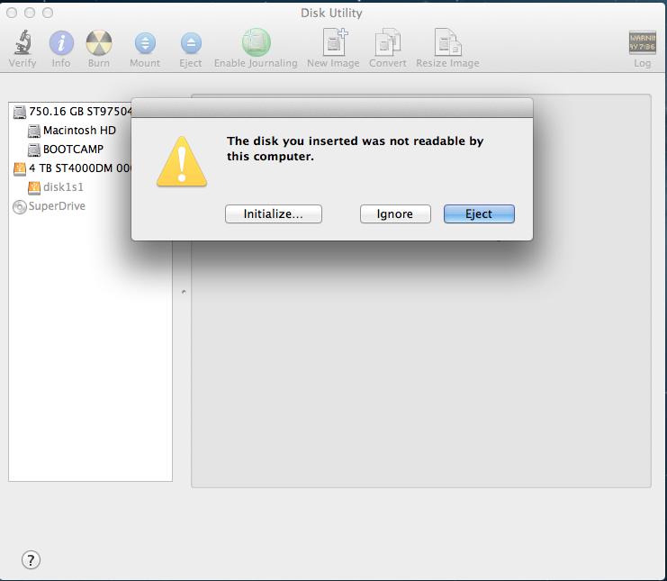

As [our note on Connectome In A Box formats](http://humanconnectome.org/data/connectome-in-a-box-format.html) states, we only guarantee full read-write access to EXT3-formatted Connectome hard drives for users with Linux-based computers (and ideally with enterprise storage to house the data). However, we recognize that some researchers will not have access to this kind of working environment. For those users with Mac computers, this walkthrough may be helpful.

 

> [!note] 
> The process for mounting Linux drives on a Mac appears to be more fragile and less reliable than on Windows, particularly for users running Mac OS X 10.10 (Yosemite). We cannot fully endorse usage of Connectome Drives on the Mac platform. Please consider alternatives, such as using Amazon Web Services to access HCP data.
 

[This CNET article](http://www.cnet.com/how-to/how-to-manage-ext2ext3-disks-in-os-x/) describes several possible methods for mounting Linux drives on Mac OS. 

## Approach 1: Mounting drives directly

This approach uses a pair of free software packages that add EXT3-formatted disk-reading capability to your Mac. However, there has been zero development or support for these packages in several years. Through our testing, this approach works fairly well on Max OSX 10.8.5 (Mountain Lion) and OSX 10.9.3 (Mavericks), but not reliably on OSX 10.10.2 (Yosemite). 

1. Download and install **[OSXFUSE](http://osxfuse.github.com/)**
2. Download and install the **[Ext2Fuse Module](http://sourceforge.net/projects/fuse-ext2/)**
3. Restart your computer and attach your Connectome hard drive.

This approach may work out of the box. However, if it does not, you will have to mount the drive manually using the **Disk Utility** and **Terminal** apps, both of which can be found in Applications > Utilities. 

### Mounting a drive manually

If you have to mount drives manually, this process will have to be repeated each time you attach a drive to your machine. (Note: always "ignore" any warning from your Mac OS when you attach your EXT3 drive.)

  

1. Launch Disk Utility and find the name of your attached EXT3 drive. This will show up in the left sidebar and be something like "disk1s1"
2. Open Terminal and enter the following commands. The first creates a temporary folder in your hidden "Volumes" directory that you will mount the drive to. The second calls the Ext2Fuse module and tells it to mount the drive at your newly-generated mountpoint.

```
mkdir /Volumes/S500-1
sudo fuse-ext2 /dev/disk1s1 /Volumes/S500-1
```

 

With any luck, your Connectome drive will mount to your Mac, and provide you with read-only access to the data. 

## Related articles

 [How To Connect to Connectome Data via AWS](./How%20To%20Connect%20to%20Connectome%20Data%20via%20AWS.md)
 
 [How to mount a Connectome In A Box Hard Drive in Mac OSX](./How%20to%20mount%20a%20Connectome%20In%20A%20Box%20Hard%20Drive%20in%20Windows.md)


# Attachments

- 
