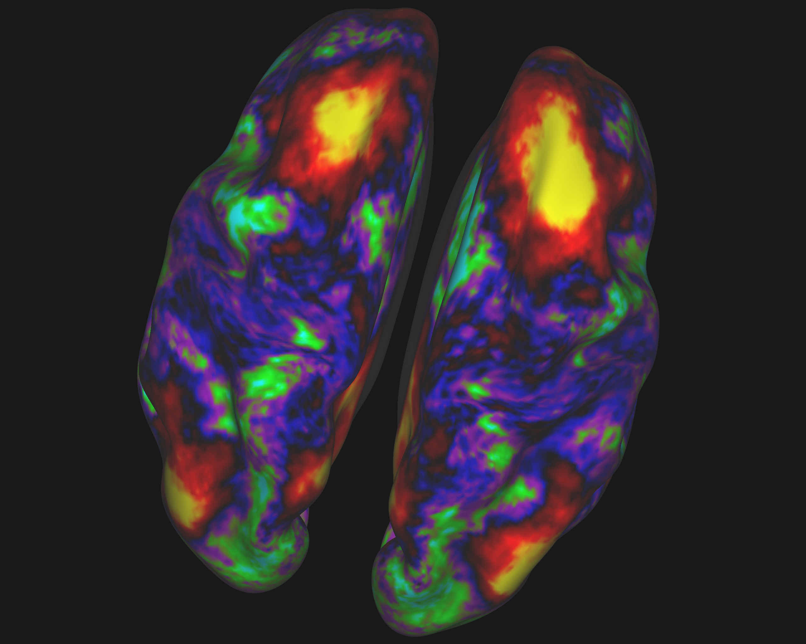
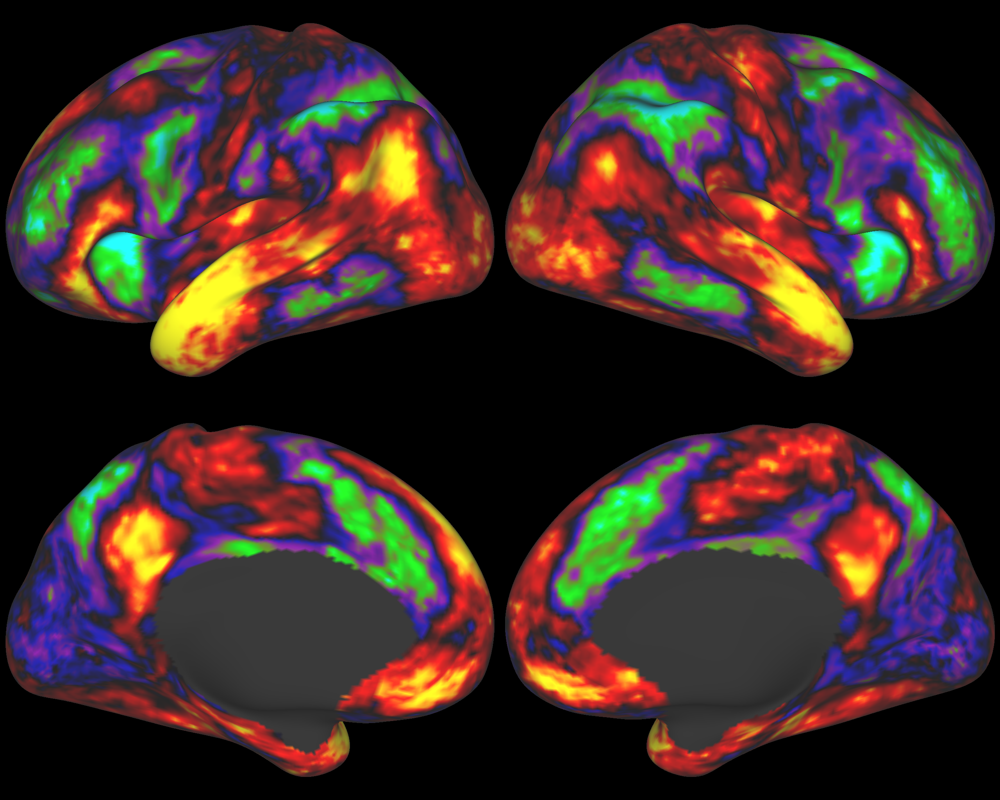
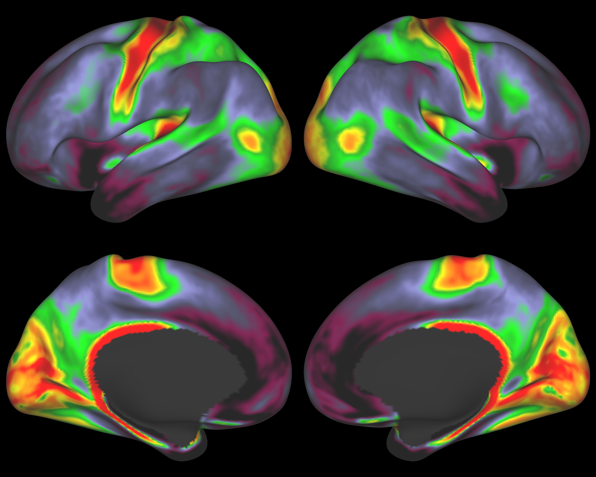
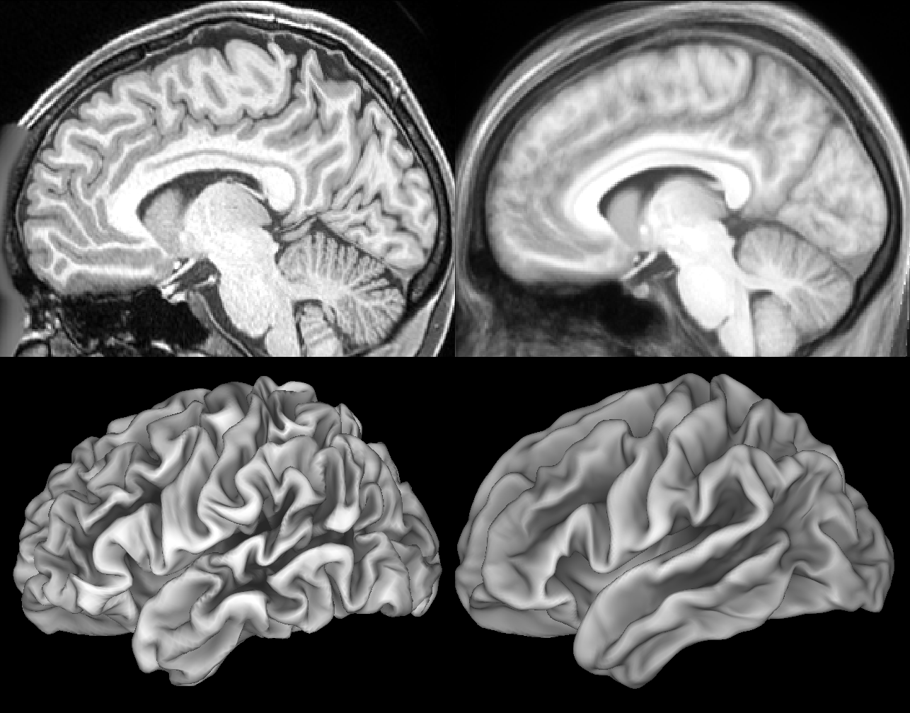
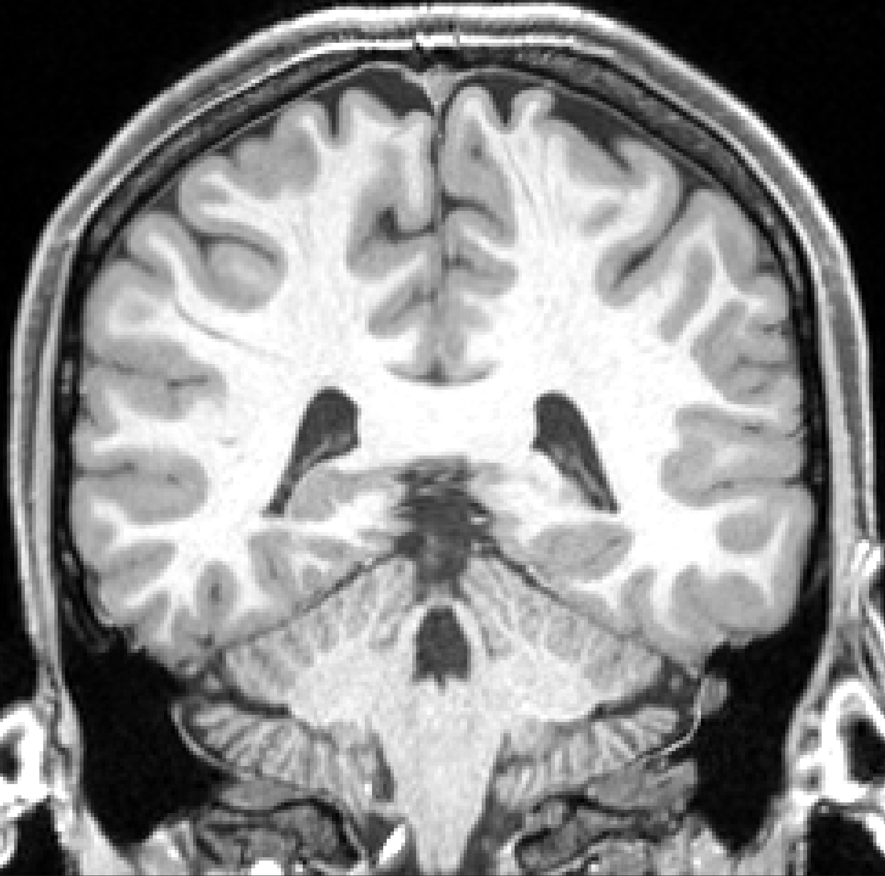

> [!note] 
> Please be sure to incorporate the credit when using these images. Please include the link to http://humanconnectome.org. There are multiple websites dedicated to the Human Connectome Project. Linking to the proper site helps avoid reader/user confusion.Please also send an email to elam@wustl.edu when your article/blog post is published so that we can track its publication for our grant and highlight it on our website. Thank you!
 

For media and other users that want images associated with the WU-Minn Human Connectome Project (HCP), here is a collection of recent examples of work. 

Download all of these images in a single ZIP archive: [HCP_Media_Images.zip](./assets/HCP_Media_Images.zip)

| Image | Caption and Credit |
| --- | --- |
|    | **Functional Connectivity: Right Hemisphere, Parietal**   "FunctionalConnectivity\_RightHemisphere\_Parietal.png"   A map of average "functional connectivity" in human cerebral cortex (including subcortical gray matter) collected on subjects while "at rest" in the MRI scanner.   Regions in yellow are functionally connected to a "seed" location in the parietal lobe of the right hemisphere, whereas regions in dark red, blue and purple are weakly connected or not connected at all. Image courtesy M. F. Glasser and S. M. Smith for the WU-Minn HCP consortium - [http://humanconnectome.org](http://humanconnectome.org/)   Download single image: [FunctionalConnectivity_RightHemisphere_Parietal.png](./assets/FunctionalConnectivity_RightHemisphere_Parietal.png) |
|    | **Functional Connectivity: Both Hemispheres, Frontal Seed**   "FunctionalConnectivity\_BothHemispheres\_FrontalSeed.png"   A map of the average "functional connectivity" in the human cerebral cortex collected on healthy subjects while "at rest" in the MRI scanner. Regions in yellow/red are functionally connected to the "seed" location in the right frontal cortex (black circle, arrow), whereas regions in green and blue are weakly connected or not connected at all.  Image courtesy M. F. Glasser and S. M. Smith for the WU-Minn HCP consortium - [http://humanconnectome.org](http://humanconnectome.org/)   Additional info: "Functional connectivity" arises from correlations in metabolic activity between brain regions while the subject is not doing a specific task (awake, but "at rest") measured by blood oxygen level (which is observable by MRI).   Download single image:  |
|    | **Functional Connectivity: Both Hemispheres, Frontal Seed, No ID**"FunctionalConnectivity\_BothHemispheres\_FrontalSeed\_noID.png"A map of the average "functional connectivity" in the human cerebral cortex collected on healthy subjects while "at rest" in the MRI scanner. Regions in yellow/red are functionally connected to the "seed" location in the right frontal cortex (center of yellow area in upper right), whereas regions in green and blue are weakly connected or not connected at all.  Image courtesy M. F. Glasser and S. M. Smith for the WU-Minn HCP consortium - [http://humanconnectome.org](http://humanconnectome.org/)Additional info: "Functional connectivity" arises from correlations in metabolic activity between brain regions while the subject is not doing a specific task (awake, but "at rest") measured by blood oxygen level (which is observable by MRI).Download single image:  |
|    | **Task fMRI: Story vs Math** "Story-vs-math\_Task-fMRI.png"A group average map of brain regions associated with language processing in human cerebral cortex.  Participants are asked to listen attentively to either a story or an arithmetic calculation (e.g. “16 minus 5 plus 18 equals”) and answer a question about what they heard. Yellow and red regions are activated by listening to stories, whereas green and blue regions are more strongly activated by performing math calculations.Image courtesy D. Barch, M. Harms, G. Burgess for the WU-Minn HCP consortium - <http://humanconnectome.org>Download single image:  |
|    | **Myelin Map Montage**"MyelinMap\_montage.png" A group average map of myelin content in human cerebral cortex.  Regions in red and yellow have high myelin content, whereas regions in blue, indigo, and black have low myelin content.  These "myelin maps" provide useful markers for functionally distinct regions of human cerebral cortex. Separating the brain into regions (a process called “parcellation”) is an important first step for calculating region-to-region structural and functional connectivity and understanding how networks of the brain are formed dynamically to do specific tasks.Image courtesy M. F. Glasser and D.C. Van Essen for the WU-Minn HCP consortium - <http://humanconnectome.org> Download single image:  |
|    | **Structural Connectivity: Probabilistic Tractography from a location in the Parietal Cortex**“Probabilistic\_Tractography.png”3D probabilistic trajectories of white matter fibers arising from a seed location in the left inferior parietal cortex (yellow arrow on the right). The orientation vectors at each voxel are RGB color-coded (red: Left-right, green: anterior posterior, blue: inferior-superior) and with opacity representative of the underlying number of streamlines that took the particular fiber orientation in the tractography calculation. Right: Part of the same probabilistic tractography results zoomed in, showing the seed location (yellow arrow) and superimposed on a structural MRI image. The white/gray matter boundary surface is shown with the black solid line. The corresponding zoom location is shown encircled in the left panel.Image courtesy S. Sotiropoulos and T. E. J. Behrens for the WU-Minn HCP consortium - <http://humanconnectome.org>Download single image:  |
|    | **Structural Connectivity: Probabilistic Tractography from a location in the Frontal Cortex**"HCP\_Probabilistic\_Tractography\_frontal.png"3D probabilistic trajectories of white matter fibers arising from a seed in the left frontal cortex, superimposed on the right cortical midthickness graymatter surface for reference . The orientation vectors at each voxel are RGB color-coded coded (red: Left-right, green: anterior posterior, blue: inferior-superior) and have opacity representative of the underlying number of streamlines that took the particular fiber orientation in the tractography calculation.Image courtesy S. Sotiropoulos and T. E. J. Behrens for the WU-Minn HCP consortium - <http://humanconnectome.org>Download single image:  |
|    | **Individual vs Group Average**"Indiv-vs-GroupAverage\_anatomical.png" (can use just half of this image, if desired)A comparison of an individual (left) and 12 subject group average (right) MRI volume and brain surface data collected by the HCP.  The individual volume highlights the very high resolution of the HCP MRI data. Individuals have very distinct brain cortical folding patterns that get "smoothed" when volumes and surfaces from subjects are averaged.Image courtesy of the WU-Minn HCP consortium - <http://humanconnectome.org>Download single image:  |
|    | **High resolution Parasagittal Volume**"Parasagittal\_volume\_hi\_res.png"A parasagittal slice from the brain volume of an individual HCP subject obtained with structural MRI, showing the high resolution of the imaging data being collected.Image(s) courtesy of the WU-Minn HCP consortium - <http://humanconnectome.org>Download single image:  |
|    | **High resolution Axial Volume**"Axial\_volume.png"A axial slice from the brain volume of an individual HCP subject obtained with structural MRI, showing the high resolution of the imaging data being collected.Image(s) courtesy of the WU-Minn HCP consortium - <http://humanconnectome.org>Download single image:  |
|    | **High resolution Coronal Volume**"Coronal\_volume.png"A coronal slice from the brain volume of an individual HCP subject obtained with structural MRI, showing the high resolution of the imaging data being collected.Image(s) courtesy of the WU-Minn HCP consortium - <http://humanconnectome.org>Download single image:  |
|    | **Diffusion Fractional Anisotropy**“Diffusion\_FA.jpg” (can use just half of this image, if desired)Fractional anisotropy (top), and principal diffusion directions (bottom) images from the HCP dMRI data provide a measure of how water diffuses in the brain. Diffusion directions are RGB-color encoded red: left–right, green: anterior–posterior, blue: inferior–superior.Image courtesy of the WU-Minn HCP consortium - <http://humanconnectome.org>Download single image:   |

# Attachments

- [HCP_Media_Images.zip](./assets/HCP_Media_Images.zip)
- 
- 
- [Diffusion_FA.JPG](./assets/Diffusion_FA.JPG)
- 
- 
- [Parasagittal_volume_hi_res.zip](./assets/Parasagittal_volume_hi_res.zip)
- 
- 
- 
- 
- 
- 
- 
