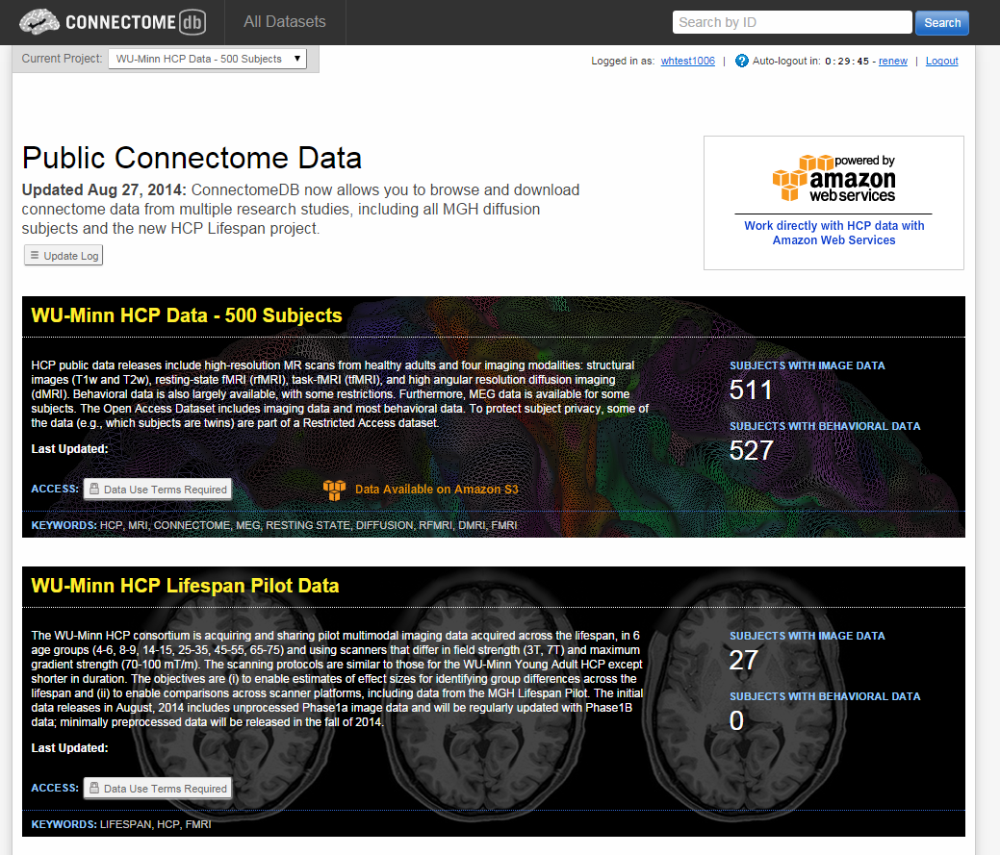
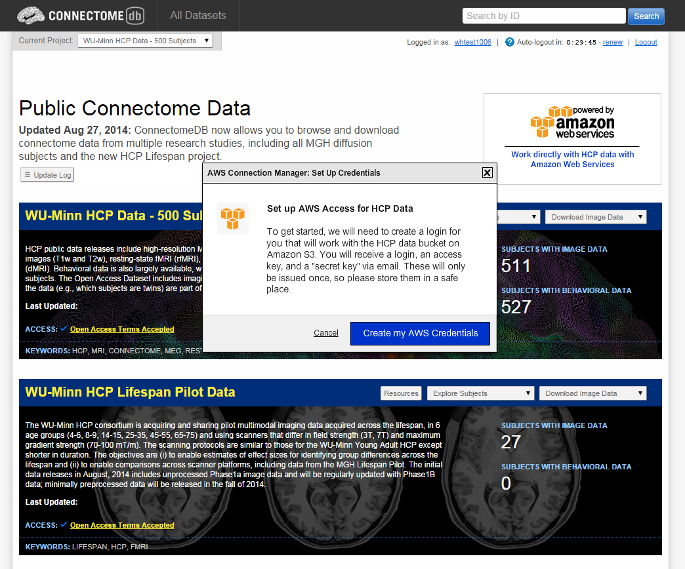
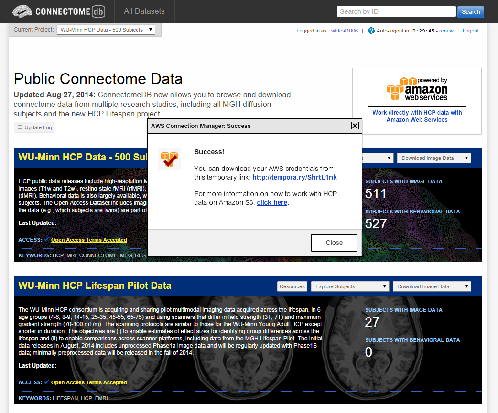
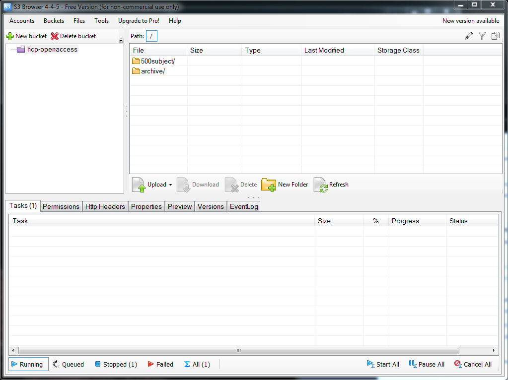

Users who are familiar with using Amazon Web Services for data processing jobs will be happy to know that HCP data is now available directly on AWS through an HCP-hosted S3 storage container. Here are setup instructions for accessing the data through AWS. 

**1. Create an account** on ConnectomeDB (if necessary) and login. You will see a list of datasets available in ConnectomeDB, some of which will also be available on AWS. 

  

**2. Accept Terms.** Before you can get access to any HCP-hosted data, either through the ConnectomeDB application or through AWS, you must review and accept the Open Access Data Use Terms specific to that dataset (click the "Data Use Terms Required" button). Therefore, if you want access to mutiple datasets, you will need to accept the terms for each dataset.

**3. Create AWS Credentials.** Click the Amazon Web Services icon (at the top of the page or for each AWS-enabled dataset). While you may have an AWS account already, we need to create a set of credentials that can be granted access to the HCP bucket that contains the data. These credentials will include your ConnectomeDB username, and a pair of keys created for your account that you will use for secure access. 

        

**4. Save AWS Credentials.** AWS creates an access key pair, made up of a public "Access Key" and a private "Secret Access Key." We only store the public key in ConnectomeDB, so it is imperative that you download and save your key pair to your local system. (If you lose your key information, you can request a new key pair from ConnectomeDB by clicking on the small "Amazon S3 Access" button at the top of the page.) 

  

**5. Start working in AWS!** Using a tool such as [Amazon S3 Browser](http://s3browser.com/), you can log in with your account name (which is the same as your ConnectomeDB login), your Access Key and Secret Access Key. Once you do, you will be granted access to the **hcp-openaccess** bucket, which contains folders of data for each data release. (You will only be able to see data for datasets for which you have accepted Data Use Terms. See Step 2.) 

To get access to additional datasets, simply go to ConnectomeDB and accept the data use terms for that dataset. Once you do, your AWS access permissions will be modified and you will be granted access to the new dataset upon login to AWS. 

  

 

# Attachments

- 
- 
- 
- 
- 
- 