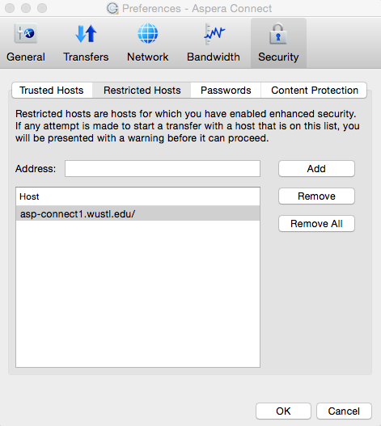

Having trouble downloading HCP resources from ConnectomeDB? These previously resolved issues might help you. If not, please feel free to [contact us](http://humanconnectome.org/contact/index.php).

### **I have Aspera installed, but downloads refuse to start. (Example error: "Server refused connection")**

Our Aspera server is configured to use **TCP and UDP Port 33001** for file transfers instead of a common port such as Port 22. If you are downloading from behind an institutional firewall, please speak with your IT people to ensure that Port 33001 is open to both TCP and UDP traffic.

Use the online [Aspera Diagnostic Tool](https://test-connect.asperasoft.com/) to test your version of Aspera, necessary browser extensions/plugins, and the ability to transfer through Port 33001.  

If you still have trouble, we have had some users have success opening all UDP ports to our Aspera server [asp-connect1.wustl.edu](http://asp-connect1.wustl.edu) IP address: 65.254.100.36.

Some users also have success downloading from home, which often avoids firewall issues.

  

---

### **I am attempting to install Aspera on Linux, but downloads are not working.**

Per [Aspera documentation](http://download.asperasoft.com/download/docs/connect/2.3/aspera-connect-linux.html), the only browser supported on Linux operating systems are Firefox versions 3 and above.

Also, it is possible that installing the Aspera plugin as the root user could prevent the plugin from working properly. (Via [betascience.blogspot.com](http://betascience.blogspot.com/2010/02/using-aspera-instead-of-ftp-to-download.html))

  

---

### **I am downloading multiple files, but am getting deluged by confirmation messages. Moreover, the little checkbox to dismiss these forever is unclickable!**

This is a rare scenario, but one that some of our own developers have come across in testing. What has happened is that our file server, `asp-connect1.humanconnectome.org`, has been added to your "Restricted Hosts" list. In order to change this, you must change the preferences on your locally installed Aspera application.

On Mac and Windows, search programs/applications for "Aspera Connect" and open it. Then, click the "gear" icon in the lower left corner of your queue window.
 
In the Aspera Preferences dialog, click the "Security" tab.

In the Security tab, click on "Restricted Hosts" and look for the `asp-connect1.humanconnectome.org` address.

  

  

You can safely remove our host from the restricted host list. If you want to go a step further and preemptively hide all future confirmation dialogs, you can add `asp-connect1.humanconnectome.org` to your "Trusted Hosts" list instead. (You will still be able to see and manage your downloads via the Aspera queue.)

  

# Attachments

- 
