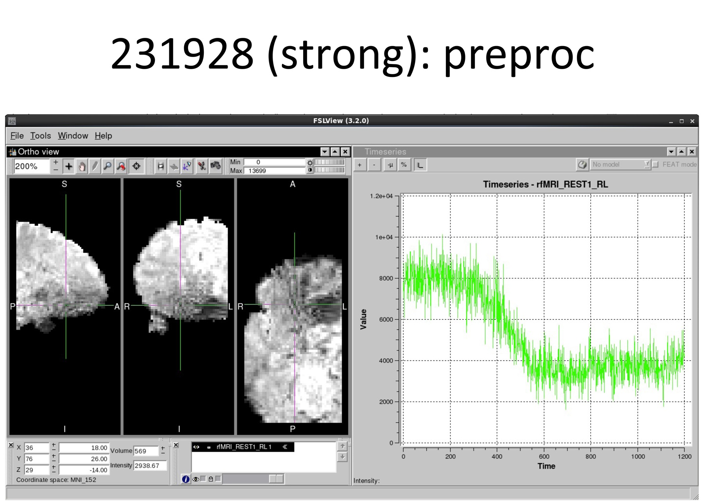
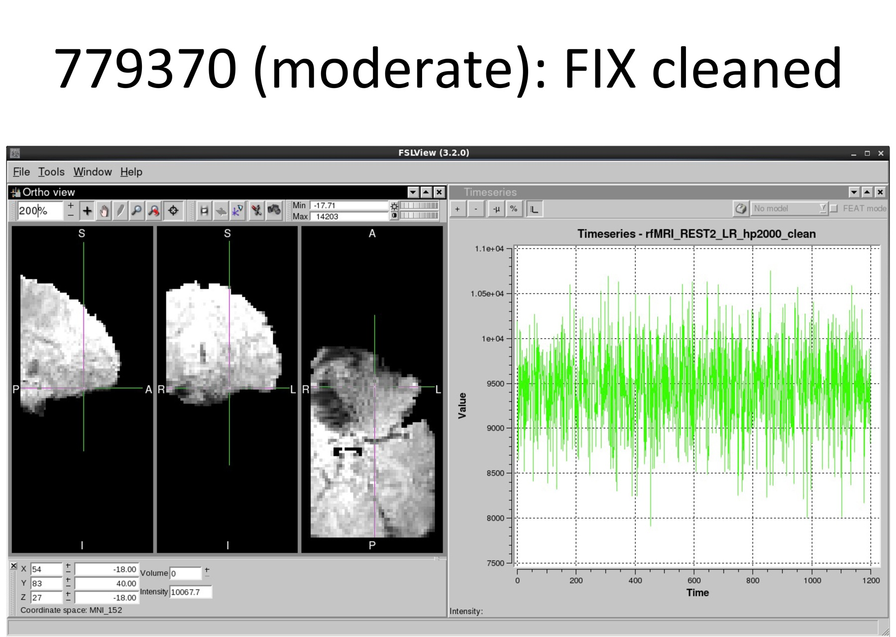

HCP has identified an artifact caused by intermittent technical problems with the 32 channel head coil in a limited number of fMRI scan session (24 rfMRI scans in 18 subjects; 6 tfMRI scans in 6 subjects) that were obtained during the summer of 2013.  When it occurred, this rare artifact arose at some point during individual scans and persisted through that scan, resulting in a striped spatial pattern in image intensity around orbitofrontal susceptibility areas. This spatially coherent change in activation has the potential to introduce apparent changes in functional connectivity or task activation that are in fact driven by the artifact.

We have determined that the artifact appears to be completely removed from the affected rfMRI scans after the HCP FIX ICA denoising process (see figures below). Other standard preprocessing methods may also reduce or remove this artifact.  Accordingly, we have opted to release these data for public use with the expectation that investigators will review the data, before and after their chosen pre-processing steps, to decide whether this artifact might affect their data analysis. Furthermore, for resting state data, we strongly encourage the use of FIX cleaned data which appears to entirely remove these artifacts .

The attached Excel spreadsheet: [HCP_Intermittent_orbitofrontal_artifact_June-July_2013.xlsx](./assets/HCP_Intermittent_orbitofrontal_artifact_June-July_2013.xlsx) lists the affected subjects and indicates the severity of the artifact, the scan name, and approximate frame number where it starts to occur.

The artifact appears in both unprocessed and minimally preprocessed datasets for the subjects and scans indicated.

      

      

      

# Attachments

- [HCP_Intermittent_orbitofrontal_artifact_June-July_2013.xlsx](./assets/HCP_Intermittent_orbitofrontal_artifact_June-July_2013.xlsx)
- 
- 
- 
- 
- 
- 
- 
- 
- 
- [Intermittent_orbitofrontal_artifact_June-July_2014.xlsx](./assets/Intermittent_orbitofrontal_artifact_June-July_2014.xlsx)
- [example_transient_orbitofrontal_artifact.pdf](./assets/example_transient_orbitofrontal_artifact.pdf)
