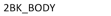
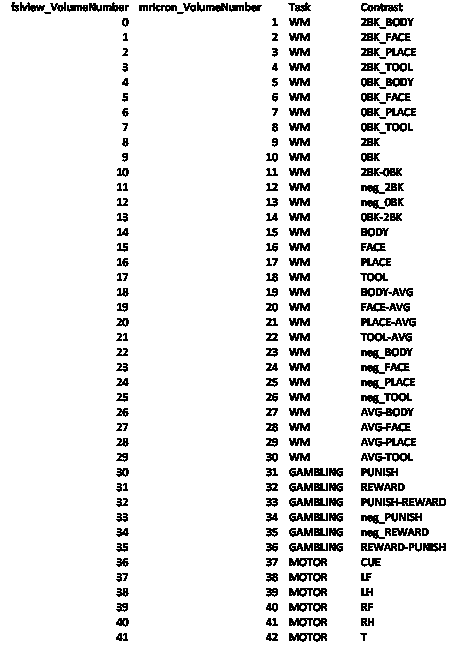
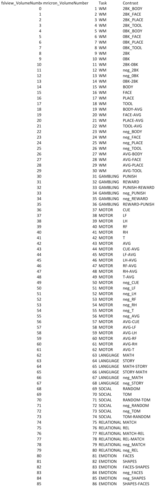

| Task | CopeNumber | ContrastName |
| --- | --- | --- |
| WM | 1 | 2BK\_BODY |
| WM | 2 | 2BK\_FACE |
| WM | 3 | 2BK\_PLACE |
| WM | 4 | 2BK\_TOOL |
| WM | 5 | 0BK\_BODY |
| WM | 6 | 0BK\_FACE |
| WM | 7 | 0BK\_PLACE |
| WM | 8 | 0BK\_TOOL |
| WM | 9 | 2BK |
| WM | 10 | 0BK |
| WM | 11 | 2BK-0BK |
| WM | 12 | neg\_2BK |
| WM | 13 | neg\_0BK |
| WM | 14 | 0BK-2BK |
| WM | 15 | BODY |
| WM | 16 | FACE |
| WM | 17 | PLACE |
| WM | 18 | TOOL |
| WM | 19 | BODY-AVG |
| WM | 20 | FACE-AVG |
| WM | 21 | PLACE-AVG |
| WM | 22 | TOOL-AVG |
| WM | 23 | neg\_BODY |
| WM | 24 | neg\_FACE |
| WM | 25 | neg\_PLACE |
| WM | 26 | neg\_TOOL |
| WM | 27 | AVG-BODY |
| WM | 28 | AVG-FACE |
| WM | 29 | AVG-PLACE |
| WM | 30 | AVG-TOOL |
| GAMBLING | 1 | PUNISH |
| GAMBLING | 2 | REWARD |
| GAMBLING | 3 | PUNISH-REWARD |
| GAMBLING | 4 | neg\_PUNISH |
| GAMBLING | 5 | neg\_REWARD |
| GAMBLING | 6 | REWARD-PUNISH |
| MOTOR | 1 | CUE |
| MOTOR | 2 | LF |
| MOTOR | 3 | LH |
| MOTOR | 4 | RF |
| MOTOR | 5 | RH |
| MOTOR | 6 | T |
| MOTOR | 7 | AVG |
| MOTOR | 8 | CUE-AVG |
| MOTOR | 9 | LF-AVG |
| MOTOR | 10 | LH-AVG |
| MOTOR | 11 | RF-AVG |
| MOTOR | 12 | RH-AVG |
| MOTOR | 13 | T-AVG |
| MOTOR | 14 | neg\_CUE |
| MOTOR | 15 | neg\_LF |
| MOTOR | 16 | neg\_LH |
| MOTOR | 17 | neg\_RF |
| MOTOR | 18 | neg\_RH |
| MOTOR | 19 | neg\_T |
| MOTOR | 20 | neg\_AVG |
| MOTOR | 21 | AVG-CUE |
| MOTOR | 22 | AVG-LF |
| MOTOR | 23 | AVG-LH |
| MOTOR | 24 | AVG-RF |
| MOTOR | 25 | AVG-RH |
| MOTOR | 26 | AVG-T |
| LANGUAGE | 1 | MATH |
| LANGUAGE | 2 | STORY |
| LANGUAGE | 3 | MATH-STORY |
| LANGUAGE | 4 | STORY-MATH |
| LANGUAGE | 5 | neg\_MATH |
| LANGUAGE | 6 | neg\_STORY |
| SOCIAL | 1 | RANDOM |
| SOCIAL | 2 | TOM |
| SOCIAL | 3 | RANDOM-TOM |
| SOCIAL | 4 | neg\_RANDOM |
| SOCIAL | 5 | neg\_TOM |
| SOCIAL | 6 | TOM-RANDOM |
| RELATIONAL | 1 | MATCH |
| RELATIONAL | 2 | REL |
| RELATIONAL | 3 | MATCH-REL |
| RELATIONAL | 4 | REL-MATCH |
| RELATIONAL | 5 | neg\_MATCH |
| RELATIONAL | 6 | neg\_REL |
| EMOTION | 1 | FACES |
| EMOTION | 2 | SHAPES |
| EMOTION | 3 | FACES-SHAPES |
| EMOTION | 4 | neg\_FACES |
| EMOTION | 5 | neg\_SHAPES |
| EMOTION | 6 | SHAPES-FACES |

- 
- 
- 
- 
